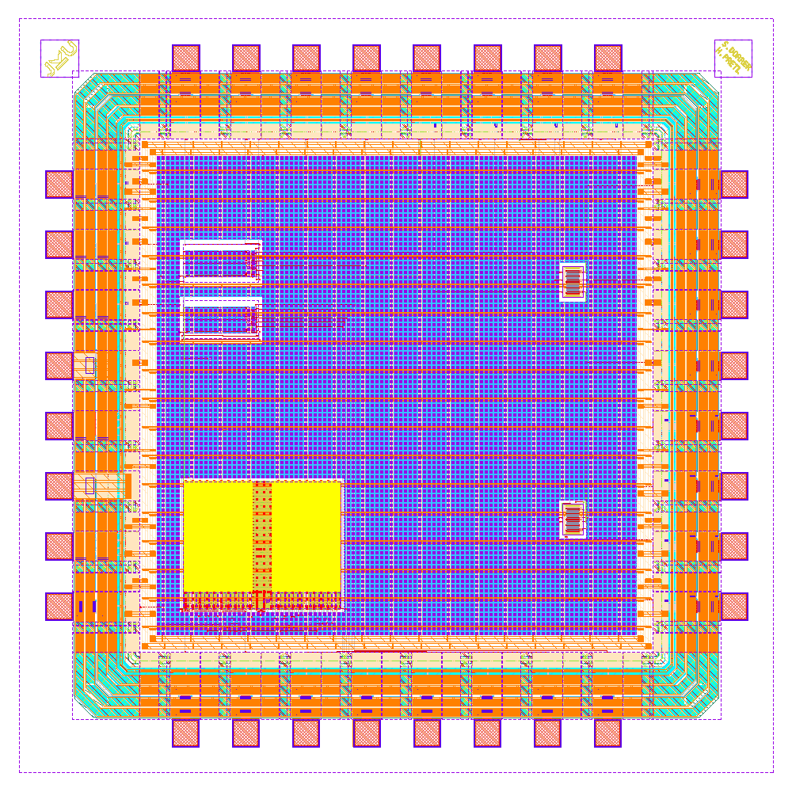
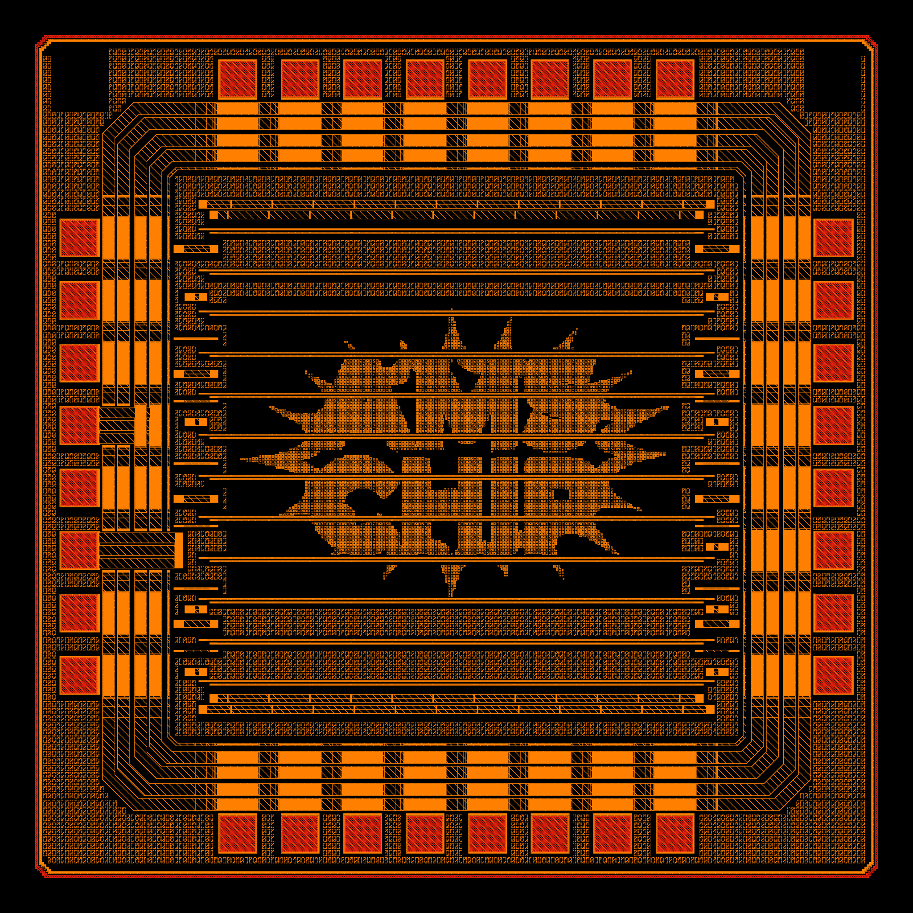

# An Open-Source Analog-Mixed Signal Chip Design Template for the ihp-sg13g2 Open-PDK

[](https://github.com/iic-jku/ihp-sg13g2-ams-chip-template/actions/workflows/quarto-publish.yml)
[](https://doi.org/10.5281/zenodo.20129233)

(c) 2026 Simon Dorrer and Harald Pretl

Institute for Integrated Circuits and Quantum Computing, Johannes Kepler University (JKU), Linz, Austria

> [!IMPORTANT]
> This repository requires the [IIC-OSIC-TOOLS](https://github.com/iic-jku/IIC-OSIC-TOOLS) container with tag `2026.05` or later.

<p align="center">
  <a href="render/img/chip_top_black.png">
    
  </a>
  <br>
  <em>Chip render of the ihp-sg13g2 analog-mixed signal template chip (1.6 mm x 1.6 mm).</em>
</p>

<p align="center">
  <a href="render/img/chip_top_black_TM2.png">
    
  </a>
  <br>
  <em>Render of the TopMetal2 AMS Chip logo, generated with the tool ArtistIC.</em>
</p>


## Overview

This Makefile-driven repository simulates, builds, and fully verifies (LVS, DRC, PEX) a complete analog mixed-signal chip for the ihp-sg13g2 130nm Open-PDK, including padframe generation and top-level assembly. It uses:

- [**LibreLane**](https://github.com/librelane/librelane) for digital macro hardening, padframe generation and top-level assembly
- [**Xschem**](https://github.com/StefanSchippers/xschem) for schematic entry
- [**Ngspice**](https://github.com/danchitnis/ngspice-sf-mirror), [**VACASK**](https://codeberg.org/arpadbuermen/VACASK) and [**CACE**](https://github.com/fossi-foundation/cace) for analog simulation
- [**KLayout**](https://github.com/KLayout/klayout) for viewing and routing of the layout
- [**Magic**](https://github.com/rtimothyedwards/magic) + [**Netgen**](https://github.com/rtimothyedwards/netgen) and [**KLayout**](https://github.com/KLayout/klayout) for LVS, DRC and PEX verification
- **SystemVerilog**, [**cocotb**](https://github.com/cocotb/cocotb), [**GTKWave**](https://github.com/gtkwave/gtkwave) and [**Surfer**](https://gitlab.com/surfer-project/surfer) for digital simulation

The repository is the starting point for your own custom silicon and provides a universal design flow solution: Just clone the repo, enter the IIC-OSIC-TOOLS container, and run `make all` to get a tapeout-ready analog-mixed signal chip. Focus on your design and do not care about the tools and the design flow!

Furthermore, it serves as a regression test for the above-mentioned open-source tools and their dependencies using the ihp-sg13g2 Open-PDK.


## Tutorial

A step-by-step tutorial, including additional exercises, can be found [here](https://iic-jku.github.io/ihp-sg13g2-ams-chip-template/index.html).


## Examples

Examples based on this template are:
- [TinyWhisper](https://github.com/iic-jku/TinyWhisper): An Open-Source Fully-Integrated Multi-Mode Short-Wave Transmitter for Amateur Radio Applications in 130-nm CMOS
- [SPARX](https://github.com/iic-jku/SG13G2_SPARX): An Open-Source, Automated, Programmatically Generated, Frequency-Scalable Six-Port Receiver in 130-nm CMOS


## Chip Documentation

A designer-oriented description of this chip lives in [doc/](doc/):

- **[doc/specifications.md](doc/specifications.md)**: top-level specifications (technology, supplies, clock, macro inventory, functional behaviour).
- **[doc/pinout.md](doc/pinout.md)**: full 32-pad bondpad table per side, with the `chip_top` port and the role each pad carries inside `chip_core`.
- **[doc/floorplan.md](doc/floorplan.md)**: die / core geometry, hard-macro placement coordinates, PDN strategy and the floorplan diagram.


## Directory Structure

```text
📁 ihp-sg13g2-ams-chip-template/
├─ 📁 doc/
│  ├─ 📁 ihp-sg13g2-Open-PDK/
│  ├─ 📁 ihp-structure-proposals/
│  ├─ 📁 klayout/
│  ├─ 📁 librelane/
│  ├─ 📁 sizing/
│  ├─ floorplan.md
│  ├─ pinout.md
│  └─ specifications.md
├─ 📁 flow/
│  ├─ 📁 artistic/
│  ├─ 📁 librelane/
│  │  ├─ chip_top.sdc
│  │  ├─ config.yaml
│  │  └─ pdn_cfg.tcl
│  └─ 📁 logo/
│     └─ chip_logo_mono.png
├─ 📁 ip/
│  ├─ 📁 sg13g2_io_custom/
│  ├─ 📁 sg13g2_ip__bondpad_70x70/
│  │  ├─ 📁 final/
│  │  ├─ 📁 script/
│  │  ├─ 📁 verification/
│  │  ├─ Makefile
│  │  └─ README.md
│  ├─ 📁 sg13g2_ip__jku/
│  │  ├─ 📁 final/
│  │  ├─ 📁 logo/
│  │  ├─ 📁 script/
│  │  ├─ 📁 verification/
│  │  ├─ Makefile
│  │  └─ README.md
│  └─ 📁 sg13g2_ip__jku_names/
│     ├─ 📁 final/
│     ├─ 📁 logo/
│     ├─ 📁 script/
│     ├─ 📁 verification/
│     ├─ Makefile
│     └─ README.md
├─ 📁 layout/
│  ├─ chip_top.gds.gz
│  └─ chip_top_logo_fill.gds.gz
├─ 📁 macros/
│  ├─ 📁 counter/
│  │  ├─ 📁 final/
│  │  ├─ 📁 flow/
│  │  ├─ 📁 fpga/
│  │  ├─ 📁 netlist/
│  │  ├─ 📁 render/
│  │  ├─ 📁 rtl/
│  │  ├─ 📁 schematic/
│  │  ├─ 📁 scripts/
│  │  ├─ 📁 testbenches/
│  │  ├─ 📁 verification/
│  │  ├─ Makefile
│  │  └─ README.md
│  └─ 📁 inverter/
│     ├─ 📁 final/
│     ├─ 📁 layout/
│     ├─ 📁 netlist/
│     ├─ 📁 render/
│     ├─ 📁 schematic/
│     ├─ 📁 scripts/
│     ├─ 📁 testbenches/
│     ├─ 📁 verification/
│     ├─ Makefile
│     └─ README.md
├─ 📁 netlist/
│  ├─ 📁 layout/
│  ├─ 📁 nl/
│  ├─ 📁 pex/
│  ├─ 📁 pnl/
│  └─ 📁 spice/
├─ 📁 release/
│  └─ 📁 v.1.0.0/
│     ├─ 📁 gds/
│     ├─ 📁 img/
│     ├─ 📁 netlist/
│     └─ README.md
├─ 📁 render/
│  ├─ 📁 blender/
│  └─ 📁 img/
├─ 📁 rtl/
│  ├─ chip_core.sv
│  └─ chip_top.sv
├─ 📁 schematic/
│  └─ 📁 xschem/
│     ├─ chip_top.sch
│     ├─ chip_top.sym
│     ├─ chip_top_pex.sym
│     └─ xschemrc
├─ 📁 scripts/
│  ├─ 📁 plot_simulations/
│  ├─ add_logo_fill.sh
│  ├─ add_rectangle.py
│  ├─ gds_xor.py
│  └─ lay2img.py
├─ 📁 testbenches/
│  ├─ 📁 cocotb/
│  │  ├─ chip_top_tb.gtkw
│  │  ├─ chip_top_tb.py
│  │  └─ chip_top_tb.surf.ron
│  └─ 📁 xschem/
│     ├─ chip_top_tb_tran.sch
│     └─ xschemrc
├─ 📁 tutorial/
│  ├─ 📁 fig/
│  ├─ _quarto.yml
│  ├─ index.qmd
│  ├─ Makefile
│  └─ requirements.txt
├─ 📁 verification/
│  ├─ 📁 drc/
│  ├─ 📁 lvs/
│  └─ 📁 reports/
│     ├─ antenna_summary.rpt
│     ├─ antenna_violations.rpt
│     ├─ hold_setup_timing.rpt
│     ├─ irdrop.rpt
│     ├─ lvs.netgen.rpt
│     ├─ manufacturability.rpt
│     ├─ stapostpnr_*.rpt
│     ├─ stat.rpt
│     ├─ yosys_post_dff.rpt
│     ├─ yosys_pre_techmap.rpt
│     └─ yosys_synth_check.rpt
├─ CITATION.cff
├─ LICENSE
├─ Makefile
├─ README.md
└─ ToDo.md
```


## Show Available Targets

The default Make target is `help`, so running `make` prints usage and all available targets with short descriptions.

```sh
make
make help
```


## Initialize Git Submodules

Initializes and updates the repository submodules (for example `artistic`):

```sh
make init-submodules
```

Run this after cloning the repository, or whenever submodule pointers are updated.


## Simulation

We use [cocotb](https://www.cocotb.org/), a Python-based testbench environment, for the verification of the chip.
The underlying simulator is [Icarus Verilog](https://github.com/steveicarus/iverilog).

The simulation targets accept an optional `CELL` variable (default: `chip_top`).
The testbench is located in `testbenches/cocotb/chip_top_tb.py`. To run the RTL simulation, use:

```sh
make sim-rtl-cocotb
```

To run the gate-level (GL) simulation with cocotb, use:

```sh
make sim-gl-cocotb
```

To run the gate-level simulation with Xschem, use:

```sh
make sim-gl-xschem
```

The cocotb simulations generate a waveform file under `testbenches/cocotb/sim_build/chip_top.fst`.
You can view it with a waveform viewer such as [GTKWave](https://gtkwave.github.io/gtkwave/) or [Surfer](https://surfer-project.org/).
The waveform viewer can be changed with `WAVEFORM_VIEWER=<gtkwave|surfer>` (default: `gtkwave`).

```sh
make sim-view-cocotb                                          # view chip_top waveform with GTKWave (default)
make sim-view-cocotb WAVEFORM_VIEWER=surfer                   # use Surfer instead
```

Each cocotb simulation folder contains a pre-configured waveform layout file (`<CELL>_tb.gtkw` for GTKWave, `<CELL>_tb.surf.ron` for Surfer).
The view target loads it automatically together with the current `.fst`, so signal formatting is preserved across runs.

To run all non-interactive simulation targets in sequence (RTL cocotb, GL cocotb, and GL Xschem), use:

```sh
make sim-all
```

> [!NOTE]
> `sim-view-cocotb` is intentionally **not** called by `sim-all`.
> It opens a waveform viewer GUI (GTKWave or Surfer), which blocks the shell until the window is closed.
> It is designed for interactive use and must be called manually after the simulation has completed.


## LibreLane Flow

Run the LibreLane flow with:

```sh
make librelane
```

Additional targets are available for different DRC configurations:

- `make librelane-nodrc` – run LibreLane without DRC checks
- `make librelane-magicdrc` – run LibreLane with only Magic DRC checks
- `make librelane-klayoutdrc` – run LibreLane with only KLayout DRC checks

These targets are also available for the digital macros. After the LibreLane flow completes successfully, the generated views are saved under `flow/final/`.


## View the Design

After completion, you can view the design using the OpenROAD GUI:

```sh
make librelane-openroad
```

Or using KLayout:

```sh
make librelane-klayout
```

These commands are also available for the digital macros.


## Copy Important Reports

To copy the Yosys synthesis checks, antenna-violation reports, post-PnR hold & setup timing summary, LVS report, and manufacturability report from the latest LibreLane run into `verification/reports/`, run:

```sh
make copy-reports
```

This only works if the latest run completed without errors. This command is also available for the digital macros.

> [!NOTE]
> The Magic and KLayout DRC reports are temporarily not copied because IHP's
> `metal1_pin_offgrid` rule trips on the pad ring. Once it is fixed upstream
> the corresponding `cp` lines in `Makefile :: copy-reports` will be re-enabled.


## Copy the Final GDS

To copy and compress the latest GDS from `flow/final/gds/` into `layout/`, run:

```sh
make copy-gds
```


## Copy the Final Netlist

To copy the latest SPICE, PnL, and NL netlists from `flow/final/spice/` into `netlist/spice/`, from `flow/final/pnl/` into `netlist/pnl/`, and from `flow/final/nl/` into `netlist/nl/`, run:

```sh
make copy-netlist
```

This only works if the latest run completed without errors.


## Copy the Final Render

To copy the latest LibreLane chip render from `flow/final/render/` into `render/img/`, run:

```sh
make copy-render
```

This creates `render/img/chip_top_librelane.png`. This only works if the latest run completed without errors.


## Render Top Layout

Renders the top-level GDS from `layout/` and saves it in the `render/img/` folder:

```sh
make render-gds
```

This only works if the latest run completed without errors. This command is also available for the digital macros.


## Build Bondpad

To build the bondpad in the `ip` folder, run the following command:

```sh
make build-bondpad
```


## Build Logos

To build the logos in the `ip` folder, run the following command:

```sh
make build-logos
```


## Build Macros

To build a specific macro, run the corresponding target from the `Makefile`. To build all currently enabled macros, run:

```sh
make build-macros
```

### Build Digital Macros

The following command builds the `counter` digital macro:

```sh
make build-counter
```

For each digital macro this dispatches to its in-tree `make all`, which lints, simulates, runs LibreLane, copies the reports, and renders the final GDS.

> [!TIP]
> Each macro has its own `Makefile` and `README.md` with additional targets, such as linting, simulation, and verification.
> For example, to lint the counter or run its simulation, refer to [macros/counter/README.md](macros/counter/README.md).

### Build Analog Macros

Each analog macro has its own `klayout-verify` and `magic-verify` targets that run LVS, DRC, and PEX for the top-level cell.

To build the inverter macro:

```sh
make build-inverter
```

All analog macros are included in `build-macros` alongside the digital macros.


## Build Top

To run LibreLane for the top-level chip and copy the resulting reports, GDS, netlist, and chip render back into the source tree, then add the logo + fill structures and render the final GDS, run:

```sh
make build-top
```

Internally this executes (in order): `librelane-nodrc` → `copy-reports` → `copy-gds` → `copy-netlist` → `copy-render` → `add-logo-fill` → `render-gds`.


## Build All

To initialise submodules, build the bondpad, build the logos, build the macros, and run the full `build-top` flow, run:

```sh
make build-all
```

This is useful if you want to rebuild the chip from scratch. Clone the repository, enter the IIC-OSIC-TOOLS environment, and run `make build-all`.


## Add Logo and Fill

To add the chip logo (PNG → GDS) and the fill structures on top of the LibreLane output (so the final GDS in `layout/` includes the artwork), run:

```sh
make add-logo-fill
```

This calls `scripts/add_logo_fill.sh` and writes `layout/chip_top_logo_fill.gds.gz`. The step is also called from `make build-top`.

> [!NOTE]
> In the future, it is planned to replace this script and Makefile target with a custom librelane step.


## Export Schematic Netlist for LVS

Exports the schematic netlist for LVS from Xschem and places it in `netlist/schematic/`.

The `EV_PRECISION` parameter sets the number of significant digits used by Xschem's `ev` function when calculating device properties (default: 5). Increase this to avoid LVS mismatches caused by floating-point rounding differences between Xschem and KLayout (see [xschem#465](https://github.com/StefanSchippers/xschem/issues/465)).

Currently, KLayout LVS extracts `ntap` and `ptap` devices, so the schematic netlist must include them as well. In contrast, Magic + Netgen LVS does not extract `ntap` and `ptap`. Therefore, the schematic uses `lvs_ignore = short` for these devices and conditional net labels (see [xschem#474](https://github.com/StefanSchippers/xschem/issues/474)). To make this effective during schematic netlist export, `set lvs_ignore 1` must be set in the `magic-lvs-netlist` target.

KLayout uses CDL netlists, while Magic uses SPICE netlists. Accordingly, `klayout-lvs-netlist` uses the Xschem commands `set spiceprefix 1`, `set lvs_netlist 1`, `set top_is_subckt 1`, and `set lvs_ignore 0`. In contrast, `magic-lvs-netlist` uses `set spiceprefix 1`, `set lvs_netlist 0`, `set top_is_subckt 1`, and `set lvs_ignore 1`.

To extract a CDL schematic netlist for KLayout LVS, use:
```sh
make klayout-lvs-netlist
make klayout-lvs-netlist CELL=chip_top
make klayout-lvs-netlist EV_PRECISION=5
```

To extract a SPICE schematic netlist for Magic + Netgen LVS, use:
```sh
make magic-lvs-netlist
make magic-lvs-netlist CELL=chip_top
make magic-lvs-netlist EV_PRECISION=5
```


## Layout Versus Schematic (LVS)

Exports the schematic netlist from Xschem, then runs LVS. Compares the GDS layout in `layout/` against the schematic netlist in `netlist/schematic/`. Reports are saved to `verification/lvs/`. The extracted layout netlist is moved to `netlist/layout/`.

**KLayout LVS** uses `run_lvs.py` from the IHP Open-PDK:

```sh
make klayout-lvs
make klayout-lvs CELL=chip_top
```

**Magic + Netgen LVS** uses `sak-lvs.sh`:

```sh
make magic-lvs
make magic-lvs CELL=chip_top
```


## Design Rule Check (DRC)

Runs DRC on the GDS layout in `layout/`. Reports are saved to `verification/drc/`.

**KLayout DRC (minimum)** runs a pre-check KLayout DRC on the final top-level layout with logo and fill structures:

```sh
make klayout-drc-minimum
```

**KLayout DRC (regular)** runs a regular KLayout DRC on the final top-level layout with logo and fill structures:

```sh
make klayout-drc-regular
```

**KLayout DRC** uses `run_drc.py` from the IHP Open-PDK with relaxed rules (FEOL, density checks, and extra rules disabled):

```sh
make klayout-drc
make klayout-drc CELL=chip_top
```

**Magic DRC** uses `sak-drc.sh`:

```sh
make magic-drc
make magic-drc CELL=chip_top
```


## Parasitic Extraction (PEX)

Runs parasitic extraction on the GDS layout in `layout/`. The extracted SPICE netlist is written to `netlist/pex/`.

The extracted SPICE filenames include the selected extraction mode:
- `klayout-pex` writes `netlist/pex/<CELL>_klayout_pex_<EXT_MODE>.spice`
- `magic-pex` writes `netlist/pex/<CELL>_magic_pex_<EXT_MODE>.spice`

The `EXT_MODE` parameter selects the extraction mode:
- `1` = C-decoupled
- `2` = C-coupled
- `3` = full-RC (default)

> [!NOTE]
> For `klayout-pex`, `EXT_MODE=1` (C-decoupled) is not yet supported by kpex and automatically falls back to `EXT_MODE=2` (CC) with a warning.

The `.subckt` name in the extracted SPICE file is automatically renamed from `<CELL>_flat` (kpex) or `<CELL>` (Magic) to `<CELL>_pex`.

If a matching Xschem symbol (`schematic/<CELL>_pex.sym`) exists, the `.subckt` pin order in the extracted SPICE file is automatically reordered to match the symbol's pin positions. This ensures the PEX netlist can be used directly with the corresponding Xschem symbol for simulation regardless of the selected `EXT_MODE`.

**KLayout PEX** uses `kpex` with the Magic extraction engine currently (2.5D engine is work in progress):

```sh
make klayout-pex
make klayout-pex CELL=chip_top
make klayout-pex CELL=chip_top EXT_MODE=3
```

**Magic PEX** uses `sak-pex.sh`:

```sh
make magic-pex
make magic-pex CELL=chip_top
make magic-pex CELL=chip_top EXT_MODE=3
```


## Verify a Specific Cell

Runs LVS, DRC, and PEX for a specific cell (e.g. `chip_top`):

```sh
make klayout-verify CELL=chip_top
make magic-verify CELL=chip_top
```


## Verify Top Cell

Runs LVS, DRC, and PEX for the top cell:

```sh
make klayout-verify
make magic-verify
```


## Build and Verify All

Runs full simulation (`sim-all`), then `build-all`, followed by Magic DRC for both `chip_top` and `chip_top_logo_fill`:

```sh
make all
```


## Release

Copies the final top-level GDS with logo and fill structures from `layout/` to `release/v.<VERSION>/gds/`, copies the generated netlists into `release/v.<VERSION>/netlist/`, and copies the chip renders into `release/v.<VERSION>/img/`.

The following netlist folders are exported:

- `netlist/layout` -> `release/v.<VERSION>/netlist/layout`
- `netlist/pnl` -> `release/v.<VERSION>/netlist/pnl`
- `netlist/spice` -> `release/v.<VERSION>/netlist/spice`

The following chip renders are exported:

- `render/img/chip_top_black.png` -> `release/v.<VERSION>/img/chip_top_black.png`
- `render/img/chip_top_white.png` -> `release/v.<VERSION>/img/chip_top_white.png`
- `render/img/chip_top_librelane.png` -> `release/v.<VERSION>/img/chip_top_librelane.png`

> [!NOTE]
> `netlist/schematic` and `netlist/pex` are currently not copied by the `release` target.

Run with default version (`1.0.0`):

```sh
make release
```

Run with a custom version:

```sh
make release VERSION=2.1.0
```


## Cite This Work

```
@software{2026_ams_chip_template,
	author = {Dorrer, Simon and Pretl, Harald},
	month = apr,
    year = {2026},
	title = {{GitHub Repository of an Open-Source Analog-Mixed Signal Chip Design Template for the ihp-sg13g2 Open-PDK}},
	url = {https://github.com/iic-jku/ihp-sg13g2-ams-chip-template},
	doi = {10.5281/zenodo.20129233}
}
```


## Acknowledgements

First, we would like to thank the open-source chip design community for its valuable input and constructive feedback. We especially thank 
- [Leo Moser](https://github.com/mole99), who initially started [template repositories](https://github.com/IHP-GmbH/ihp-sg13g2-librelane-template) based on the LibreLane flow.
- [Tim Edwards](https://github.com/RTimothyEdwards) for helping with Magic + Netgen LVS and PEX issues.
- [Krzysztof Herman](https://github.com/KrzysztofHerman) for discussions about the [directory structure](https://github.com/iic-jku/ihp-sg13g2-ams-chip-template/tree/main/doc/ihp-structure-proposals).

This project is funded by the JKU/SAL [IWS Lab](https://research.jku.at/de/projects/jku-lit-sal-intelligent-wireless-systems-lab-iws-lab/), a collaboration of [Johannes Kepler University](https://jku.at) and [Silicon Austria Labs](https://silicon-austria-labs.com).

<table width="100%">
  <tr>
    <td align="left" width="50%">
      <a href="https://iic.jku.at" target="_blank">
        
      </a>
    </td>
    <td align="right" width="50%">
      <a href="https://silicon-austria-labs.com" target="_blank">
        
      </a>
    </td>
  </tr>
</table>