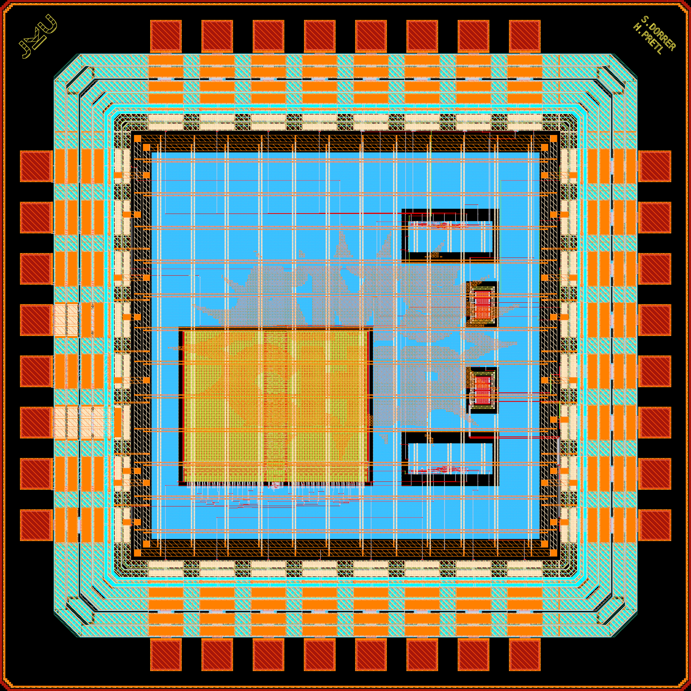
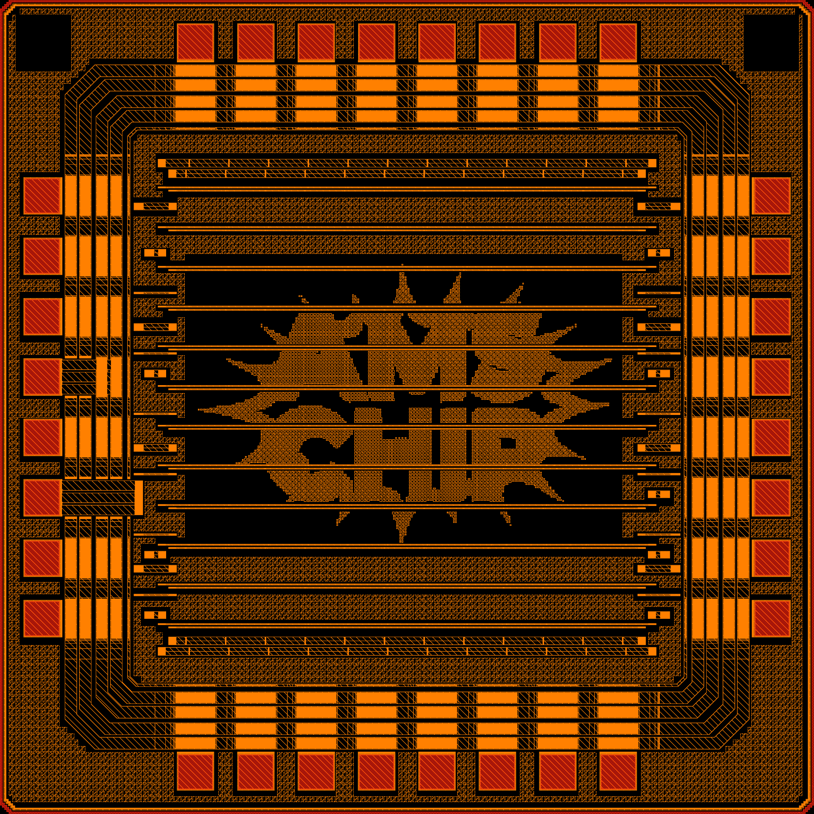
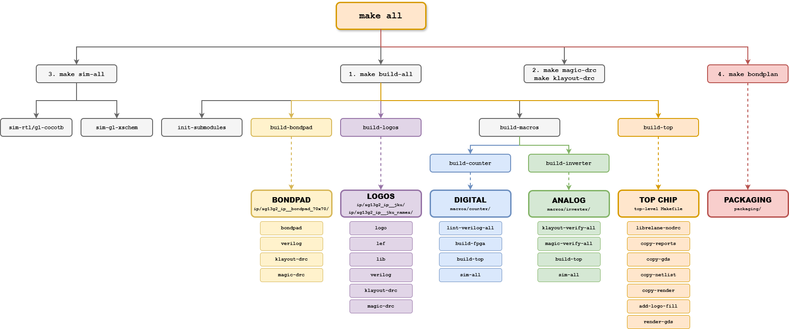

# An Open-Source Analog Mixed-Signal Chip Design Template & Tutorial for the ihp-sg13g2 Open-PDK

[](LICENSE)
[](https://github.com/iic-jku/ihp-sg13g2-ams-chip-template/actions/workflows/quarto-publish.yml)
[](https://github.com/iic-jku/ihp-sg13g2-ams-chip-template/actions/workflows/regression.yml)
[](https://github.com/iic-jku/ihp-sg13g2-ams-chip-template/actions/workflows/license-check.yml)
[](https://iic-jku.github.io/ihp-sg13g2-ams-chip-template/index.html)
[](https://doi.org/10.5281/zenodo.20129233)

(c) 2026 Simon Dorrer and Harald Pretl

Institute for Integrated Circuits and Quantum Computing, Johannes Kepler University (JKU), Linz, Austria

> [!IMPORTANT]
> This repository requires the [IIC-OSIC-TOOLS](https://github.com/iic-jku/IIC-OSIC-TOOLS) container with tag `2026.08` or later.

<p align="center">
  <a href="render/img/chip_top_black.png">
    
  </a>
  <br>
  <em>Chip render of the ihp-sg13g2 analog mixed-signal template chip (1.6 mm x 1.6 mm).</em>
</p>

<p align="center">
  <a href="render/img/chip_top_black_TM2.png">
    
  </a>
  <br>
  <em>Render of the TopMetal2 AMS Chip logo, generated with the tool ArtistIC.</em>
</p>


## Overview

Developing high-performance open-source silicon requires both the availability of tapeout-ready open-PDKs and robust, user-friendly EDA flows. While digital RTL-to-GDS flows offer an easy entry with documentation and examples, analog mixed-signal (AMS) design still suffers from a steep learning curve and the lack of examples and instructions. This repository provides a comprehensive template and tutorial for AMS chip design using the ihp-sg13g2 Open-PDK, guiding the designer from initial system-level specifications to the tapeout-ready chip.

This Makefile-driven repository simulates, builds, and fully verifies (DRC, LVS, PEX) a complete analog mixed-signal chip for the ihp-sg13g2 Open-PDK, including padframe generation, top-level assembly and bondplan generation. The flow uses:

- [**LibreLane**](https://github.com/librelane/librelane) for digital macro hardening, padframe generation, top-level assembly, filler and logo insertion
- [**Xschem**](https://github.com/StefanSchippers/xschem) for schematic entry
- [**Ngspice**](https://github.com/danchitnis/ngspice-sf-mirror), [**VACASK**](https://codeberg.org/arpadbuermen/VACASK) and [**CACE**](https://github.com/fossi-foundation/cace) for analog simulation
- [**KLayout**](https://github.com/KLayout/klayout) for viewing and routing of the layout
- [**Magic**](https://github.com/rtimothyedwards/magic) + [**Netgen**](https://github.com/rtimothyedwards/netgen) and [**KLayout**](https://github.com/KLayout/klayout) for DRC, LVS and PEX verification
- **SystemVerilog**, [**Verilator**](https://github.com/verilator/verilator), [**iverilog**](https://github.com/steveicarus/iverilog), [**cocotb**](https://github.com/cocotb/cocotb), [**GTKWave**](https://github.com/gtkwave/gtkwave) and [**Surfer**](https://gitlab.com/surfer-project/surfer) for linting and simulation of digital macros

The repository is the starting point for your own custom silicon and provides a universal design flow solution: Just clone the repo, enter the IIC-OSIC-TOOLS container, and run `make all` to get a tapeout-ready analog mixed-signal chip. Focus on your design and do not worry about the tools and the design flow!

Furthermore, it serves as a regression test for the above-mentioned open-source tools and their dependencies using the ihp-sg13g2 Open-PDK.


## Tutorial

A step-by-step tutorial, including additional exercises, can be found [here](https://iic-jku.github.io/ihp-sg13g2-ams-chip-template/index.html).

An overview of the open-source IC design landscape is presented [here](https://ic3.ie/resources/open-source-ic-design-day).

Are you interested in an open-source RFIC flow? Check it out [here](https://github.com/iic-jku/SG13CMOS_SPARX).


## Examples

Examples based on this template are:
- [TinyWhisper](https://github.com/iic-jku/TinyWhisper): An Open-Source Fully-Integrated Multi-Mode Short-Wave Transmitter for Amateur Radio Applications in 130-nm CMOS
- [SPARX](https://github.com/iic-jku/SG13CMOS_SPARX): An Open-Source, Automated, Programmatically Generated, Frequency-Scalable Six-Port Receiver in 130-nm CMOS
- [Multi-Project Chip](https://github.com/iic-jku/gf180mcu-jku-projects) for the wafer.space gf180mcuD MPW run


## Chip Documentation

A designer-oriented description of this chip can be found in [doc/](doc/):

- **[doc/specifications.md](doc/specifications.md)**: top-level specifications (technology, supplies, clock, macro inventory, functional behaviour).
- **[doc/pinout.md](doc/pinout.md)**: full 32-pad bondpad table per side, with the `chip_top` port and the role each pad carries inside `chip_core`.
- **[doc/floorplan.md](doc/floorplan.md)**: die / core geometry, hard-macro placement coordinates, PDN strategy and the floorplan diagram.


## Directory Structure

<details>
<summary>Show Directory Structure</summary>

```text
📁 ihp-sg13g2-ams-chip-template/
├─ 📁 .github/
│  └─ 📁 workflows/
│     ├─ license-check.yml
│     ├─ quarto-publish.yml
│     └─ regression.yml
├─ 📁 doc/
│  ├─ 📁 ihp-sg13g2-Open-PDK/
│  ├─ 📁 ihp-structure-proposals/
│  ├─ 📁 klayout/
│  ├─ 📁 librelane/
│  ├─ 📁 sizing/
│  ├─ 📁 verilog/
│  ├─ floorplan.md
│  ├─ pinout.md
│  ├─ README.md
│  └─ specifications.md
├─ 📁 flow/
│  ├─ 📁 artistic/
│  ├─ 📁 librelane/
│  │  ├─ chip_top.sdc
│  │  ├─ config.yaml
│  │  └─ pdn_cfg.tcl
│  └─ 📁 logo/
│     └─ chip_logo_mono.png
├─ 📁 ip/
│  ├─ 📁 sg13g2_io_custom/
│  ├─ 📁 sg13g2_ip__bondpad_70x70/
│  │  ├─ 📁 final/
│  │  ├─ 📁 script/
│  │  ├─ 📁 verification/
│  │  ├─ Makefile
│  │  └─ README.md
│  ├─ 📁 sg13g2_ip__jku/
│  │  ├─ 📁 final/
│  │  ├─ 📁 logo/
│  │  ├─ 📁 script/
│  │  ├─ 📁 verification/
│  │  ├─ Makefile
│  │  └─ README.md
│  └─ 📁 sg13g2_ip__jku_names/
│     ├─ 📁 final/
│     ├─ 📁 logo/
│     ├─ 📁 script/
│     ├─ 📁 verification/
│     ├─ Makefile
│     └─ README.md
├─ 📁 layout/
│  ├─ chip_top.gds.gz
│  └─ chip_top_logo_fill.gds.gz
├─ 📁 LICENSES/
│  ├─ Apache-2.0.txt
│  ├─ LicenseRef-EUROPRACTICE.txt
│  └─ SHL-2.1.txt
├─ 📁 macros/
│  ├─ 📁 counter/
│  │  ├─ 📁 final/
│  │  ├─ 📁 flow/
│  │  ├─ 📁 fpga/
│  │  ├─ 📁 netlist/
│  │  ├─ 📁 render/
│  │  ├─ 📁 rtl/
│  │  ├─ 📁 schematic/
│  │  ├─ 📁 scripts/
│  │  ├─ 📁 testbenches/
│  │  ├─ 📁 verification/
│  │  ├─ Makefile
│  │  └─ README.md
│  └─ 📁 inverter/
│     ├─ 📁 final/
│     ├─ 📁 layout/
│     │  ├─ 📁 klayout/
│     │  └─ 📁 magic/
│     ├─ 📁 netlist/
│     ├─ 📁 render/
│     ├─ 📁 schematic/
│     ├─ 📁 scripts/
│     ├─ 📁 testbenches/
│     ├─ 📁 verification/
│     ├─ Makefile
│     └─ README.md
├─ 📁 netlist/
│  ├─ 📁 layout/
│  ├─ 📁 nl/
│  ├─ 📁 pex/
│  ├─ 📁 pnl/
│  ├─ 📁 schematic/
│  └─ 📁 spice/
├─ 📁 packaging/
│  ├─ 📁 layout/
│  │  ├─ chip_top_bondplan.gds
│  │  ├─ chip_top_logo_TM2.gds.gz
│  │  ├─ EP_PACKAGES_08022018.gds
│  │  └─ OP_QFN32_A4_FIT.gds
│  ├─ 📁 render/
│  │  └─ chip_top_bondplan_{white,black}.{png,svg}
│  ├─ 📁 scripts/
│  │  └─ run_bondplan.py
│  ├─ config.yaml
│  ├─ README.md
│  └─ result.md
├─ 📁 release/
│  └─ 📁 v.1.0.0/
│     ├─ 📁 gds/
│     ├─ 📁 img/
│     └─ 📁 netlist/
├─ 📁 render/
│  ├─ 📁 blender/
│  └─ 📁 img/
├─ 📁 rtl/
│  ├─ chip_core.sv
│  └─ chip_top.sv
├─ 📁 schematic/
│  └─ 📁 xschem/
│     ├─ chip_top.sch
│     ├─ chip_top.sym
│     ├─ chip_top_pex.sym
│     └─ xschemrc
├─ 📁 scripts/
│  ├─ add_logo_fill.sh
│  ├─ add_rectangle.py
│  └─ check_pex_ports.py
├─ 📁 testbenches/
│  ├─ 📁 cocotb/
│  │  ├─ chip_top_tb.gtkw
│  │  ├─ chip_top_tb.py
│  │  └─ chip_top_tb.surf.ron
│  └─ 📁 xschem/
│     ├─ 📁 plot_simulations/
│     │  ├─ 📁 data/
│     │  ├─ 📁 figures/
│     │  ├─ ngspice2python.py
│     │  └─ plot_chip_top.py
│     ├─ chip_top_tb_tran.sch
│     └─ xschemrc
├─ 📁 tutorial/
│  ├─ 📁 fig/
│  ├─ _quarto.yml
│  ├─ index.qmd
│  ├─ Makefile
│  └─ requirements.txt
├─ 📁 verification/
│  ├─ 📁 drc/
│  ├─ 📁 lvs/
│  └─ 📁 reports/
│     ├─ antenna_summary.rpt
│     ├─ antenna_violations.rpt
│     ├─ irdrop.rpt
│     ├─ lvs.netgen.rpt
│     ├─ manufacturability.rpt
│     ├─ stapostpnr_*.rpt
│     ├─ stat.rpt
│     ├─ yosys_post_dff.rpt
│     ├─ yosys_pre_techmap.rpt
│     └─ yosys_synth_check.rpt
├─ CITATION.cff
├─ LICENSE
├─ Makefile
├─ README.md
├─ REUSE.toml
└─ ToDo.md
```

</details>


## Layout Folders

`layout/` means two different things in this repo, and which one it is follows from whether the cells inside are drawn or generated:

- Where cells are **drawn**, the sources sit in one folder per tool, [`macros/inverter/layout/klayout/`](macros/inverter/layout/klayout/) and [`macros/inverter/layout/magic/`](macros/inverter/layout/magic/), the same way schematics sit in `schematic/xschem/`. The analog macro is the only place with these. A cell is drawn in one of the two and the macro Makefile finds it in either, so the choice of tool stays inside the macro. The tools get a folder each because a Magic hierarchy also carries the device cells Magic generates for every placed device, which in a shared folder would bury the handful of files that are actually the design. See [Layout Sources and the Exported Tapeout GDS](macros/inverter/README.md#layout-sources-and-the-exported-tapeout-gds) in the macro README.
- Everywhere else `layout/` holds a **derived** GDS and stays flat, because GDS is the interchange format that every tool in the flow reads: the chip top-level [`layout/`](layout/) is filled from the last LibreLane run by `make copy-gds` and `make add-logo-fill`, and `make bondplan` writes its outputs into [`packaging/layout/`](packaging/layout/) beside the EUROPRACTICE package library it reads. `make clean` deletes the generated ones.

The same split decides where a new folder goes: a tool subfolder when the files are that tool's own working format, a plain folder when they are an interchange format or a result.


## Xschem Configuration

Xschem reads exactly one `xschemrc` at start-up, and that file decides which symbol libraries are visible and where netlists and simulation output are written. This template ships one per folder that holds schematics:

| `xschemrc` | Belongs to |
| --- | --- |
| [`schematic/xschem/xschemrc`](schematic/xschem/xschemrc) | chip top-level schematics |
| [`testbenches/xschem/xschemrc`](testbenches/xschem/xschemrc) | chip top-level testbenches |
| [`macros/inverter/schematic/xschem/xschemrc`](macros/inverter/schematic/xschem/xschemrc) | inverter schematics |
| [`macros/inverter/testbenches/xschem/xschemrc`](macros/inverter/testbenches/xschem/xschemrc) | inverter testbenches |
| [`macros/inverter/verification/cace/templates/xschemrc`](macros/inverter/verification/cace/templates/xschemrc) | CACE testbench templates |
| [`macros/counter/schematic/xschem/xschemrc`](macros/counter/schematic/xschem/xschemrc) | counter schematics |
| [`macros/counter/testbenches/xschem/xschemrc`](macros/counter/testbenches/xschem/xschemrc) | counter testbenches |


### What Every File Does

All of them run the same four steps, in this order:

1. **Pick the PDK.** `PDK_ROOT` is probed in the usual install locations if the environment does not set it, and `PDK` falls back to `ihp-sg13g2`. The container already exports `PDK_ROOT`, and [`.designinit`](.designinit) exports `PDK`, so this step is only a safety net for an Xschem started outside that environment.
2. **Source the PDK `xschemrc`.** `$PDK_ROOT/$PDK/libs.tech/xschem/xschemrc` brings in the IHP device symbols, the ngspice model paths and the IHP menu. It is guarded by `[info exists PDK]` so it is read once even when several project files are chained.
3. **Add the project library paths.** `append_xschem_library_path_unique` appends a folder to `XSCHEM_LIBRARY_PATH` only if it is not already there, so the same folder never appears twice no matter how the files are chained. [`testbenches/xschem/xschemrc`](testbenches/xschem/xschemrc) adds none of its own and gets its paths from the file it sources.
4. **Pin the netlist directory.** `pin_netlist_dir` decides where `xschem netlist` and the simulators write.

Both helper procedures are defined behind an `[info commands ...]` guard, so sourcing one file from another is harmless and the order does not matter.


### How the Files Are Chained

The chip top-level pulls in everything below it:

```text
testbenches/xschem/xschemrc
└─ source schematic/xschem/xschemrc
   ├─ source macros/inverter/schematic/xschem/xschemrc
   └─ source macros/counter/schematic/xschem/xschemrc

macros/inverter/verification/cace/templates/xschemrc
└─ source macros/inverter/schematic/xschem/xschemrc
```

Each schematic folder puts itself and its sibling testbenches folder on the library path, and each testbenches folder does the reverse. The chip top-level therefore sees all six schematic and testbench folders, which is what lets `chip_top.sch` instantiate `inverter_top.sym` and `counter_top.sym`, and what lets you open a macro testbench from a chip top-level session. The macro files do not source each other, so a macro can be opened and simulated on its own without the top level being present.


### Where Netlists and Simulation Output Go

`pin_netlist_dir` maps the folder of the schematic being netlisted to a `simulations/` folder:

| Schematic lives in | `netlist_dir` |
| --- | --- |
| `<x>/testbenches/xschem` | `<x>/testbenches/xschem/simulations` |
| `<x>/schematic/xschem` | `<x>/testbenches/xschem/simulations` |
| `.../cace/templates` | `.../cace/templates/simulations` |
| anywhere else (a PDK example) | left at the value the `xschemrc` pinned |

It runs twice: once while the `xschemrc` is read, using that file's own folder, and again through Xschem's `load_file_postprocess` hook for every schematic that is opened afterwards. The second call is the important one. Because the chip top-level puts the macro folders on the library path, a macro testbench can be opened from a chip top-level session, and without the hook its netlist would land in `testbenches/xschem/simulations/`. Its relative includes such as `.include ../../../netlist/pex/inverter_magic_pex_3.spice` are resolved by ngspice relative to the netlist file, so they would then point at the wrong tree and the simulation would abort. With the hook, the netlist always lands next to its own schematic and the includes resolve.

A `set netlist_dir` passed on the Xschem command line still wins, because `--command` runs after the file is loaded. The LVS netlist targets rely on this to write into `netlist/schematic/` instead.

All `simulations/` folders are generated and git-ignored.


### Which File Is Used

- The Makefile targets always name one explicitly with `--rcfile`, so a target behaves the same from any working directory.
- Inside the container, [`.designinit`](.designinit) wraps `xschem` so that a plain `xschem <file>` from anywhere uses `schematic/xschem/xschemrc`.
- Starting Xschem from within one of the seven folders picks up that folder's file, which is the normal interactive case.


## Makefile Structure

The whole flow is driven by Makefiles. The top-level `Makefile` builds the chip, and every component under [`macros/`](macros/) and [`ip/`](ip/) has its own `Makefile` and `README.md` following the same conventions (`make help`, `make all`, and so on). You can run each component from the top level or directly from inside its own folder. The figure below shows how the targets are connected when you run `make all` at the top level.

<p align="center">
  <a href="tutorial/fig/targets_overview/targets_overview.png">
    
  </a>
  <br>
  <em>Overview of the Makefile targets.</em>
</p>

Every coloured branch corresponds to one deliverable (top chip, bondpad, logos, digital macro, analog macro, packaging). The grey targets connect `make all` to those branches.

Solid arrows are direct `$(MAKE) <target>` calls within a single Makefile. Dashed arrows descend into a subdirectory, either as a recursive `$(MAKE) -C <dir> all` call into a sub-Makefile or as the Python bondplan flow in `packaging/`. The numbers on the second level give the execution order of `make all`, and the vertical order inside the coloured boxes gives the execution order of each sub-Makefile.

At the top level, `make all` runs four steps in this order:

1. `build-all` initialises the submodules and builds every component by calling its own `all` target: bondpad, logos, digital macro, analog macro, and finally the chip assembly with `build-top` (LibreLane, copy-back of all artifacts, logo and fill insertion, final GDS render).
2. `magic-drc` runs the DRC of the final `chip_top` and `chip_top_logo_fill` GDS. The KLayout DRC is not part of `make all` to shorten the runtime. Run it separately with `klayout-drc-minimum` or `klayout-drc-regular`.
3. `sim-all` runs the top-level RTL and gate-level simulations on the netlists produced by this build.
4. `bondplan` generates the bonding diagram, the bondwires, and the pin table.

Every component follows the same principle. The simulations always run last, so they use the artifacts that the same invocation has just produced.

| Makefile | `all` flow |
| --- | --- |
| [`macros/counter/`](macros/counter/) (digital) | lint -> build (FPGA and LibreLane, including the XSPICE model) -> extract (PEX of the hardened GDS) -> simulate. DRC and LVS run inside the LibreLane flow. |
| [`macros/inverter/`](macros/inverter/) (analog) | verify (DRC, LVS, PEX) -> build (LEF, LIB, Verilog stub, GDS, render) -> simulate |
| [`ip/*`](ip/) (bondpad, logos) | build -> verify (DRC) |
| top level | build -> verify (DRC) -> simulate -> package |

The following sections describe the top-level targets in detail. The macro and IP targets are documented in the `README.md` of the respective subfolder.


## Makefile Targets

### Show Available Targets

The default Make target is `help`, so running `make` prints usage and all available targets with short descriptions.

```sh
make
make help
```


### Open the Design Files

Opens a file browser for this folder with `sak-open.py` from the [IIC-OSIC-TOOLS](https://github.com/iic-jku/IIC-OSIC-TOOLS), one button per design file, grouped by directory:

```sh
make open
```

Clicking a button launches the matching tool in the file's own directory, so Xschem finds its `simulations/` folder and KLayout its run outputs where they belong:

| File type | Tool |
| --- | --- |
| `.sch`, `.sym` | Xschem |
| `.gds`, `.gds.gz`, `.oas`, `.oas.gz` | KLayout in edit mode |
| `.mag` | Magic |
| `.vcd`, `.fst`, `.gtkw` | GTKWave |
| `.raw` | gaw (ngspice rawfile) |
| `.png`, `.pdf` | the desktop's handler (`xdg-open`) |
| `.sv`, `.svh`, `.v`, `.vh`, `.vhd`, `.vhdl`, `.spice`, `.cir`, `.sp`, `.cdl`, `.sdc`, `.lef`, `.lib`, `.tcl`, `.mk`, `.yaml`, `.json`, `.py`, `.qmd`, `.tex`, `.md` and `Makefile` | gvim |

Only these types get a button. Files with any other extension (`.sh`, `.svg`, `.pcf`, `.save`, `.rpt`, `.txt`, `.csv` and so on) are not listed.

Schematics and symbols that belong to one design unit share a single tabbed Xschem instance instead of one process per click. The unit is the nearest ancestor holding a `Makefile`, so each macro and the top level get their own instance. Every tab then writes its netlists to the folder that macro's `xschemrc` pins, see [Xschem Configuration](#xschem-configuration).

The tree is rescanned every 15 s, so files a running flow produces appear on their own and are highlighted for a minute. Generated directories are skipped by default: `runs/`, `sim_build/`, `obj_dir/`, `simulations/`, `__pycache__/`, `_freeze/` and `.git/`. The Xschem `simulations/` folder is one of them, so the `.raw` files show up only with `--all`. Pass extra options with `OPEN_ARGS`:

```sh
make open OPEN_ARGS=--all              # include the build outputs
make open OPEN_ARGS="--prune backups"  # skip one more directory name
```

At most 400 buttons are drawn at once, because each one is an X window, and what is left out is stated at the end of the list. That cap is easy to hit with `--all`: it pulls in roughly 19000 files at the top level and 5700 in the counter, against 66 in the inverter. Use `--all` from the folder you actually care about, or narrow it with `--prune`, rather than at the top level.

> [!NOTE]
> This target needs a display. Run it inside the container's VNC/noVNC desktop or over X11 forwarding. In a shell-only container it stops with `cannot open a window`. The `.png` and `.pdf` buttons hand the file to the desktop's registered handler, so those two need the full VNC/noVNC session and do not work over a bare X forward.


### Initialise Git Submodules

Initialises and updates the repository submodules (for example [ArtistIC](https://github.com/pulp-platform/artistic)):

```sh
make init-submodules
```

Run this after cloning the repository, or whenever submodule pointers are updated.


### Simulation

We use [cocotb](https://www.cocotb.org/), a Python-based testbench environment, for the verification of the chip.
The underlying simulator is [Icarus Verilog](https://github.com/steveicarus/iverilog).

The simulation targets accept an optional `CELL` variable (default: `chip_top`).
The testbench is located in `testbenches/cocotb/chip_top_tb.py`. To run the RTL simulation, use:

```sh
make sim-rtl-cocotb
```

To run the gate-level (GL) simulation with cocotb, use:

```sh
make sim-gl-cocotb
```

To run the gate-level simulation with Xschem, use:

```sh
make sim-gl-xschem
make sim-gl-xschem TB=<testbenchname>
```

The testbench is selected with the `TB` variable, given without the `.sch` extension (default: `<CELL>_tb_tran`). All testbench schematics are located in `testbenches/xschem/`, and the generated netlists are written to `testbenches/xschem/simulations/`.

Every testbench pulls in a FET `.save` file through its `SAVE` code block (for example `.include chip_top_tb_tran.save`). That file lists the operating-point parameters of every transistor (`ids`, `gm`, `gds`, `vth` and so on), which the `annotate_fet_params` symbols and the `Annotate OP` launcher read back from the raw file. The include uses the bare file name, so it resolves inside `testbenches/xschem/simulations/`, where ngspice runs. Both `sim-gl-xschem` and the schematic's `Simulate` launcher write the file on every run, so it always matches the devices currently in the schematic and a fresh clone needs no manual export. Xschem's **IHP > Create FET .save file** menu entry writes the same file by hand.

The simulation runs in **batch mode**: the target netlists the testbench with `xschem netlist` and then invokes `ngspice -b` directly instead of using `xschem simulate`. `xschem simulate` would spawn an interactive ngspice in a terminal detached from `make`: the target would return immediately, the result would never be checked, and the process (with its X server) would leak. Running the simulator directly makes `make` block until the run finishes and see its exit status.

Because the run is headless, the `plot` commands in a testbench's `.control` block are a no-op and no plot windows appear. Every testbench instead exports its results with `wrdata` to `testbenches/xschem/plot_simulations/data/`, from where they are plotted with `sim-view-xschem`.

> [!NOTE]
> `sim-gl-xschem` is part of `sim-all`, but it may take a long time depending on the hardware used.

To plot the Xschem simulation results, use `sim-view-xschem`. It runs a plotting script from `testbenches/xschem/plot_simulations/` (`SIM_PLOT_DIR`), selected with the `SCRIPT` variable, given without the `.py` extension (default: `plot_<CELL>`), and reproduces the plots of the testbench's `.control` block with matplotlib from the exported data in `plot_simulations/data/`:

```sh
make sim-view-xschem                      # run the default plotting script (plot_chip_top)
make sim-view-xschem SCRIPT=<scriptname>  # run another plotting script
```

The target runs `SHOW_PLOTS=1 python3 testbenches/xschem/plot_simulations/$(SCRIPT).py`. Every script writes its figures to `testbenches/xschem/plot_simulations/figures/`. Run through `sim-view-xschem`, the script additionally opens the plot windows when a display is available (e.g. the container's X/VNC session). Headless, only the figures are written.

> [!NOTE]
> `sim-view-xschem` is intentionally **not** called by `sim-all`.
> It opens the generated Python figures, which blocks the shell until the window is closed.
> It is designed for interactive use and must be called manually after the simulation has completed.

The cocotb simulations generate a waveform file under `testbenches/cocotb/sim_build/chip_top.fst`.
You can view it with a waveform viewer such as [GTKWave](https://gtkwave.github.io/gtkwave/) or [Surfer](https://surfer-project.org/).
The waveform viewer can be changed with `WAVEFORM_VIEWER=<gtkwave|surfer>` (default: `gtkwave`).

```sh
make sim-view-cocotb                                          # view chip_top waveform with GTKWave (default)
make sim-view-cocotb WAVEFORM_VIEWER=surfer                   # use Surfer instead
```

Each cocotb simulation folder contains a pre-configured waveform layout file (`<CELL>_tb.gtkw` for GTKWave, `<CELL>_tb.surf.ron` for Surfer).
The view target loads it automatically together with the current `.fst`, so signal formatting is preserved across runs.

To run all non-interactive simulation targets in sequence (RTL cocotb, GL cocotb and GL Xschem), use:

```sh
make sim-all
```

> [!NOTE]
> `sim-view-cocotb` is intentionally **not** called by `sim-all`.
> It opens a waveform viewer GUI (GTKWave or Surfer), which blocks the shell until the window is closed.
> It is designed for interactive use and must be called manually after the simulation has completed.

> [!NOTE]
> `sim-view-xschem` is intentionally **not** called by `sim-all` either. Run it manually with
> `make sim-view-xschem SCRIPT=plot_chip_top` after the simulation has completed.


### LibreLane Flow

Run the LibreLane flow with:

```sh
make librelane
```

Additional targets are available for different DRC configurations:

- `make librelane-nodrc` – run LibreLane without DRC checks
- `make librelane-magicdrc` – run LibreLane with only Magic DRC checks
- `make librelane-klayoutdrc` – run LibreLane with only KLayout DRC checks

These targets are also available for the digital macros. After the LibreLane flow completes successfully, the generated views are saved under `flow/final/`.


### View the Design

After completion, you can view the design using the OpenROAD GUI:

```sh
make librelane-openroad
```

Or using KLayout:

```sh
make librelane-klayout
```

These commands are also available for the digital macros.


### Copy Important Reports

To copy the Yosys synthesis checks, antenna reports, post-PnR timing summary, per-corner power reports, IR-drop report, LVS report, and manufacturability report from the latest LibreLane run into `verification/reports/`, run:

```sh
make copy-reports
```

This only works if the latest run completed without errors. This command is also available for the digital macros.

> [!NOTE]
> The Magic and KLayout DRC reports are temporarily not copied because IHP's
> `metal1_pin_offgrid` rule trips on the pad ring (see [IHP-Open-PDK#683](https://github.com/IHP-GmbH/IHP-Open-PDK/issues/683#issuecomment-4065791975)).
> Once it is fixed upstream, the corresponding `cp` lines in `Makefile :: copy-reports` will be re-enabled.


### Copy the Final GDS

To copy and compress the latest GDS from `flow/final/gds/` into `layout/`, run:

```sh
make copy-gds
```


### Copy the Final Netlist

To copy the latest SPICE, PnL, and NL netlists from `flow/final/spice/` into `netlist/spice/`, from `flow/final/pnl/` into `netlist/pnl/`, and from `flow/final/nl/` into `netlist/nl/`, run:

```sh
make copy-netlist
```

This only works if the latest run completed without errors.


### Copy the Final Render

To copy the latest LibreLane chip render from `flow/final/render/` into `render/img/`, run:

```sh
make copy-render
```

This creates `render/img/chip_top_librelane.png`. This only works if the latest run completed without errors.


### Render Top Layout

Renders the final top-level GDS `layout/chip_top_logo_fill.gds.gz` (with logo and filler) with `sak-render.py` from the [IIC-OSIC-TOOLS](https://github.com/iic-jku/IIC-OSIC-TOOLS):

```sh
make render-gds
```

Three images are written to the `render/img/` folder:

- `chip_top_white.png` and `chip_top_black.png`: all physical mask layers, on a white and on a black background.
- `chip_top_black_TM2.png`: only `TopMetal2`, `TopVia2`, the `TopMetal2` filler and `Passiv` on a black background, which shows the chip logo and the padframe.

All three images are 2048 px wide and rendered with 4x oversampling. `sak-render.py` reads the layer colours from the PDK's own KLayout layer properties and crops to the drawn geometry, so the images have no border margin.

This only works if the latest run completed without errors. This command is also available for the digital macros.


### Build Bondpad

To build the bondpad in the `ip` folder, run the following command:

```sh
make build-bondpad
```


### Build Logos

To build the logos in the `ip` folder, run the following command:

```sh
make build-logos
```


### Build Macros

To build a specific macro, run the corresponding target from the `Makefile`. To build all currently enabled macros, run:

```sh
make build-macros
```

#### Build Digital Macros

The following command builds the `counter` digital macro:

```sh
make build-counter
```

For each digital macro this dispatches to its in-tree `make all`, which runs the macro's full flow: lint, build (FPGA and LibreLane, including netlists and the XSPICE model), verify (DRC and LVS within the LibreLane flow), extract (`magic-pex` on the hardened GDS) and simulate. The simulations run after the build, so the gate-level simulations run on the netlists produced by this build.

The FPGA part of that build emulates the macro on a board. It covers three boards across two FPGA architectures (Lattice iCE40 and Lattice ECP5), selected with `BOARD=`, and defaults to the pico-ice. See [macros/counter/fpga/README.md](macros/counter/fpga/README.md) for the board list, the toolchain notes, and how to add a further one.

> [!TIP]
> Each macro has its own `Makefile` and `README.md` with additional targets, such as linting, simulation, and verification.
> For example, to lint the counter or run its simulation, refer to [macros/counter/README.md](macros/counter/README.md).

#### Build Analog Macros

Each analog macro has its own `klayout-verify` and `magic-verify` targets that run DRC, LVS, and PEX for the top-level cell.

To build the inverter macro:

```sh
make build-inverter
```

For each analog macro this dispatches to its in-tree `make all`, which runs the macro's full flow: verify (DRC, LVS, PEX), build, and simulate. The simulations run after the verification, so the top-level testbench includes the PEX netlist produced by this run.

All analog macros are included in `build-macros` alongside the digital macros.


### Build Top

To run LibreLane for the top-level chip and copy the resulting reports, GDS, netlist, and chip render back into the source tree, then add the logo + fill structures and render the final GDS, run:

```sh
make build-top
```

Internally this executes (in order): `librelane-nodrc` -> `copy-reports` -> `copy-gds` -> `copy-netlist` -> `copy-render` -> `add-logo-fill` -> `render-gds`.

> [!NOTE]
> `build-top` runs `librelane-nodrc` instead of `librelane` for the same reason the DRC reports are not copied: IHP's `metal1_pin_offgrid` rule trips on the pad ring (see [IHP-Open-PDK#683](https://github.com/IHP-GmbH/IHP-Open-PDK/issues/683#issuecomment-4065791975)).
> Once it is fixed upstream, `Makefile :: build-top` switches back to `librelane`.


### Build All

To initialise submodules, build the bondpad, build the logos, build the macros, and run the full `build-top` flow, run:

```sh
make build-all
```

This is useful if you want to rebuild the chip from scratch. Clone the repository, enter the IIC-OSIC-TOOLS environment, and run `make build-all`.


### Add Logo and Fill

To add the chip logo (PNG -> GDS) and the fill structures on top of the LibreLane output (so the final GDS in `layout/` includes the artwork), run:

```sh
make add-logo-fill
```

This calls `scripts/add_logo_fill.sh` and writes `layout/chip_top_logo_fill.gds.gz`. The step is also called from `make build-top`.

> [!NOTE]
> In the future, it is planned to replace this script and Makefile target with a custom LibreLane step.


### Design Rule Check (DRC)

Runs DRC on the GDS layout in `layout/`. Both flows use `sak-drc.sh` and write their reports into per-cell run folders: `verification/drc/<CELL>.magic.drc/` (Magic) and `verification/drc/<CELL>.klayout.drc/` (KLayout, `.lyrdb`). The run folders are wiped at the start of each run, so they always reflect the latest run only.

The `DRC_LEVEL` parameter selects the KLayout DRC level (`sak-drc.sh -l`). It is ignored by `magic-drc`, since Magic has no selectable rule decks and always runs the full rule set compiled into the PDK's Magic tech file:

- `precheck` = core FEOL + BEOL manufacturing rules only (fast iteration)
- `macro` = block-in-isolation sign-off: `precheck` plus off-grid, zero-area, and pin/label checks (default)
- `regular` = full-chip sign-off: all checks, including density and antenna

| Check | `precheck` | `macro` _(default)_ | `regular` |
| --- | :---: | :---: | :---: |
| FEOL + BEOL core rules | ✓ | ✓ | ✓ |
| Off-grid / angle | – | ✓ | ✓ |
| Zero-area / geometry | – | ✓ | ✓ |
| Pin / label | – | ✓ | ✓ |
| Recommended / extra rules | – | – | ✓ |
| Density (full-chip fill) | – | – | ✓ |
| Antenna | – | – | ✓ |

**KLayout DRC (minimum)** runs a pre-check (`precheck`) KLayout DRC on the final top-level layout with logo and fill structures:

```sh
make klayout-drc-minimum
```

**KLayout DRC (regular)** runs a full (`regular`) KLayout DRC on the final top-level layout with logo and fill structures:

```sh
make klayout-drc-regular
```

**KLayout DRC** runs a KLayout DRC at the selected `DRC_LEVEL`:

```sh
make klayout-drc
make klayout-drc CELL=chip_top
make klayout-drc CELL=chip_top DRC_LEVEL=regular
```

**Magic DRC** runs a Magic DRC with all subcells flattened (`sak-drc.sh -f "*"`):

```sh
make magic-drc
make magic-drc CELL=chip_top
```


### Export Schematic Netlist for LVS

Exports the schematic netlist for LVS from Xschem and places it in `netlist/schematic/`.

The `EV_PRECISION` parameter sets the number of significant digits used by Xschem's `ev` function when calculating device properties (default: 5). Increase this to avoid LVS mismatches caused by floating-point rounding differences between Xschem and KLayout (see [xschem#465](https://github.com/StefanSchippers/xschem/issues/465)).

The `ntap` and `ptap` substrate contacts are ignored during LVS in both flows. `sak-lvs.sh` runs KLayout LVS with the `--disable_tap_extraction` option so it does not extract `ntap` and `ptap` devices from the layout (matching Magic + Netgen LVS).

KLayout uses CDL netlists, while Magic uses SPICE netlists. Accordingly, `klayout-lvs-netlist` uses the Xschem commands `set spiceprefix 1`, `set lvs_netlist 1`, `set top_is_subckt 1`, and `set lvs_ignore 1`, while `magic-lvs-netlist` uses `set spiceprefix 1`, `set lvs_netlist 0`, `set top_is_subckt 1`, and `set lvs_ignore 1`. Hence, switching between CDL and SPICE netlists can be done with `lvs_netlist`.

To extract a CDL schematic netlist for KLayout LVS, use:
```sh
make klayout-lvs-netlist
make klayout-lvs-netlist CELL=chip_top
make klayout-lvs-netlist EV_PRECISION=5
```

To extract a SPICE schematic netlist for Magic + Netgen LVS, use:
```sh
make magic-lvs-netlist
make magic-lvs-netlist CELL=chip_top
make magic-lvs-netlist EV_PRECISION=5
```


### Layout Versus Schematic (LVS)

Exports the schematic netlist from Xschem, then runs LVS. Compares the GDS layout in `layout/` against the schematic netlist in `netlist/schematic/`. Both flows use `sak-lvs.sh` and write their reports into per-cell run folders: `verification/lvs/<CELL>.magic.lvs/` (Magic + Netgen) and `verification/lvs/<CELL>.klayout.lvs/` (KLayout, `.lvsdb`). The run folders are wiped at the start of each run, so they always reflect the latest run only. The extracted layout netlist is moved to `netlist/layout/`.

**KLayout LVS** uses `sak-lvs.sh` (KLayout mode `-k`), which wraps `run_lvs.py` from the IHP Open-PDK:

```sh
make klayout-lvs
make klayout-lvs CELL=chip_top
```

**Magic + Netgen LVS** uses `sak-lvs.sh` (Magic + Netgen mode `-m`, the default), which extracts the layout netlist with Magic and compares it against the schematic netlist with Netgen, using the Netgen setup from the IHP Open-PDK:

```sh
make magic-lvs
make magic-lvs CELL=chip_top
```


### Build Xschem PEX Symbol

Builds the Xschem symbol the PEX flow needs, `schematic/xschem/<CELL>_pex.sym`, from the regular cell symbol `schematic/xschem/<CELL>.sym`:

```sh
make symbol-pex                  # build chip_top_pex.sym from chip_top.sym
make symbol-pex CELL=<cellname>  # build the PEX symbol of another cell
```

The generated symbol is a copy of `<CELL>.sym` with two changes: `type=subcircuit` becomes `type=primitive`, and the pin boxes the extracted netlist has no port for are dropped. Everything else (the remaining pin boxes and their order, every text label, `format`, `spectre_format`, `template`, graphics) is inherited, which is exactly what the PEX flow needs:

- **`type=primitive`** stops Xschem from descending into a schematic of the same name. There is no `<CELL>_pex.sch`, so the instance line is emitted as it stands and the subcircuit comes from the `.include`d PEX netlist instead.
- **`format="@name @pinlist @symname"`** makes the instance reference `@symname`, which resolves to `<CELL>_pex`, exactly the `.subckt` name the PEX flow writes.
- **The pin order** is what `sak-pin-reorder.py` reorders the extracted netlist to, so it has to be that of the cell symbol.

`PEX_MERGED_PINS` (default `IOVSS`) names the supply pins that the extraction does not report as ports of their own. `IOVSS` and `VSS` are separate nets in [chip_top.sv](rtl/chip_top.sv), in the LibreLane netlist `netlist/spice/chip_top.spice` and in the pin labels of the GDS, but both ground rings tap the p-substrate, so the flat Magic extraction sees one ground node and names it `VSS`. The extracted `.subckt` has no `IOVSS` port, and a PEX symbol that still carried the pin would fail the reorder with `[ERROR] Pin count mismatch`. Set the variable to an empty string for a cell whose supplies do stay separate: `make magic-pex PEX_MERGED_PINS=`.

[`scripts/prune_pex_symbol.py`](scripts/prune_pex_symbol.py) drops those pins and, for the same reason, every repeat of a pin name after the first: a `.subckt` port list holds one entry per net, so pads that share a supply share a port. Only the pin boxes go and every text label stays, so `<CELL>_pex.sym` still reads as the full pad ring while carrying exactly the pins the netlist has a port for.

`symbol-pex` runs automatically at the start of `klayout-pex` and `magic-pex`, so the symbol is rebuilt from the current `<CELL>.sym` before every extraction and cannot go stale when a pin is added, removed or renamed. Calling it by hand is only needed to refresh the symbol without re-running an extraction. Anything added to the generated file by hand is lost at the next extraction, so make the change in `<CELL>.sym` instead.

If `<CELL>.sym` does not exist, the target prints a note and does nothing, which leaves the PEX targets running without a pin reorder just as before. It fails only when `<CELL>.sym` declares neither `type=subcircuit` nor `type=primitive`.

The cell symbol `<CELL>.sym` that this one is derived from is a hand-drawn source file at the chip top-level, because its pins are the pad ring and their placement is part of the drawing. The digital macro has two further targets for its own cell symbol, `symbol-gl` to scaffold one from the ports of a freshly hardened design and `symbol-check` to verify it on every build, see [Build the Xschem Symbol](macros/counter/README.md#build-the-xschem-symbol). They are macro targets only: they key on the `sim_pinname` property that the gate-level XSPICE flow needs, and `chip_top.sym` neither carries it nor has an XSPICE model to match.

> [!NOTE]
> Every symbol in this project also carries `spectre_format="@name ( @pinlist ) @symname"`. Xschem writes that line itself whenever a symbol is built from a schematic's pin list (key `a`, `make_sym.awk`), and it is read **only** by the Spectre netlister, which is also the one that drives VACASK (`xschem.tcl` configures `vacask "$N"` as the default simulator for `netlist_type spectre`). The SPICE netlister used for ngspice ignores it, so it has no effect on any target in this Makefile.
> Do not strip it: without it, instances of the symbol are **silently dropped** from a Spectre/VACASK netlist and the `subckt` line of the symbol itself comes out with an empty port list, with no warning at all.


### Check the Cell Symbol Against the Layout Netlist

Compares the pins of `schematic/xschem/<CELL>.sym` with the ports of the layout SPICE netlist `netlist/spice/<CELL>.spice` that LibreLane writes from the RTL:

```sh
make check-ports                  # check chip_top.sym against netlist/spice/chip_top.spice
make check-ports CELL=<cellname>  # check the symbol of another cell
```

The layout netlist is generated from the port list of [chip_top.sv](rtl/chip_top.sv), so it is the authoritative pin list of the chip, while `chip_top.sym` is hand-drawn. [`scripts/check_top_ports.py`](scripts/check_top_ports.py) reports two kinds of drift and fails the target on either of them:

- A netlist port with no symbol pin, for example a pad added in the RTL that never reached the drawing.
- A symbol pin with no netlist port, for example a pin whose name drifted apart from the RTL.

A pin name carried by several pads is reported and not rejected, since those pads are one net and therefore one port.

A 1-bit bus is reconciled first: Yosys flattens `input_PAD [0:0]` to the scalar `input_PAD`, which matches the symbol pin `input_PAD[0]`.

`check-ports` runs automatically after `symbol-pex` in `klayout-pex` and `magic-pex`, so the drift fails the build there instead of surfacing later as a pin count mismatch in the reorder. For a cell without a layout netlist the check prints a note and passes, which leaves the PEX targets for subcells running as before.


### Parasitic Extraction (PEX)

Runs parasitic extraction on the GDS layout in `layout/`. The extracted SPICE netlist is written to `netlist/pex/`.

The extracted SPICE filenames include the selected extraction mode:
- `klayout-pex` writes `netlist/pex/<CELL>_klayout_pex_<EXT_MODE>.spice`
- `magic-pex` writes `netlist/pex/<CELL>_magic_pex_<EXT_MODE>.spice`

The `EXT_MODE` parameter selects the extraction mode:
- `1` = C-decoupled (default)
- `2` = C-coupled
- `3` = full-RC

> [!NOTE]
> For `klayout-pex`, `EXT_MODE=1` (C-decoupled) is not yet supported by kpex and automatically falls back to `EXT_MODE=2` (C-coupled) with a warning.

The `.subckt` name in the extracted SPICE file is `<CELL>_pex`: `magic-pex` sets it directly via the `sak-pex.sh` option `-n <CELL>_pex`, while for `klayout-pex` it is automatically renamed from `<CELL>` (kpex).

Both targets start by running `symbol-pex` (see above), so `schematic/xschem/<CELL>_pex.sym` always reflects the current cell symbol. The `.subckt` pin order in the extracted SPICE file is then reordered with `sak-pin-reorder.py` (installed in the IIC-OSIC-TOOLS container) to match that symbol's pin positions. This ensures the PEX netlist can be used directly with the corresponding Xschem symbol for simulation regardless of the selected `EXT_MODE`.

Both targets finish by running [`scripts/check_pex_ports.py`](scripts/check_pex_ports.py) on the netlist they just wrote. It verifies that every pin of the `.subckt` really reaches the circuit, and fails the target otherwise. Two cases are caught:

- A port that is declared in the `.subckt` line but referenced by no element at all. Whatever is wired to that pin from outside is then left floating.
- A port whose net was split into `<port>.t<n>` and `<port>.n<n>` fragments by `extresist` (`EXT_MODE=3`), where none of the fragments is connected back to the port. The pin is then dangling even though the fragments themselves are wired up.

Both produce a netlist that ngspice reads without a single warning while the cell behaves completely differently in simulation, so the check is worth the two seconds it costs. It can also be run by hand on any SPICE netlist:

```sh
python3 scripts/check_pex_ports.py netlist/pex/chip_top_magic_pex_1.spice
python3 scripts/check_pex_ports.py -v netlist/pex/*.spice     # -v also prints the size of each subcircuit
```

**KLayout PEX** currently uses `kpex` with the Magic extraction engine (the 2.5D engine is work in progress):

```sh
make klayout-pex
make klayout-pex CELL=chip_top
make klayout-pex CELL=chip_top EXT_MODE=3
```

**Magic PEX** uses `sak-pex.sh`, which extracts the parasitics with Magic (C-decoupled, C-coupled, or full-RC):

```sh
make magic-pex
make magic-pex CELL=chip_top
make magic-pex CELL=chip_top EXT_MODE=3
```

For full-RC extraction (`EXT_MODE=3`), `magic-pex` additionally exposes the three `extresist` tuning parameters of `sak-pex.sh`. They are ignored in `EXT_MODE=1`/`2`.

A full-RC extraction of a whole chip would produce a resistor network far too large to simulate, and most of it would be wires so short that their resistance does not matter. The three parameters are the filters Magic applies to keep only the part of the network that is worth having. They run in this order:

1. **`THRESHOLD`** (`-t`, in mOhm, default `10000` = 10 Ohm) decides **which nets are extracted at all**. Before doing any real work, Magic makes a quick end-to-end resistance guess for every net. The guess is deliberately pessimistic: it is an absolute worst case. Nets that stay below `THRESHOLD` even in that worst case cannot matter, so they are treated as ideal wires and skipped. This is the cheap first pass that removes the many short, low-resistance nets.
2. **`MINDELAY`** (`-y`, in ps, default `1`) decides **which of the extracted nets are kept**. Because the guess above overestimates, Magic re-checks each net once it has been properly extracted and discards its resistor network again if the RC delay it adds stays below `MINDELAY`. Setting `MINDELAY=0` switches the delay criterion off and applies `THRESHOLD` a second time instead, now against the accurately extracted resistance rather than the initial guess.
3. **`MINRES`** (`-r`, in mOhm, default `1000` = 1 Ohm) decides **how detailed the kept networks are**. Inside a net, neighbouring resistors below `MINRES` are merged as far as possible, which shrinks the network without changing its overall resistance much.

In short: `THRESHOLD` and `MINDELAY` control *how many* nets carry parasitic resistance, while `MINRES` controls *how finely* each of them is modelled. Raising all three gives a smaller netlist that simulates faster with less detail. Lowering them gives a more accurate but considerably larger one.

```sh
make magic-pex CELL=chip_top EXT_MODE=3 THRESHOLD=5000 MINRES=500 MINDELAY=2
```


### Verify a Specific Cell

Runs DRC, LVS, and PEX for a specific cell (e.g. `chip_top`):

```sh
make klayout-verify CELL=chip_top
make magic-verify CELL=chip_top
```


### Verify Top Cell

Runs DRC, LVS, and PEX for the top cell:

```sh
make klayout-verify
make magic-verify
```


### Packaging (Bondplan Generation)

Generates the bondplan fully automatically: the die placed in the package cavity, all bondwires, a pin table, and the filled EUROPRACTICE title block. Inputs are the final chip GDS (`layout/chip_top_logo_fill.gds.gz`) and the EUROPRACTICE package library, from which the QFN32 drawing sheet is extracted:

```sh
make bondplan                        # uses the default VERSION (1.0.0)
make bondplan VERSION=2.1.0          # stamp another version on the sheet
```

The `VERSION` variable is passed to the flow and printed in the title block (`DIE: CHIP_TOP - V.1.0.0`), so the version number is maintained in the Makefile only.

The flow ([packaging/scripts/run_bondplan.py](packaging/scripts/run_bondplan.py)) is driven by [packaging/config.yaml](packaging/config.yaml), which holds the full package-pin-to-die-pad `PINOUT` in a LibreLane-style config format. It detects the die bondpads (`Passiv` openings and `TopMetal2.text` labels), places the die in the package cavity, draws the bondwires, and checks wire lengths, crossings, spacing, lead skew and analog guard clearances. Outputs:

- `packaging/layout/chip_top_bondplan.gds`: the bondplan GDS
- [packaging/result.md](packaging/result.md): bond report with summary and bond table
- `packaging/render/chip_top_bondplan_{white,black}.{png,svg}`: bonding diagram images

See [packaging/README.md](packaging/README.md) for the full flow documentation and configuration reference.

<p align="center">
  <a href="packaging/render/chip_top_bondplan_white.png">
    
  </a>
  <br>
  <em>Bonding diagram of the ihp-sg13g2 AMS template chip in a QFN32 package.</em>
</p>


### Build, Verify and Simulate All

Runs `build-all` first, followed by Magic DRC for both `chip_top` and `chip_top_logo_fill`, then the chip simulations (`sim-all`) and finally generates the bondplan (`bondplan`) once all checks have passed:

```sh
make all
```


### Release

Copies the final top-level GDS with logo and fill structures from `layout/` to `release/v.<VERSION>/gds/`, copies the generated netlists into `release/v.<VERSION>/netlist/`, and copies the chip renders and the bonding diagram into `release/v.<VERSION>/img/`.

The following netlist folders are exported:

- `netlist/schematic` -> `release/v.<VERSION>/netlist/schematic`
- `netlist/layout` -> `release/v.<VERSION>/netlist/layout`
- `netlist/pnl` -> `release/v.<VERSION>/netlist/pnl`
- `netlist/spice` -> `release/v.<VERSION>/netlist/spice`

> [!NOTE]
> `netlist/pex` is **not** copied by the `release` target. It holds the Magic-extracted top-level netlist (`chip_top_magic_pex_1.spice`, ~73 MB and ~566k lines even in the C-decoupled `EXT_MODE=1`). Since `release/` is committed to the repository, copying it would add those ~73 MB to every released version. The netlist stays available in `netlist/pex/`.

> [!NOTE]
> `netlist/schematic` and `netlist/layout` are still empty. The schematic netlist is written by `klayout-lvs-netlist` / `magic-lvs-netlist` and the extracted layout netlist by `klayout-lvs` / `magic-lvs`, and the top-level LVS is not finished yet. Both folders fill up once it runs through.

The following chip renders are exported:

- `render/img/chip_top_black.png` -> `release/v.<VERSION>/img/chip_top_black.png`
- `render/img/chip_top_white.png` -> `release/v.<VERSION>/img/chip_top_white.png`
- `render/img/chip_top_black_TM2.png` -> `release/v.<VERSION>/img/chip_top_black_TM2.png`
- `render/img/chip_top_librelane.png` -> `release/v.<VERSION>/img/chip_top_librelane.png`

The bonding diagram is exported as well (see `make bondplan`):

- `packaging/render/chip_top_bondplan_black.png` -> `release/v.<VERSION>/img/chip_top_bondplan_black.png`
- `packaging/render/chip_top_bondplan_white.png` -> `release/v.<VERSION>/img/chip_top_bondplan_white.png`

Run with default version (`1.0.0`):

```sh
make release
```

Run with a custom version:

```sh
make release VERSION=2.1.0
```


### Regression

The `regression` target is the project's end-to-end smoke test for the [IIC-OSIC-TOOLS](https://github.com/iic-jku/IIC-OSIC-TOOLS) environment. Its goal is to exercise **every tool and flow** in the template at least once with the **shortest possible runtime**. It is a tool/flow regression, not a design sign-off.

```sh
make regression
```

This target also runs automatically in continuous integration: the [`regression`](.github/workflows/regression.yml) GitHub Actions workflow runs `make regression` inside the `IIC-OSIC-TOOLS` container nightly (and on manual dispatch), and its status is shown by the *Regression* badge at the top of this README. The scheduled run is gated so it only executes when there have been changes since the previous night.

To keep the runtime low while still covering the full toolchain, the regression makes the following trade-offs:

- The counter macro is hardened with `librelane-magicdrc` (only **Magic DRC** enabled, the slower KLayout DRC is skipped). Netgen LVS still runs as part of the flow.
- The chip top-level runs `librelane-nodrc`. All DRC checks are skipped to save runtime on the large top-level assembly. The macros and IP blocks are DRC-checked individually beforehand, so this only leaves the top-level routing/fill unchecked.
- KLayout DRC (`sak-drc.sh`) is skipped inside the LibreLane runs, but is still exercised in the bondpad and logo IP builds, and in the inverter `klayout-verify`.
- Only **one** logo (`sg13g2_ip__jku`) is regenerated. It is the only step that exercises the PNG to GDS flow. The second logo (`sg13g2_ip__jku_names`) uses an identical toolchain and reuses its committed views.
- Exactly **one** CACE parameter set is run (the AC VDD sweep `ac_params`, no Monte Carlo). Swap `ac_params` for `ac_mc_params` / `ac_mm_params` in the target to also exercise the Monte Carlo flow.

The regression runs bottom-up: first the inverter and counter macros, then the top-level prerequisites (submodules, bondpad, logo) and finally the chip top-level LibreLane run that integrates the freshly built macros and IP. After the counter is hardened, `copy-final` copies its fresh `flow/final/` views into `macros/counter/final/`, so that the gate-level simulation (`sim-gl-cocotb`) and the chip top-level integration use the freshly built outputs rather than the committed ones.

The following tools and flows are checked:

| Tool / flow | Where it is exercised |
| --- | --- |
| git submodules | `init-submodules` |
| KLayout scripting (bondpad generator), KLayout DRC, Magic DRC | `build-bondpad` |
| PNG to GDS logo generation, KLayout DRC, Magic DRC | `sg13g2_ip__jku all` (single logo) |
| Xschem + ngspice (analog simulation) | inverter `sim-xschem` (`inverter_tb_dc_vout`) |
| CACE (+ ngspice) | inverter CACE, single parameter set (`ac_params`) |
| KLayout DRC (`sak-drc.sh`) + KLayout LVS (`sak-lvs.sh`) + KLayout PEX (`kpex`) | inverter `klayout-verify CELL=inverter_top` |
| Magic DRC (`sak-drc.sh`) + Magic extract + Netgen LVS (`sak-lvs.sh`) + Magic PEX (`sak-pex.sh`) | inverter `magic-verify CELL=inverter_top` |
| Magic LEF export + LIB + Verilog stub + `sak-render.py` render | inverter `build-top` |
| Verilator lint | counter `lint-verilog-all` |
| Icarus Verilog (`iverilog`/`vvp`) | counter `sim-rtl-verilog` |
| cocotb (RTL + gate-level) | counter `sim-rtl-cocotb`, `sim-gl-cocotb` |
| Yosys + nextpnr-ice40 + icepack (FPGA) | counter `build-fpga` |
| LibreLane (OpenROAD / Yosys / KLayout streamout / Netgen LVS) | counter `librelane-magicdrc`, chip `librelane-nodrc` |
| Magic DRC (sign-off, run inside LibreLane) | counter `librelane-magicdrc` |
| `verilog2sym.py` (Xschem symbol check) + `spi2xspice.py` + `sak-pin-reorder.py` (XSPICE model) | counter `generate-xspice` |
| Xschem gate-level | counter `sim-gl-xschem` |


### Clean

`make clean` deletes everything the chip top-level targets generate. The sources stay untouched: the RTL, the schematics, symbols and testbenches, the scripts, the LibreLane and packaging configurations, the EUROPRACTICE package library `packaging/layout/EP_PACKAGES_08022018.gds`, and `render/blender/`. Deleted are:

- `flow/librelane/runs/` and `flow/final/` (LibreLane run directories and the saved views)
- `layout/` (`chip_top.gds.gz` and `chip_top_logo_fill.gds.gz`)
- `netlist/` (schematic, layout, PEX, PnL, NL and SPICE netlists)
- `render/img/` (the chip renders)
- `verification/drc/`, `verification/lvs/` and `verification/reports/`
- `schematic/xschem/simulations/`, `testbenches/xschem/simulations/` and the `plot_simulations/` outputs (`data/`, `figures/`, `__pycache__/`)
- `testbenches/cocotb/sim_build/` and the `__pycache__` folders under `scripts/`, `packaging/scripts/` and `testbenches/cocotb/`
- the bondplan outputs in `packaging/` (`render/`, `result.md`, and in `layout/` the generated `chip_top_bondplan.gds`, `chip_top_logo_TM2.gds.gz` and the extracted package footprint `OP_QFN32_A4_FIT.gds`)

The macros under [`macros/`](macros/) and the IPs under [`ip/`](ip/) are left alone. `make clean-all` runs `clean` here and then `make clean` in every IP and macro:

```sh
make clean        # chip top-level only
make clean-all    # chip top-level, IPs and macros
```

[`release/`](release/) is never deleted, so published versions survive a clean. Every target recreates the folders it writes to, so a full rebuild from a clean tree is:

```sh
make clean-all
make all
```

> [!WARNING]
> Most of these outputs are committed in this repository, so `make clean` leaves a large deletion set in `git status`. Run `git restore .` to get the tracked ones back if you did not mean to remove them. The LibreLane run directories under `flow/librelane/runs/` are **not** tracked and cannot be restored that way.

> [!NOTE]
> The chip top-level testbench includes the counter XSPICE model `macros/counter/netlist/xspice/counter_top.xspice`, which `clean-all` removes. Run `make build-counter` (or the full `make all`) once before `make sim-gl-xschem`, otherwise the include fails.


## Start a New Chip from This Template

This repository is itself the template for a new chip. Fork it or copy it, then work outwards from the top level:

1. Run `make clean-all` so that no output of the example chip is left behind.
2. Set `TOP` in the `Makefile` and `DESIGN` in [`scripts/add_logo_fill.sh`](scripts/add_logo_fill.sh).
3. Rename the RTL in [`rtl/`](rtl/), the Xschem schematic, symbols and testbenches in [`schematic/xschem/`](schematic/xschem/) and [`testbenches/`](testbenches/), and the plotting script in `testbenches/xschem/plot_simulations/`.
4. Update [`flow/librelane/config.yaml`](flow/librelane/config.yaml): `DESIGN_NAME`, `VERILOG_FILES`, `CLOCK_PORT`, `DIE_AREA`, the `MACROS` entries with their instance placements, and the IO pad ring. Rename `flow/librelane/chip_top.sdc` and update the three `*_SDC_FILE` keys that point at it.
5. Update [`packaging/config.yaml`](packaging/config.yaml): `DESIGN_NAME` and the `PINOUT` map. The `{design}` placeholder expands to `DESIGN_NAME`, so the bondplan output names follow automatically.
6. Replace or remove the example macros under [`macros/`](macros/) and the logos under [`ip/`](ip/), and adjust `build-macros`, `build-logos` and `clean-all` in the `Makefile` to match.
7. Update `CITATION.cff`, this `README.md` and the tutorial under [`tutorial/`](tutorial/).

Then build from the clean tree:

```sh
make clean-all
make all
```

The two example macros are themselves templates for the two kinds of block. See [Start a New Analog Macro from This Template](macros/inverter/README.md#start-a-new-analog-macro-from-this-template) for the inverter and [Start a New Digital Macro from This Template](macros/counter/README.md#start-a-new-digital-macro-from-this-template) for the counter.


## Cite This Work

```
@software{2026_ams_chip_template,
	author = {Dorrer, Simon and Pretl, Harald},
	month = apr,
	year = {2026},
	title = {{GitHub Repository of an Open-Source Analog Mixed-Signal Chip Design Template for the ihp-sg13g2 Open-PDK}},
	url = {https://github.com/iic-jku/ihp-sg13g2-ams-chip-template},
	doi = {10.5281/zenodo.20129233}
}
```


## Acknowledgements

First, we would like to thank the open-source chip design community for its valuable input and constructive feedback. We especially thank:
- [Leo Moser](https://github.com/mole99), who initially started [template repositories](https://github.com/IHP-GmbH/ihp-sg13g2-librelane-template) based on the LibreLane flow.
- [Tim Edwards](https://github.com/RTimothyEdwards) for helping with Magic + Netgen LVS and PEX issues.
- [Krzysztof Herman](https://github.com/KrzysztofHerman) for discussions about the [directory structure](https://github.com/iic-jku/ihp-sg13g2-ams-chip-template/tree/main/doc/ihp-structure-proposals).

This project is funded by the JKU/SAL [IWS Lab](https://research.jku.at/de/projects/jku-lit-sal-intelligent-wireless-systems-lab-iws-lab/), a collaboration of [Johannes Kepler University](https://jku.at) and [Silicon Austria Labs](https://silicon-austria-labs.com).

<table width="100%">
  <tr>
    <td align="left" width="50%">
      <a href="https://iic.jku.at" target="_blank">
        
      </a>
    </td>
    <td align="right" width="50%">
      <a href="https://silicon-austria-labs.com" target="_blank">
        
      </a>
    </td>
  </tr>
</table>

## License

Licensed under the **Solderpad Hardware License v2.1**, see [`LICENSE`](LICENSE).
