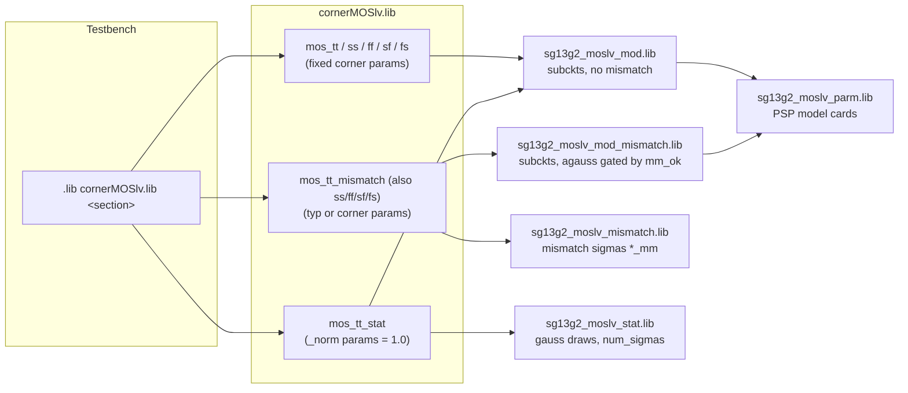

# SG13G2 ngspice Models: Corner, Monte Carlo and Mismatch Simulation Guide

**Scope:** `ihp-sg13g2/libs.tech/ngspice/models/` of the IHP Open PDK, `dev` branch, state of August 2026.
This guide explains how the model files fit together, what the `mm_ok` and `num_sigmas` (formerly `mc_ok`) parameters do, and which statistical simulations are possible with which devices.

---

## 1. Three kinds of variation

The PDK models three different effects. Keeping them apart is the key to understanding the file structure.

| Effect | What it models | Mechanism in the PDK | Scope |
|---|---|---|---|
| **Corners** (tt, ss, ff, sf, fs, typ, bcs, wcs) | Fixed worst/best case process shifts | Fixed `.param` values per library section | All devices of a family together |
| **Global process variation** ("stat", MC) | Lot-to-lot and wafer-to-wafer spread | `gauss()` draws at `.param` level, **one draw per simulation run**, shared by all devices of a type | All devices of a type get the *same* shift |
| **Local mismatch** ("MM") | Device-to-device differences on the same die | `agauss()` draws inside each subcircuit, **one draw per instance**, gated by `mm_ok` | Every instance gets its *own* shift |

Corners are deterministic. Stat and mismatch are random and only make sense inside a Monte Carlo loop, where the netlist is re-evaluated for every run so that new random values are drawn.

---

## 2. File overview

The directory contains 34 files. The naming follows a pattern with four roles:

* `corner*.lib` - entry points. These are the only files a testbench should reference. Each contains several `.LIB section ... .ENDL` blocks that set parameters and include the right model files.
* `*_mod.lib` - the actual device models (subcircuits and model cards), without mismatch.
* `*_mod_mismatch.lib` - the same device models, with per-instance `agauss()` mismatch terms gated by `mm_ok`.
* `*_stat.lib` - global process variation. Random `gauss()` draws at `.param` level that feed the model cards.
* `*_mismatch.lib` (without `_mod`) - just the mismatch sigma values (`*_mm` parameters), included next to `*_mod_mismatch.lib`.
* `*_parm.lib` - huge PSP parameter cards for the MOS devices, included by both the `_mod` and `_mod_mismatch` flavor.

### Complete file list

| File | Role | Contents |
|---|---|---|
| `cornerMOSlv.lib` | entry point | Sections `mos_tt/ss/ff/sf/fs`, each also as `_mismatch`, plus `mos_tt_stat`. LV MOS. |
| `cornerMOShv.lib` | entry point | Same section names as above. HV MOS plus the `sg13_hv_svaricap` varactor. |
| `cornerRES.lib` | entry point | `res_typ/bcs/wcs`, each also as `_mismatch`, plus `res_stat` and `res_stat_mismatch`. |
| `cornerCAP.lib` | entry point | `cap_typ/bcs/wcs`, each also as `_mismatch`, plus `cap_typ_stat`. MIM caps. |
| `cornerHBT.lib` | entry point | `hbt_typ/bcs/wcs`, each also as `_mismatch`, plus `hbt_typ_stat`. |
| `cornerDIO.lib` | entry point | `dio_tt` and `dio_tt_stat`. Diodes, ESD, Schottky. |
| `sg13g2_moslv_mod.lib` | model | `sg13_lv_nmos`, `sg13_lv_pmos` subcircuits (PSP). Includes `sg13g2_moslv_parm.lib`. |
| `sg13g2_moslv_mod_mismatch.lib` | model + MM | Same subcircuits with `agauss()` on w, l, `delvto`, `factuo`. |
| `sg13g2_moslv_parm.lib` | parameter card | PSP 103 model cards for LV MOS. |
| `sg13g2_moslv_stat.lib` | stat | `gauss()` draws for vfbo, ctl, muew, tox and more. Defines `num_sigmas=1`. |
| `sg13g2_moslv_mismatch.lib` | MM sigmas | `sg13g2_lv_*_delvto_mm`, `factuo_mm`, `dw_mm`, `dl_mm`. |
| `sg13g2_moshv_mod.lib` etc. | | Same five-file structure for HV MOS. |
| `sg13g2_svaricaphv_mod.lib` | model | `sg13_hv_svaricap` varactor. |
| `sg13g2_svaricaphv_mod_mismatch.lib` | model + MM | Varactor with `agauss()` on w and l. Sigmas live in `sg13g2_moshv_mismatch.lib`. |
| `resistors_mod.lib` | model | `rsil`, `rppd`, `rhigh` on the r3_cmc model, plus `Rparasitic`. `sw_mman=0`. |
| `resistors_mod_mismatch.lib` | model + MM | Same, with `sw_mman=1` and `mm_ok`-gated `nsmm_*` draws. |
| `resistors_stat.lib` | stat | Global sigma values `drsh_*`, `dw_*`, `dl_*` (plain numbers, the random draw sits on the model card). |
| `capacitors_mod.lib` | model | `cap_cmim`, `cap_rfcmim`, `cparasitic`. |
| `capacitors_mod_mismatch.lib` | model + MM | Same, with a 1 % `agauss()` on the area capacitance. |
| `capacitors_stat.lib` | stat | `gauss()` draws for `cap_carea` and `cap_cpara`. |
| `sg13g2_hbt_mod.lib` | model | `npn13G2`, `npn13G2l`, `npn13G2v` plus `_5t` variants (VBIC), and `pnpMPA`. |
| `sg13g2_hbt_mod_mismatch.lib` | model + MM | npn13G2 family with a 10 % `agauss()` on the emitter area factor `qarea`. No mismatch for `pnpMPA`. |
| `sg13g2_hbt_stat.lib` | stat | `gauss()` draws for cje, cjc, is, ibei, re and more, for VBIC and `pnpMPA`. |
| `diodes.lib` | model | Antenna diodes and others. No statistics. |
| `sg13g2_esd.lib` | model | ESD devices. No statistics. |
| `sg13g2_bondpad.lib` | model | Bondpad. No statistics. |
| `sg13g2_dschottky_nbl1_mod.lib` | model | Schottky diode. |
| `sg13g2_dschottky_nbl1_stat.lib` | stat | `gauss()` draws for the Schottky diode. |

A historical note: the headers of some `_mod.lib` files still say "do not include this file directly, use models.typ, .bcs or .wcs only". Those top level files no longer exist. The `corner*.lib` sections took over that job. The advice itself still holds, always go through a corner section.

---

## 3. How the files link together

Every device family follows the same include pattern. The corner section decides which flavor of the model gets loaded.



The same shape repeats for every family:

| Section flavor | MOS LV | MOS HV | RES | CAP | HBT |
|---|---|---|---|---|---|
| plain corner | `sg13g2_moslv_mod.lib` | `sg13g2_moshv_mod.lib` + `sg13g2_svaricaphv_mod.lib` | `resistors_mod.lib` | `capacitors_mod.lib` | `sg13g2_hbt_mod.lib` |
| `*_mismatch` | `sg13g2_moslv_mismatch.lib` + `sg13g2_moslv_mod_mismatch.lib` | `sg13g2_moshv_mismatch.lib` + `sg13g2_moshv_mod_mismatch.lib` + `sg13g2_svaricaphv_mod_mismatch.lib` | `resistors_mod_mismatch.lib` | `capacitors_mod_mismatch.lib` | `sg13g2_hbt_mod_mismatch.lib` |
| `*_stat` | `sg13g2_moslv_stat.lib` + `sg13g2_moslv_mod.lib` | `sg13g2_moshv_stat.lib` + `sg13g2_moshv_mod.lib` + `sg13g2_svaricaphv_mod.lib` | `resistors_stat.lib` + `resistors_mod.lib` | `capacitors_stat.lib` + `capacitors_mod.lib` | `sg13g2_hbt_stat.lib` + `sg13g2_hbt_mod.lib` |
| `res_stat_mismatch` | not available | not available | `resistors_stat.lib` + `resistors_mod_mismatch.lib` | not available | not available |

The MOS columns additionally pull in their `*_parm.lib` PSP model cards through the `_mod` and `_mod_mismatch` files.

`cornerDIO.lib` is simpler: `dio_tt` loads `diodes.lib`, `sg13g2_esd.lib` and the Schottky model, `dio_tt_stat` swaps in the Schottky stat file on top. Only the Schottky diode has statistical data, the other diodes and the ESD devices are always deterministic.

---

## 4. Global process variation and `num_sigmas` (the parameter formerly known as `mc_ok`)

The `*_stat.lib` files implement global process variation. The pattern, from `sg13g2_moslv_stat.lib`:

```spice
.param num_sigmas=1
.param mc_sg13g2_lv_nmos_vfbo = 'gauss(sg13g2_lv_nmos_vfbo_norm, 0.0050, num_sigmas)'
.param sg13g2_lv_nmos_vfbo    = mc_sg13g2_lv_nmos_vfbo
```

The corner section sets `sg13g2_lv_nmos_vfbo_norm = 1.0`, the stat file draws a random value around it, and the PSP model card in `sg13g2_moslv_parm.lib` multiplies it in (`vfbo = '-0.94312*sg13g2_lv_nmos_vfbo'`). Because the draw happens in a `.param` statement, it is evaluated once per netlist load. All LV NMOS devices in the circuit see the same `vfbo` in a given Monte Carlo run. That is exactly what global process variation means.

The stated sigma values are one-sigma deviations (one third of the min-max corner span, as noted in the file headers).

### What happened to `mc_ok`

`mc_ok` was the original name of the third `gauss()` argument in the stat files, used as a global on/off switch (`.param mc_ok=1`). In May 2025 it was renamed to `num_sigmas` in all ngspice stat files (commit `f0e3d00b`, "introduce num_sigmas instead mc_ok for statistical models"). Same position, same default of 1, but the name now reflects what the argument really is: it tells ngspice at how many sigmas the given deviation is specified.

In short: **`mc_ok` no longer exists in the ngspice models.** It still appears in three places:

1. The **Xyce** model files (`libs.tech/xyce/models/*_stat.lib`) were never renamed and still use `mc_ok`.
2. Some older xschem test schematics (for example `sg13g2_tests/mc_lv_nmos_cs_loop.sch`) still contain a leftover `.param mc_ok=1`. Against the current ngspice models this line defines an unused parameter and has no effect.
3. Git history.

A practical consequence of the mechanism: a third argument of 0 disables the random draw and `gauss()` returns the nominal value. The mismatch gating described next relies on exactly this behavior.

---

## 5. Local mismatch and `mm_ok`

The `*_mod_mismatch.lib` files add device-to-device variation. Every random term sits inside the subcircuit, so each instance draws its own value, and every term carries the same gate:

```spice
(mm_ok != 1 ? 0 : 1)
```

as the third `agauss()` argument. With `mm_ok=1` the draw is active, with anything else it collapses to the nominal value. `mm_ok` is a parameter of each device subcircuit, so it can be set per instance in the schematic.

### What actually varies per family

| Family | Mismatched quantities | Sigma source |
|---|---|---|
| MOS (LV and HV, incl. RF) | w, l, threshold shift `delvto`, gain factor `factuo` | `sg13g2_mos*_mismatch.lib`. The `delvto`/`factuo` sigmas scale with `1/sqrt(m*l*w)`, the Pelgrom area law. Larger devices mismatch less. |
| Resistors rsil, rppd, rhigh | sheet resistance, w, l via the r3_cmc `nsmm_*` inputs, `sw_mman=1` | Section parameters `rsh_*_mm`, `dw_*_mm`, `dl_*_mm` |
| npn13G2 family (all 6 variants) | effective emitter area `qarea`, 10 % one-sigma | hardcoded in `sg13g2_hbt_mod_mismatch.lib` |
| cap_cmim, cap_rfcmim | area capacitance, 1 % one-sigma | hardcoded in `capacitors_mod_mismatch.lib` |
| sg13_hv_svaricap | w, l | `sg13g2_moshv_mismatch.lib` |
| pnpMPA, diodes, ESD, bondpad | nothing | no mismatch model exists |

### Where `mm_ok` comes from and what the defaults are

`mm_ok` as an instance parameter was introduced on the xschem side in two steps. PR [#991](https://github.com/IHP-GmbH/IHP-Open-PDK/pull/991) added it to `sg13_lv_nmos` and `sg13_lv_pmos`. PR [#993](https://github.com/IHP-GmbH/IHP-Open-PDK/pull/993) (merged May 28, 2026) rolled the same convention out to all remaining primitive symbols: HV MOS, RF MOS, the resistors, the whole npn13G2 family, svaricap, cap_cmim and cap_rfcmim. Each symbol got `mm_ok=@mm_ok` in its netlisting `format` string and a default in its `template` string. The LVS format string was deliberately left untouched, because `mm_ok` is a simulation knob and not a physical property. It must never show up in an LVS netlist.

The defaults are set at two levels, and they differ on purpose:

| Level | Default | Meaning |
|---|---|---|
| xschem symbol (`template` attribute) | **`mm_ok=1`** | Every device netlisted from xschem has mismatch enabled |
| ngspice subcircuit (`.param` / subckt line) | **`mm_ok=0`** | A netlist that does not pass `mm_ok` gets deterministic devices |
| Qucs-S symbols | `mm_ok=1` (hidden) | Same convention as xschem |

During the PR the defaults moved around: the first commits set the symbol templates to 0 and the final commit `d4c61ce6` ("set mm_ok=1 by default at the symbol level") flipped them to 1. **As merged, the designer-facing default is `mm_ok=1`**, and mismatch runs behave the way most designers expect out of the box. The subcircuit fallback of 0 protects hand-written or third-party netlists from silently becoming random.

### What about schematics created before PR #993?

Instances placed before the PR carry no `mm_ok` attribute in the `.sch` file. This is not a problem. When xschem netlists an instance, any `@param` token in the symbol's format string that the instance does not define falls back to the value in the symbol's `template` attribute. Since the installed PDK symbols now say `mm_ok=1`, old schematics netlist with `mm_ok=1` exactly like new ones. The default is applied in the background.

Two situations where this fallback does **not** save you:

* The schematic uses **local copies** of the PDK symbols made before the PR. Those templates have no `mm_ok`, the netlist then contains no `mm_ok`, and the subcircuit default of 0 switches mismatch off without any warning.
* The netlist is written **by hand** or generated by another tool and omits `mm_ok`. Same result, mismatch is silently off.

If a mismatch Monte Carlo produces suspiciously identical runs, check the netlist for `mm_ok=1` on the instance lines first.

---

## 6. What you can simulate: the full matrix

The corner section chooses the mechanism. `mm_ok` only acts inside `*_mismatch` sections, everywhere else it is accepted and ignored. The stat sections exist only at the typical corner.

### Per-family section overview

| | plain corner | corner + mismatch | typ + stat (global MC) | stat + mismatch |
|---|---|---|---|---|
| **MOS LV** (`cornerMOSlv.lib`) | `mos_tt`, `mos_ss`, `mos_ff`, `mos_sf`, `mos_fs` | all five as `*_mismatch` | `mos_tt_stat` | not available |
| **MOS HV + svaricap** (`cornerMOShv.lib`) | same | same | `mos_tt_stat` | not available |
| **Resistors** (`cornerRES.lib`) | `res_typ`, `res_bcs`, `res_wcs` | all three as `*_mismatch` | `res_stat` | **`res_stat_mismatch`** |
| **MIM caps** (`cornerCAP.lib`) | `cap_typ`, `cap_bcs`, `cap_wcs` | all three as `*_mismatch` | `cap_typ_stat` | not available |
| **HBT** (`cornerHBT.lib`) | `hbt_typ`, `hbt_bcs`, `hbt_wcs` | all three as `*_mismatch` | `hbt_typ_stat` | not available |
| **Diodes** (`cornerDIO.lib`) | `dio_tt` | not available | `dio_tt_stat` (Schottky only) | not available |

### Result matrix

```
MC only (global process variation):
  mos_tt_stat        + (mm_ok irrelevant)   -> all devices shift together, no mismatch
  cap_typ_stat, hbt_typ_stat, res_stat, dio_tt_stat behave the same way

MM only (local mismatch):
  mos_tt_mismatch    + mm_ok=1              -> per-device mismatch around typical
  mos_tt_mismatch    + mm_ok=0              -> nothing varies, identical to mos_tt
  mos_ss_mismatch    + mm_ok=1              -> per-device mismatch around the SS corner
  (same for ff/sf/fs and for the bcs/wcs mismatch sections of RES, CAP, HBT)

MC and MM combined:
  res_stat_mismatch  + mm_ok=1              -> resistors only. Global draw for all
                                               resistors plus a local draw per instance
  res_stat_mismatch  + mm_ok=0              -> global draw only, equals res_stat
```

Three points worth spelling out:

* **Corner plus mismatch is supported everywhere.** The `_mismatch` flavor exists for every corner of MOS, RES, CAP and HBT, not just typical. Mismatch around SS or WCS is a normal use case.
* **Global MC exists only at the typical corner.** There is no `mos_ss_stat` or similar. That is by design, the corners themselves already bound the global spread.
* **Stat plus mismatch in one run exists only for resistors** (`res_stat_mismatch`). For MOS, CAP and HBT the two mechanisms cannot be combined with the shipped sections, because the stat sections always include the non-mismatch model file. If you need it, you can write your own section following the `res_stat_mismatch` pattern (combine `*_stat.lib`, `*_mismatch.lib` and `*_mod_mismatch.lib`), but that is a user extension and not qualified by IHP.

### Is `mos_tt_mismatch` with `mm_ok=0` the same as `mos_tt`?

Yes, the two are numerically identical. Verified against the current files:

* The fixed parameter blocks of the `mos_tt` and `mos_tt_mismatch` sections in `cornerMOSlv.lib` are line-for-line the same.
* With the draws disabled, the mismatch subcircuit passes `w`, `l`, `delvto=0`, `factuo=1` to the PSP model. The non-mismatch subcircuit in `sg13g2_moslv_mod.lib` passes exactly `delvto=0` and `factuo=1` explicitly.
* Both include the same `sg13g2_moslv_parm.lib` model cards.

The only requirement is that *every* instance has `mm_ok=0`. And since `mm_ok` is unused in the non-mismatch sections, `mos_tt + mm_ok=0` and `mos_tt + mm_ok=1` are trivially the same as well.

The same equivalence holds for the other families. For resistors the disabled `nsmm_*` draws and the `nsig_*=0` parameters of `res_typ_mismatch` reduce it to `res_typ` (the remaining difference, `sw_mman=1` with all mismatch inputs at zero, changes nothing).

---

## 7. Practical usage

### Selecting sections in a testbench

```spice
* corner run
.lib cornerMOSlv.lib mos_tt
.lib cornerRES.lib   res_typ
.lib cornerCAP.lib   cap_typ

* global process MC
.lib cornerMOSlv.lib mos_tt_stat
.lib cornerRES.lib   res_stat
.lib cornerCAP.lib   cap_typ_stat

* mismatch MC
.lib cornerMOSlv.lib mos_tt_mismatch
.lib cornerRES.lib   res_typ_mismatch
.lib cornerCAP.lib   cap_typ_mismatch
```

Random values are redrawn when the circuit is re-parsed. A typical ngspice control loop therefore reloads or resets between runs. The PDK ships working examples in `libs.tech/xschem/sg13g2_tests/`, see `mc_lv_nmos_cs_loop.sch`, `mc_res_op.sch`, `mc_mim_cap_ac.sch` and `mc_hbt_13g2.sch`.

### Controlling mismatch per device

In xschem, select the instance, press `q` and set `mm_ok=0` or `mm_ok=1`. The classic application is offset analysis: leave `mm_ok=1` on the input pair of a comparator and set `mm_ok=0` on current mirrors, loads and bias devices to see how much of the offset the pair itself contributes. Devices keep their defaults (`mm_ok=1`) unless you override them.

### Pitfalls

* **`res_typ_stat` does not exist.** The resistor stat sections are named `res_stat` and `res_stat_mismatch`, without `typ`, unlike every other family. Note that `sg13g2_tests/mc_res_op.sch` currently references `res_typ_stat`, which does not match any section in `cornerRES.lib`.
* **`num_sigmas` is defined inside the stat files** with a default of 1. If you want to change it, make sure your `.param num_sigmas=...` actually takes effect after the library include, and verify with a listing before trusting the results.
* **Old symbol copies and hand netlists** fall back to the subcircuit default `mm_ok=0`, see section 5.
* **Xyce is not in sync with ngspice.** The Xyce stat files still use `mc_ok`, the Xyce resistor subcircuits still default to `mm_ok=1`, and the MOS/HBT/CAP Xyce models do not accept `mm_ok` on the instance line at all (which is why it was removed from the Qucs-S Xyce netlists). This guide applies to ngspice only.
* **No mismatch for pnpMPA, diodes, ESD and bondpad.** Setting `mm_ok` there does nothing, and for global variation only the Schottky diode and pnpMPA have stat data.

---

## 8. Quick reference

| Parameter | Lives in | Default | Purpose |
|---|---|---|---|
| `mm_ok` | every device subcircuit (instance parameter) | 1 in xschem/Qucs-S symbols, 0 in the ngspice subckt definition | Enables the local mismatch draws of *this instance*. Only effective in `*_mismatch` sections. |
| `num_sigmas` | `*_stat.lib` files (global parameter) | 1 | Sigma interpretation of the global `gauss()` draws. Replaced `mc_ok` in May 2025. |
| `mc_ok` | removed from ngspice models | was 1 | Old name of `num_sigmas`. Still present in Xyce models and some old testbenches. |

Related pull requests: [#991](https://github.com/IHP-GmbH/IHP-Open-PDK/pull/991) (mm_ok on LV MOS symbols), [#993](https://github.com/IHP-GmbH/IHP-Open-PDK/pull/993) (mm_ok on all remaining primitive symbols, subckt defaults to 0, symbol defaults to 1).
