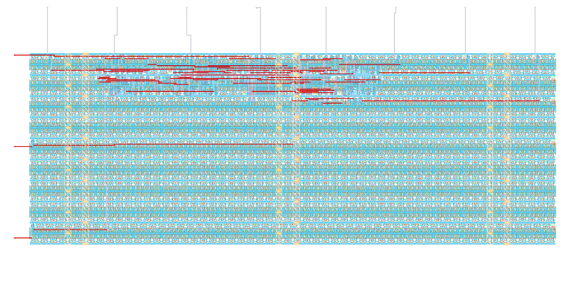

# ihp-sg13g2 Counter

> [!IMPORTANT]
> This repository requires the [IIC-OSIC-TOOLS](https://github.com/iic-jku/IIC-OSIC-TOOLS) container with tag `2026.05` or later.

<p align="center">
  <a href="render/img/counter_top_white.png">
    
  </a>
  <br>
  <em>Render of the ihp-sg13g2 counter layout (200um x 100um).</em>
</p>


## Directory Structure

```text
📁 counter/
├─ 📁 final/
│  ├─ 📁 gds/
│  │  └─ counter_top.gds
│  ├─ 📁 lef/
│  │  └─ counter_top.lef
│  ├─ 📁 lib/
│  │  ├─ 📁 nom_fast_1p32V_m40C/
│  │  ├─ 📁 nom_fast_1p65V_m40C/
│  │  ├─ 📁 nom_slow_1p08V_125C/
│  │  ├─ 📁 nom_slow_1p35V_125C/
│  │  ├─ 📁 nom_typ_1p20V_25C/
│  │  └─ 📁 nom_typ_1p50V_25C/
│  ├─ 📁 nl/
│  │  └─ counter_top.nl.v
│  ├─ 📁 pnl/
│  │  └─ counter_top.pnl.v
│  ├─ 📁 spef/
│  │  └─ 📁 nom/
│  └─ 📁 vh/
│     └─ counter_top.vh
├─ 📁 flow/
│  ├─ 📁 final/               # .gitignore'd — important files are copied to counter/final/ (listed here to document LibreLane output folders)
│  │  ├─ 📁 def/              # Design Exchange Format — cell placement & routing (text-based)
│  │  ├─ 📁 gds/              # GDSII layout — final tape-out file
│  │  ├─ 📁 json_h/           # Yosys JSON headers — machine-readable netlist for internal scripts
│  │  ├─ 📁 klayout_gds/      # KLayout GDS — with extra visual-debug metadata
│  │  ├─ 📁 lef/              # Library Exchange Format — abstract pin & blockage view for P&R
│  │  ├─ 📁 lib/              # Liberty timing files — timing, power & area models
│  │  ├─ 📁 mag/              # Magic layout files — used for DRC & GDS generation
│  │  ├─ 📁 mag_gds/          # GDS generated/processed by Magic
│  │  ├─ 📁 nl/               # Netlist — gate-level Verilog after synthesis
│  │  ├─ 📁 odb/              # OpenDB — internal OpenROAD binary database (LEF+DEF combined)
│  │  ├─ 📁 pnl/              # Powered Netlist — gate-level Verilog with explicit VDD/VSS (for LVS)
│  │  ├─ 📁 render/           # Layout render images
│  │  ├─ 📁 sdc/              # Synopsys Design Constraints — clock periods & timing requirements
│  │  ├─ 📁 sdf/              # Standard Delay Format — timing delays for gate-level simulation
│  │  ├─ 📁 spef/             # Standard Parasitic Exchange Format — RC parasitics from layout
│  │  ├─ 📁 spice/            # SPICE netlist — for LVS & transistor-level simulation
│  │  ├─ 📁 vh/               # Verilog headers — for hierarchy management & simulation inclusion
│  │  ├─ metrics.csv          # Design metrics (area, power, timing slack, DRC/LVS) — spreadsheet
│  │  └─ metrics.json         # Design metrics (area, power, timing slack, DRC/LVS) — JSON summary
│  ├─ 📁 librelane/
│  │  ├─ config.yaml
│  │  ├─ impl.sdc
│  │  ├─ pin_order.cfg
│  │  └─ signoff.sdc
├─ 📁 fpga/
│  ├─ Makefile
│  ├─ pico-ice.pcf
│  └─ README.md
├─ 📁 netlist/
│  ├─ 📁 nl/
│  │  └─ counter_top.nl.v
│  ├─ 📁 pnl/
│  │  └─ counter_top.pnl.v
│  ├─ 📁 spice/
│  │  └─ counter_top.spice
│  └─ 📁 xspice/
│     └─ counter_top.xspice
├─ 📁 render/
│  ├─ 📁 blender/
│  └─ 📁 img/
│     ├─ counter_top_black.png
│     ├─ counter_top_librelane.png
│     └─ counter_top_white.png
├─ 📁 rtl/
│  ├─ constants.sv
│  ├─ counter.sv
│  └─ counter_top.sv
├─ 📁 schematic/
│  └─ 📁 xschem/
│     ├─ counter_top.sym
│     └─ xschemrc
├─ 📁 scripts/
│  ├─ lay2img.py
│  ├─ reorder_xspice_pins.py
│  ├─ spi2xspice.py
│  └─ 📁 plot_simulations/
│     ├─ ngspice2python.py
│     └─ plot_counter_top.py
├─ 📁 testbenches/
│  ├─ 📁 cocotb/
│  │  ├─ counter_top_tb.gtkw
│  │  ├─ counter_top_tb.py
│  │  └─ counter_top_tb.surf.ron
│  ├─ 📁 verilog/
│  │  ├─ counter_top_tb.gtkw
│  │  ├─ counter_top_tb.surf.ron
│  │  └─ counter_top_tb.sv
│  └─ 📁 xschem/
│     ├─ counter_top_tb_tran.sch
│     └─ xschemrc
├─ 📁 verification/
│  ├─ antenna_summary.rpt
│  ├─ antenna_violations.rpt
│  ├─ stapostpnr_summary.rpt
│  ├─ stapostpnr_nom_fast_1p32V_m40C_power.rpt
│  ├─ stapostpnr_nom_fast_1p65V_m40C_power.rpt
│  ├─ stapostpnr_nom_slow_1p08V_125C_power.rpt
│  ├─ stapostpnr_nom_slow_1p35V_125C_power.rpt
│  ├─ stapostpnr_nom_typ_1p20V_25C_power.rpt
│  ├─ stapostpnr_nom_typ_1p50V_25C_power.rpt
│  ├─ irdrop.rpt
│  ├─ drc.magic.rpt
│  ├─ drc.klayout.json
│  ├─ lvs.netgen.rpt
│  ├─ manufacturability.rpt
│  ├─ stat.rpt
│  ├─ yosys_post_dff.rpt
│  ├─ yosys_pre_techmap.rpt
│  └─ yosys_synth_check.rpt
├─ Makefile
└─ README.md
```


## Show Available Targets

The default Make target is `help`, so running `make` prints usage and all available targets with short descriptions.

```sh
make
make help
```


## Linting

To lint the Verilog/SystemVerilog source files with [Verilator](https://www.veripool.org/verilator/), run:

```sh
make lint-verilog                # lint the full counter_top design
make lint-verilog CELL=counter   # lint the standalone counter cell
make lint-verilog-all            # lint counter and counter_top in sequence
```

When `CELL=counter_top` (the default), all synthesis sources (`constants.sv`, `counter.sv`, `counter_top.sv`) are passed to Verilator.
For a single cell, `constants.sv` is always included first so the shared `` `COUNTER_MAX_DEFAULT `` and `` `CLK_FREQ_DEFAULT `` macros are in scope.

The `lint-verilog-all` target runs these lint checks in sequence:

1. `make lint-verilog CELL=counter`
2. `make lint-verilog` (default: `counter_top`)

This is also the lint step used by `make all`.


## Verification and Simulation

We use [cocotb](https://www.cocotb.org/), a Python-based testbench environment, and [Icarus Verilog](https://github.com/steveicarus/iverilog) for the verification of the macro.

The simulation targets are unified and accept an optional `CELL` variable (default: `counter_top`).
The waveform viewer can be changed with `WAVEFORM_VIEWER=<gtkwave|surfer>` (default: `gtkwave`).

> [!NOTE]
> In the current repository state, the provided Verilog, cocotb, and Xschem testbench/viewer files are for `counter_top`.
> Running simulation/view targets with another `CELL` requires corresponding testbench files (for example, `testbenches/verilog/<CELL>_tb.*`, `testbenches/cocotb/<CELL>_tb.py`, and `testbenches/xschem/<CELL>_tb_tran.sch`).

### RTL Verilog Simulation

Compiles the RTL with Icarus Verilog and runs the simulation.
When `CELL=counter_top` (the default), the full `MODULES_SIM` source list and the `.sv` testbench are selected automatically.
For non-top cells, `constants.sv` is included first (so the shared `` `COUNTER_MAX_DEFAULT `` / `` `CLK_FREQ_DEFAULT `` macros are in scope) and the RTL source is auto-selected as `rtl/<CELL>.sv` when present, otherwise `rtl/<CELL>.v`.
The waveform is written to `testbenches/verilog/` (e.g. `testbenches/verilog/counter_top_tb.vcd`):

```sh
make sim-rtl-verilog              # run counter_top RTL simulation
```

To view the waveform afterwards:

```sh
make sim-view-verilog                                  # view counter_top waveform
make sim-view-verilog WAVEFORM_VIEWER=surfer           # use Surfer instead
```

The simulation folder contains a pre-configured waveform layout file (`counter_top_tb.gtkw` for GTKWave, `counter_top_tb.surf.ron` for Surfer).
The view target loads it automatically together with the current `.vcd`, so signal formatting is preserved across runs.

### RTL / GL cocotb Simulation

The cocotb testbench is located in `testbenches/cocotb/counter_top_tb.py` and exercises:

- reset clears the counter to 0
- the counter holds its value while `enable_i` is low
- the counter increments by 1 on every rising clock edge while `enable_i` is high
- the counter wraps from `CTR_MAX` back to 0

```sh
make sim-rtl-cocotb               # run counter_top RTL cocotb simulation
```

To run the gate-level (GL) cocotb simulation (sources the post-synthesis netlist from `final/nl/`):

```sh
make sim-gl-cocotb                # gate-level simulation of counter_top
```

> [!NOTE]
> Gate-level simulation requires the latest implementation in `flow/final/` (and a `final/nl/counter_top.nl.v` copy via `make copy-final`).

A waveform file is generated under `testbenches/cocotb/sim_build/counter_top.fst`.
To view it:

```sh
make sim-view-cocotb                                  # view counter_top waveform
make sim-view-cocotb WAVEFORM_VIEWER=surfer           # use Surfer instead
```

The cocotb folder contains a pre-configured waveform layout file (`counter_top_tb.gtkw` for GTKWave, `counter_top_tb.surf.ron` for Surfer).
The view target loads it automatically together with the current `.fst`, so signal formatting is preserved across runs.

### Gate-Level Xschem Simulation

Runs the mixed-signal gate-level transient simulation testbench in `testbenches/xschem/<CELL>_tb_tran.sch`:

```sh
make sim-gl-xschem                # run counter_top gate-level Xschem simulation
make sim-gl-xschem CELL=<cell>    # run gate-level Xschem simulation for another cell
```

> [!NOTE]
> This flow expects the generated XSPICE model in `netlist/xspice/`. If needed, generate it first with:
>
> ```sh
> make generate-xspice
> ```

### View Xschem Simulation Results

After the gate-level Xschem simulation has completed, plot the results with:

```sh
make sim-view-xschem              # plot counter_top simulation results
make sim-view-xschem CELL=<cell>  # plot results for another cell
```

This runs `scripts/plot_simulations/plot_<CELL>.py` and exports the figures and a CSV to `scripts/plot_simulations/figures/`.

> [!NOTE]
> `sim-view-xschem` is intentionally **not** called by `sim-all`. It opens an interactive plot window and must be called manually after the simulation has completed.

### Run All Simulations

To run all simulation targets in sequence:

```sh
make sim-all
```

This executes the following targets in order:

1. `sim-rtl-verilog` (default: `counter_top`)
2. `sim-rtl-cocotb` (default: `counter_top`)
3. `sim-gl-cocotb` (default: `counter_top`)
4. `sim-gl-xschem` (default: `counter_top`)

> [!NOTE]
> The `sim-view-verilog` and `sim-view-cocotb` targets are intentionally **not** called by `sim-all`.
> Both open a waveform viewer GUI (GTKWave or Surfer), which blocks the shell until the window is closed.
> They are designed for interactive use and must be called manually after the simulation has completed.


## LibreLane Flow

Run the LibreLane flow with:

```sh
make librelane
```

Additional targets are available for different DRC configurations:

- `make librelane-nodrc` – run LibreLane without DRC checks
- `make librelane-magicdrc` – run LibreLane with only Magic DRC checks
- `make librelane-klayoutdrc` – run LibreLane with only KLayout DRC checks

After the LibreLane flow completes successfully, the generated views are saved under `flow/final/`. `flow/final/` is included in `.gitignore`.


## View the Design

After completion, you can view the design using the OpenROAD GUI:

```sh
make librelane-openroad
```

Or using KLayout:

```sh
make librelane-klayout
```


## Copy Important Reports

To copy the yosys synthesis checks, antenna reports, post-PnR timing summary, per-corner power reports, IR-drop report, Magic/KLayout DRC results, LVS report, and manufacturability report from the latest run into `verification/`, run:

```sh
make copy-reports
```

This only works if at least one LibreLane run exists in `flow/librelane/runs/` and the latest run completed without errors.


## Copy the Final Folders

To copy the latest GDS, LEF, LIB, NL, PNL, SPEF, and VH from `flow/final/` into `final/`, run:

```sh
make copy-final
```

This assumes the final folders exist under `flow/final/` after a successful LibreLane run.


## Copy the Final Netlist

To copy the latest SPICE, PnL, and Netlist files from `flow/final/` into `netlist/`, run:

```sh
make copy-netlist
```

This only works if the required final views exist in `flow/final/spice/`, `flow/final/pnl/`, and `flow/final/nl/`.


## Copy the Final Render

To copy the latest LibreLane render from `flow/final/render/` into `render/img/`, run:

```sh
make copy-render
```

This only works if the final render exists in `flow/final/render/`.


## Render Top Layout

Renders the final GDS from `final/gds/` with `scripts/lay2img.py` and saves it in the `render/img/` folder:

```sh
make render-gds
```

This only works if the latest run completed without errors.


## Build FPGA

The FPGA flow targets a [pico-ice](https://pico-ice.tinyvision.ai/) board (iCE40 UP5K, sg48 package) and uses the open-source iCE40 toolchain: Yosys → nextpnr → icepack.

To run the full flow (lint → synthesis → place-and-route → bitstream), run:

```sh
make build-fpga
```

This invokes `make -C fpga all`. Individual steps can also be run from `fpga/`:

```sh
make -C fpga synthesis       # Yosys iCE40 synthesis
make -C fpga pr              # nextpnr place-and-route
make -C fpga gen_bitstream   # icepack → .bin
make -C fpga flash_bitstream # flash via dfu-util
```

> [!NOTE]
> Flashing uses `dfu-util`, not `iceprog`. Both flash iCE40 bitstreams, but they target different interfaces:
> - **`iceprog`** speaks directly over SPI via an FTDI USB bridge (iCEstick, iCEBreaker, …).
> - **`dfu-util`** uses the USB DFU standard — the pico-ice's RP2040 co-processor acts as the DFU bootloader and forwards the bitstream to the iCE40 flash. `iceprog` does not work on this board.


## Build Top

To build the macro with LibreLane, copy its reports, copy final folders, copy netlists, copy the render, and render the final GDS, run:

```sh
make build-top
```


## Layout Versus Schematic (LVS) & Design Rule Check (DRC)

The LibreLane flow already includes LVS and DRC checks with Magic and KLayout, and they are saved in the `verification/` folder.


## Build and Verify All

Builds and verifies the whole macro by running both simulation and build steps:

- `lint-verilog-all`
- `sim-all`
- `build-fpga`
- `build-top`

The LVS and DRC verification is done within the LibreLane flow.

```sh
make all
```


## Generate XSPICE File

To generate an XSPICE file of the macro for mixed-signal simulation in Xschem, run:

```sh
make generate-xspice
```

> [!NOTE]
> This command should not be run as part of `all`, since this XSPICE file is generated once with specific CPU settings for a more convenient simulation.
> This method does not work with the `.pnl.v` file in `flow/final/`. The `.nl.v` file from the LibreLane step `yosys-synthesis` must be used.
> Pin reordering uses the symbol file in `schematic/xschem/<TOP>.sym`.
> Conversion pipeline: Copy gate-level Verilog (`.nl.v`) → Verilog with power pins (`.vp`) → SPICE (`.spice`) → XSPICE (`.xspice`) → Reorder pins in XSPICE file according to the Xschem symbol.
