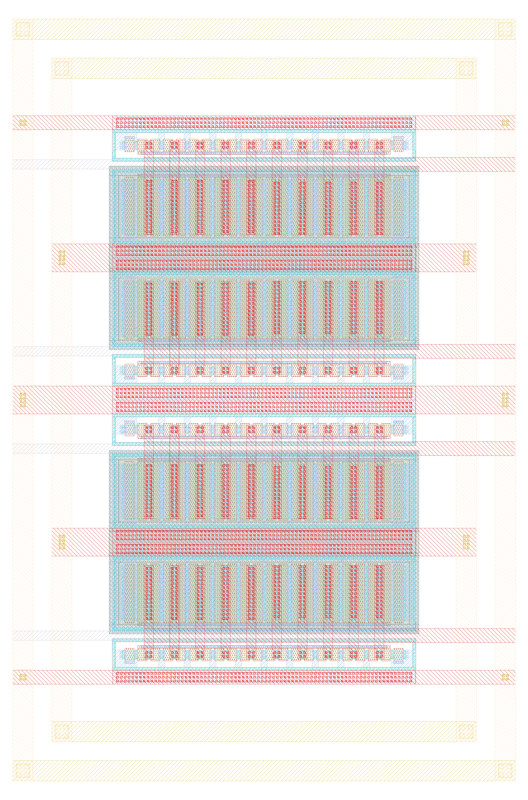

# ihp-sg13g2 Inverter

> [!IMPORTANT]
> This repository requires the [IIC-OSIC-TOOLS](https://github.com/iic-jku/IIC-OSIC-TOOLS) container with tag `2026.05` or later.

<p align="center">
  <a href="render/img/inverter_top_white.png">
    
  </a>
  <br>
  <em>Render of the ihp-sg13g2 inverter layout (337um x 142um).</em>
</p>


## Directory Structure

```text
📁 inverter/
├─ 📁 final/
│  ├─ 📁 gds/
│  │  └─ inverter_top.gds
│  ├─ 📁 lef/
│  │  └─ inverter_top.lef
│  ├─ 📁 lib/
│  │  └─ inverter_top.lib
│  └─ 📁 vh/
│     └─ inverter_top.v
├─ 📁 layout/
│  ├─ *.gds
│  ├─ *.klay.gds
│  └─ inverter_top.gds
├─ 📁 netlist/
│  ├─ 📁 layout/
│  │  ├─ *.cir
│  │  ├─ *.ext.spc
│  │  ├─ inverter_top_klayout.cir
│  │  └─ inverter_top_magic.ext.spc
│  ├─ 📁 pex/
│  │  ├─ *.spice
│  │  ├─ inverter_top_klayout_pex_*.spice
│  │  ├─ inverter_top_magic_pex_*.spice
│  │  └─ reorder_spice_pins.py
│  └─ 📁 schematic/
│     ├─ *.cdl
│     ├─ *.spice
│     ├─ inverter_top_klayout.cdl
│     └─ inverter_top_magic.spice
├─ 📁 render/
│  ├─ 📁 blender/
│  └─ 📁 img/
│     ├─ inverter_top_black.png
│     └─ inverter_top_white.png
├─ 📁 schematic/
│  ├─ *.sch
│  ├─ *.sym
│  ├─ inverter_top.sch
│  ├─ inverter_top.sym
│  ├─ inverter_top_pex.sym
│  └─ xschemrc
├─ 📁 scripts/
│  ├─ 📁 plot_simulations/
│  │  ├─ 📁 data/
│  │  ├─ 📁 figures/
│  │  ├─ ngspice2python.py
│  │  └─ plot_inverter_top.py
│  ├─ 📁 sizing/
│  │  ├─ 📁 figures/
│  │  ├─ lookup_commands.ipynb
│  │  └─ sizing_inverter_top.ipynb
│  └─ lay2img.py
├─ 📁 testbenches/
│  ├─ *_tb_*.sch
│  ├─ inverter_top_tb_ac_ol.sch
│  ├─ inverter_top_tb_tran.sch
│  ├─ inverter_top_tb_Vout.sch
│  └─ xschemrc
├─ 📁 verification/
│  ├─ 📁 cace/
│  │  ├─ 📁 results/
│  │  ├─ 📁 scripts/
│  │  ├─ 📁 templates/
│  │  └─ inverter_top.yaml
│  ├─ 📁 drc/
│  │  │  *.magic.drc.rpt
│  │  │  *_full.lyrdb
│  │  │  inverter_top.magic.drc.rpt
│  │  └─ inverter_top.inverter_top_full.lyrdb
│  └─ 📁 lvs/
│     ├─ *.lvsdb
│     └─ inverter_top.lvsdb
├─ Makefile
└─ README.md
```


## Show Available Targets

The default Make target is `help`, so running `make` prints usage and all available targets with short descriptions.

```sh
make
make help
```

For the `sim-xschem` target, `TB=<testbenchname>` is required.

All targets that operate on a specific cell accept an optional `CELL=<cellname>` parameter. The default is the top-level cell (`inverter_top`).

```sh
make <target> [CELL=<cellname>] [EXT_MODE=<1|2|3>] [EV_PRECISION=<digits>]
```


## Layout File Extension Usage

The Makefile defines a `_GDS_EXT` variable that auto-selects the layout file extension: it prefers `.gds` when available, and falls back to `.klay.gds` otherwise.

- KLayout targets use `layout/<name>.$(_GDS_EXT)` and work with either `.gds` or `.klay.gds`:
  - `klayout-lvs`
  - `klayout-drc`
  - `klayout-pex`

- Magic targets always use `layout/<name>.gds` (Magic requires standard `.gds`):
  - `magic-lvs`
  - `magic-drc`
  - `magic-pex`

- Build targets always use `layout/<name>.gds`:
  - `lef`
  - `copy-gds`
  - `render-gds`


## Run Xschem Testbench Simulation

Runs a single Xschem testbench in batch mode (no display): saves the schematic, exports the netlist to `testbenches/simulations/`, and runs the simulator. The testbench name **must** be specified via the `TB` variable:

```sh
make sim-xschem TB=<testbenchname>
```

For example:

```sh
make sim-xschem TB=inverter_top_tb_tran
make sim-xschem TB=inverter_top_tb_ac
make sim-xschem TB=inverter_mfb_lpf_tb_ac_cl
make sim-xschem TB=inverter_mfb_lpf_ota_core_tb_ac_ol
make sim-xschem TB=inverter_mixer_se2diff_tb_tran
make sim-xschem TB=inverter_mixer_tb_tran
```

All available testbench schematics are located in `testbenches/`. Generated netlists are written to `testbenches/simulations/`.


## CACE Simulations

Runs [CACE](https://github.com/fossi-foundation/cace) characterization simulations for the LPF and OTA core, collecting result plots into `verification/cace/results/`. Each CACE YAML
- `inverter_mfb_lpf.yaml` — characterization of the 3rd-order MFB low-pass filter
- `inverter_mfb_lpf_ota_core.yaml` — characterization of the inverter-based OTA core
is invoked with its AC parameter sets (mismatch, Monte Carlo, corner sweep), the generated plots are copied, and temporary run artifacts are cleaned up:

```sh
make sim-cace
```

Result plots are saved to:
- `verification/cace/results/inverter_mfb_lpf/` — closed-loop gain, CMRR, and unity-gain frequency plots
- `verification/cace/results/inverter_mfb_lpf_ota_core/` — open-loop gain, CMRR, and unity-gain frequency plots


## Simulate All

Runs all simulations:

```sh
make sim-all
```

## Build Top Cell

Builds the top-level cell deliverables in sequence: LEF export, LIB generation, Verilog stub generation, GDS copy, and layout image rendering:

```sh
make build-top
```


## Export LEF

Exports a LEF file (`final/lef/<TOP>.lef`) from the top-level layout GDS in `layout/` using Magic with the `-hide` option:

```sh
make lef
```


## Liberty Timing Library

Generates a Liberty timing library stub (`final/lib/<TOP>.lib`) with default threshold settings for the top-level cell:

```sh
make lib
```


## Verilog Stub

Generates a Verilog stub (`final/vh/<TOP>.v`) for top-level integration into the LibreLane flow by parsing pins from the Magic PEX netlist (`netlist/pex/<TOP>_magic_pex.spice`).

The `verilog` target:
- requires `netlist/pex/<TOP>_magic_pex.spice` (run `make magic-pex` first)
- reads the `.subckt <TOP>_pex` pin list (including continuation lines)
- emits recognized supply pins (`VDD`, `VSS`, `VPWR`, `VGND`, `VNB`, `VPB`) as `inout` under `` `ifdef USE_POWER_PINS ``
- classifies signal pins by prefix: `di_*` as `input`, `do_*` as `output`, others as `inout`

```sh
make verilog
```


## Copy GDS

Copies the top-level GDS from `layout/` to `final/gds/`:

```sh
make copy-gds
```


## Render Layout Image

Renders the top-level layout GDS using `lay2img.py` and saves the image to `render/img/`:

```sh
make render-gds
```


## Export Schematic Netlist for LVS

Exports the schematic netlist for LVS from Xschem and places it in `netlist/schematic/`.

The `EV_PRECISION` parameter sets the number of significant digits used by Xschem's `ev` function when calculating device properties (default: 5). Increase this to avoid LVS mismatches caused by floating-point rounding differences between Xschem and KLayout (see [xschem#465](https://github.com/StefanSchippers/xschem/issues/465)).

Currently, KLayout LVS extracts `ntap` and `ptap` devices, so the schematic netlist must include them as well. In contrast, Magic + Netgen LVS does not extract `ntap` and `ptap`. Therefore, the schematic uses `lvs_ignore = short` for these devices and conditional net labels (see [xschem#474](https://github.com/StefanSchippers/xschem/issues/474)). To make this effective during schematic netlist export, `set lvs_ignore 1` must be set in the `magic-lvs-netlist` target.

KLayout uses CDL netlists, while Magic uses SPICE netlists. Accordingly, `klayout-lvs-netlist` uses the Xschem commands `set spiceprefix 1`, `set lvs_netlist 1`, `set top_is_subckt 1`, and `set lvs_ignore 0`. In contrast, `magic-lvs-netlist` uses `set spiceprefix 1`, `set lvs_netlist 0`, `set top_is_subckt 1`, and `set lvs_ignore 1`.

To extract a CDL schematic netlist for KLayout LVS, use:
```sh
make klayout-lvs-netlist
make klayout-lvs-netlist CELL=inverter_top
make klayout-lvs-netlist EV_PRECISION=5
```

To extract a SPICE schematic netlist for Magic + Netgen LVS, use:
```sh
make magic-lvs-netlist
make magic-lvs-netlist CELL=inverter_top
make magic-lvs-netlist EV_PRECISION=5
```


## Layout Versus Schematic (LVS)

Exports the schematic netlist from Xschem, then runs LVS. Compares the layout in `layout/` against the schematic netlist in `netlist/schematic/`.

- `klayout-lvs` uses `layout/<CELL>.$(_GDS_EXT)` (`.gds` if present, otherwise `.klay.gds`)
- `magic-lvs` uses `layout/<CELL>.gds` (Magic requires `.gds`)

Reports are saved to `verification/lvs/`. The extracted layout netlist is moved to `netlist/layout/`.

**KLayout LVS** uses `run_lvs.py` from the IHP Open-PDK:

```sh
make klayout-lvs
make klayout-lvs CELL=inverter_top
```

**Magic + Netgen LVS** uses `sak-lvs.sh`:

```sh
make magic-lvs
make magic-lvs CELL=inverter_top
```


## Design Rule Check (DRC)

Runs DRC on the layout in `layout/`.

- `klayout-drc` uses `layout/<CELL>.$(_GDS_EXT)` (`.gds` if present, otherwise `.klay.gds`)
- `magic-drc` uses `layout/<CELL>.gds` (Magic requires `.gds`)

Reports are saved to `verification/drc/`.

**KLayout DRC** uses `run_drc.py` from the IHP Open-PDK with relaxed rules (FEOL, density checks, and extra rules disabled):

```sh
make klayout-drc
make klayout-drc CELL=inverter_top
```

**Magic DRC** uses `sak-drc.sh`:

```sh
make magic-drc
make magic-drc CELL=inverter_top
```


## Parasitic Extraction (PEX)

Runs parasitic extraction on the layout in `layout/`. The extracted SPICE netlist is written to `netlist/pex/`.

- `klayout-pex` uses `layout/<CELL>.$(_GDS_EXT)` (`.gds` if present, otherwise `.klay.gds`)
- `magic-pex` uses `layout/<CELL>.gds` (Magic requires `.gds`)

The extracted SPICE filenames include the selected extraction mode:
- `klayout-pex` writes `netlist/pex/<CELL>_klayout_pex_<EXT_MODE>.spice`
- `magic-pex` writes `netlist/pex/<CELL>_magic_pex_<EXT_MODE>.spice`

The `EXT_MODE` parameter selects the extraction mode:
- `1` = C-decoupled
- `2` = C-coupled
- `3` = full-RC (default)

> **Note:** For `klayout-pex`, `EXT_MODE=1` (C-decoupled) is not yet supported by kpex and automatically falls back to `EXT_MODE=2` (CC) with a warning.

The `.subckt` name in the extracted SPICE file is automatically renamed from `<CELL>_flat` (kpex) or `<CELL>` (Magic) to `<CELL>_pex`.

If a matching Xschem symbol (`schematic/<CELL>_pex.sym`) exists, the `.subckt` pin order in the extracted SPICE file is automatically reordered to match the symbol's pin positions. This ensures the PEX netlist can be used directly with the corresponding Xschem symbol for simulation regardless of the selected `EXT_MODE`.

**KLayout PEX** uses `kpex` with the Magic extraction engine currently (2.5D engine is work in progress):

```sh
make klayout-pex
make klayout-pex CELL=inverter_top
make klayout-pex CELL=inverter_top EXT_MODE=3
```

**Magic PEX** uses `sak-pex.sh`:

```sh
make magic-pex
make magic-pex CELL=inverter_top
make magic-pex CELL=inverter_top EXT_MODE=3
```


## Verify with KLayout

**Verify a single cell** by running LVS, DRC, and PEX in sequence:

```sh
make klayout-verify
make klayout-verify CELL=inverter_mixer
```

**Verify all cells** (`inverter_mfb_lpf`, `inverter_mixer`, `inverter_top`):

```sh
make klayout-verify-all
```


## Verify with Magic

**Verify a single cell** by running LVS, DRC, and PEX in sequence:

```sh
make magic-verify
make magic-verify CELL=inverter_mixer
```

**Verify all cells** (`inverter_mfb_lpf`, `inverter_mixer`, `inverter_top`):

```sh
make magic-verify-all
```


## Build All

Runs the full flow in sequence: simulations, top-level build deliverables, and all verification steps (`sim-all`, `build-top`, `klayout-verify-all`, `magic-verify-all`):

```sh
make all
```
