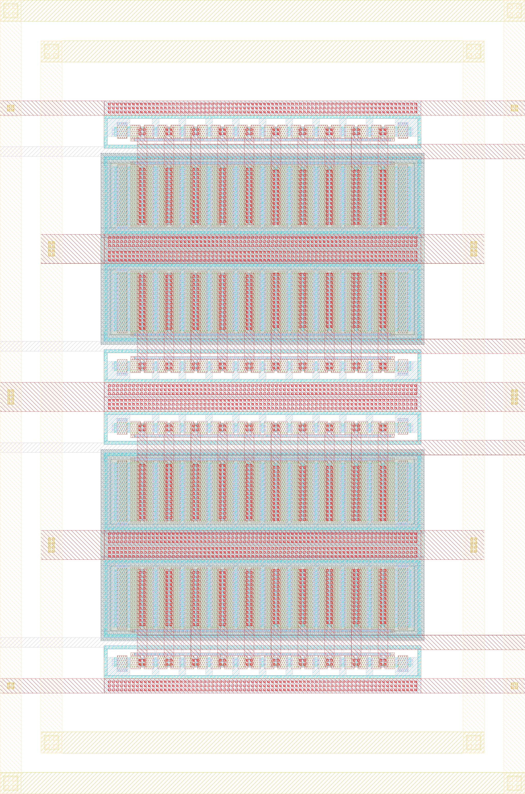

# ihp-sg13g2 Inverter

<p align="center">
  <a href="render/img/inverter_top_white.png">
    
  </a>
  <br>
  <em>Render of the ihp-sg13g2 inverter layout (54um x 82um).</em>
</p>


## Directory Structure

```text
📁 inverter/
├─ 📁 final/
│  ├─ 📁 gds/
│  │  └─ inverter_top.gds
│  ├─ 📁 lef/
│  │  └─ inverter_top.lef
│  ├─ 📁 lib/
│  │  └─ inverter_top.lib
│  └─ 📁 vh/
│     └─ inverter_top.v
├─ 📁 layout/
│  ├─ *.gds
│  ├─ *.klay.gds
│  └─ inverter_top.gds
├─ 📁 netlist/
│  ├─ 📁 layout/
│  │  ├─ *.cir
│  │  ├─ *.ext.spc
│  │  ├─ inverter_top_klayout.cir
│  │  └─ inverter_top_magic.ext.spc
│  ├─ 📁 pex/
│  │  ├─ *.spice
│  │  ├─ inverter_top_klayout_pex_*.spice
│  │  └─ inverter_top_magic_pex_*.spice
│  └─ 📁 schematic/
│     ├─ *.cdl
│     ├─ *.spice
│     ├─ inverter_top_klayout.cdl
│     └─ inverter_top_magic.spice
├─ 📁 render/
│  ├─ 📁 blender/
│  └─ 📁 img/
│     ├─ inverter_top_black.png
│     └─ inverter_top_white.png
├─ 📁 schematic/
│  └─ 📁 xschem/
│     ├─ *.sch
│     ├─ *.sym
│     ├─ inverter_top.sch
│     ├─ inverter_top.sym
│     ├─ inverter_top_pex.sym
│     └─ xschemrc
├─ 📁 scripts/
│  ├─ 📁 plot_simulations/
│  │  ├─ 📁 data/
│  │  ├─ 📁 figures/
│  │  ├─ ngspice2python.py
│  │  ├─ plot_inverter.py
│  │  └─ plot_inverter_top.py
│  ├─ 📁 sizing/
│  │  ├─ 📁 data/
│  │  ├─ 📁 figures/
│  │  ├─ lookup_commands.ipynb
│  │  └─ sizing_inverter.ipynb
│  ├─ reorder_spice_pins.py
│  └─ lay2img.py
├─ 📁 testbenches/
│  └─ 📁 xschem/
│     ├─ *_tb_*.sch
│     ├─ inverter_tb_ac_ol.sch
│     ├─ inverter_tb_tran.sch
│     ├─ inverter_tb_dc_vout.sch
│     ├─ inverter_top_tb_tran.sch
│     └─ xschemrc
├─ 📁 verification/
│  ├─ 📁 cace/
│  │  ├─ 📁 results/
│  │  ├─ 📁 scripts/
│  │  ├─ 📁 templates/
│  │  └─ inverter.yaml
│  ├─ 📁 drc/
│  │  ├─ 📁 *.klayout.drc/
│  │  ├─ 📁 *.magic.drc/
│  │  ├─ 📁 inverter_top.klayout.drc/
│  │  └─ 📁 inverter_top.magic.drc/
│  └─ 📁 lvs/
│     ├─ *.lvsdb
│     └─ inverter_top.lvsdb
├─ Makefile
└─ README.md
```


## Show Available Targets

The default Make target is `help`, so running `make` prints usage and all available targets with short descriptions.

```sh
make
make help
```

For the `sim-xschem` target, `TB=<testbenchname>` is required.

All targets that operate on a specific cell accept an optional `CELL=<cellname>` parameter. The default is the top-level cell (`inverter_top`).

```sh
make <target> [CELL=<cellname>] [EXT_MODE=<1|2|3>] [THRESHOLD=<mOhm>] [MINRES=<mOhm>] [MINDELAY=<ps>] [DRC_LEVEL=<precheck|macro|regular>] [EV_PRECISION=<digits>]
```


## Layout File Extension Usage

The Makefile defines a `_GDS_EXT` variable that auto-selects the layout file extension: it prefers `.gds` when available, and falls back to `.klay.gds` otherwise.

- Targets that use `layout/<name>.$(_GDS_EXT)` and work with either `.gds` or `.klay.gds`:
  - `klayout-lvs`
  - `klayout-drc`
  - `klayout-pex`
  - `magic-drc` (`sak-drc.sh` derives the GDS top cell name from the `<name>.klay.gds` naming convention)

- Magic targets that always use `layout/<name>.gds` (`sak-lvs.sh` and `sak-pex.sh` require standard `.gds`):
  - `magic-lvs`
  - `magic-pex`

- Build targets always use `layout/<name>.gds`:
  - `lef`
  - `copy-gds`
  - `render-gds`


## Run Xschem Testbench Simulation

Runs a single Xschem testbench in batch mode (no display): saves the schematic, exports the netlist to `testbenches/xschem/simulations/`, and runs the simulator. The testbench name **must** be specified via the `TB` variable:

```sh
make sim-xschem TB=<testbenchname>
```

For example:

```sh
make sim-xschem TB=inverter_tb_ac_ol
make sim-xschem TB=inverter_tb_tran
make sim-xschem TB=inverter_tb_dc_vout
make sim-xschem TB=inverter_top_tb_tran
```

All available testbench schematics are located in `testbenches/xschem/`. Generated netlists are written to `testbenches/xschem/simulations/`.


## Plot Xschem Simulation Results

Plots simulation results using the Python script selected by `CELL`:

```sh
make sim-view-xschem [CELL=<cellname>]
```

The target runs:
- `python3 scripts/plot_simulations/plot_<CELL>.py`

`CELL` defaults to `inverter_top`, so running without `CELL` uses `plot_inverter_top.py`.

Examples:

```sh
make sim-view-xschem
make sim-view-xschem CELL=inverter_top
make sim-view-xschem CELL=inverter
```


## CACE Simulations

Runs [CACE](https://github.com/fossi-foundation/cace) characterization for the inverter macro using `verification/cace/inverter.yaml`.

The `sim-cace` target runs these parameter sets in sequence:
- `ac_mm_params`
- `ac_mc_params`
- `ac_params`

For each run, selected result plots are copied to `verification/cace/results/inverter/`, and temporary `_runs` folders are cleaned between runs. At the end, `_runs`, `_docs`, and `netlist` under `verification/cace/` are removed.

Run with:

```sh
make sim-cace
```

Result plots are saved to:
- `verification/cace/results/inverter/`
  - `Adc_ol_dB_mm.png`, `fcu_mm.png`
  - `Adc_ol_dB_mc.png`, `fcu_mc.png`
  - `Adc_ol_dB_vs_vdd.png`, `fcu_vs_vdd.png`


## Simulate All

Runs all simulation steps in sequence:
- `make sim-xschem TB=inverter_tb_ac_ol`
- `make sim-xschem TB=inverter_tb_tran`
- `make sim-xschem TB=inverter_tb_dc_vout`
- `make sim-xschem TB=inverter_top_tb_tran`
- `make sim-cace`

Invoke with:

```sh
make sim-all
```

> [!NOTE]
> The `sim-view-xschem` target is intentionally **not** called by `sim-all`.
> It opens the generated Python figures, which blocks the shell until the window is closed.
> They are designed for interactive use and must be called manually after the simulation has completed.


## Build Top Cell

Builds the top-level cell deliverables in sequence: LEF export, LIB generation, Verilog stub generation, GDS copy, and layout image rendering:

```sh
make build-top
```


## Export LEF

Exports a LEF file (`final/lef/<TOP>.lef`) from the top-level layout GDS in `layout/` using Magic with the `-hide` option:

```sh
make lef
```


## Liberty Timing Library

Generates a Liberty timing library stub (`final/lib/<TOP>.lib`) with default threshold settings for the top-level cell:

```sh
make lib
```


## Verilog Stub

Generates a Verilog stub (`final/vh/<TOP>.v`) for top-level integration into the LibreLane flow by parsing pins from an extracted PEX netlist in `netlist/pex/`.

The `verilog` target:
- requires one of the following PEX files (run `make magic-pex` or `make klayout-pex` first):
  - `netlist/pex/<TOP>_magic_pex_1.spice`
  - `netlist/pex/<TOP>_magic_pex_2.spice`
  - `netlist/pex/<TOP>_magic_pex_3.spice`
  - `netlist/pex/<TOP>_klayout_pex_1.spice`
  - `netlist/pex/<TOP>_klayout_pex_2.spice`
  - `netlist/pex/<TOP>_klayout_pex_3.spice`
- auto-selects the first existing file from the list above
- reads the `.subckt <TOP>_pex` pin list (including continuation lines)
- emits recognized supply pins (`VDD`, `VSS`, `VPWR`, `VGND`, `VNB`, `VPB`) as `inout` under `` `ifdef USE_POWER_PINS ``
- classifies signal pins by prefix: `di_*` as `input`, `do_*` as `output`, others as `inout`

```sh
make verilog
```


## Copy GDS

Copies the top-level GDS from `layout/` to `final/gds/`:

```sh
make copy-gds
```


## Render Layout Image

Renders the top-level layout GDS using `lay2img.py` and saves the image to `render/img/`:

```sh
make render-gds
```


## Export Schematic Netlist for LVS

Exports the schematic netlist for LVS from Xschem and places it in `netlist/schematic/`.

The `EV_PRECISION` parameter sets the number of significant digits used by Xschem's `ev` function when calculating device properties (default: 5). Increase this to avoid LVS mismatches caused by floating-point rounding differences between Xschem and KLayout (see [xschem#465](https://github.com/StefanSchippers/xschem/issues/465)).

The `ntap` and `ptap` substrate contacts are ignored during LVS in both flows. KLayout LVS has to be run with the `--disable_tap_extraction` option so it does not extract `ntap` and `ptap` devices from the layout (matching Magic + Netgen LVS).

KLayout uses CDL netlists, while Magic uses SPICE netlists. Accordingly, `klayout-lvs-netlist` uses the Xschem commands `set spiceprefix 1`, `set lvs_netlist 1`, `set top_is_subckt 1`, and `set lvs_ignore 1`, while `magic-lvs-netlist` uses `set spiceprefix 1`, `set lvs_netlist 0`, `set top_is_subckt 1`, and `set lvs_ignore 1`. Hence, switching between CDL and SPICE netlists can be done with `lvs_netlist`.

To extract a CDL schematic netlist for KLayout LVS, use:
```sh
make klayout-lvs-netlist
make klayout-lvs-netlist CELL=inverter_top
make klayout-lvs-netlist EV_PRECISION=5
```

To extract a SPICE schematic netlist for Magic + Netgen LVS, use:
```sh
make magic-lvs-netlist
make magic-lvs-netlist CELL=inverter_top
make magic-lvs-netlist EV_PRECISION=5
```


## Layout Versus Schematic (LVS)

Exports the schematic netlist from Xschem, then runs LVS. Compares the layout in `layout/` against the schematic netlist in `netlist/schematic/`.

- `klayout-lvs` uses `layout/<CELL>.$(_GDS_EXT)` (`.gds` if present, otherwise `.klay.gds`)
- `magic-lvs` uses `layout/<CELL>.gds` (Magic requires `.gds`)

Reports are saved to `verification/lvs/`. The extracted layout netlist is moved to `netlist/layout/`.

**KLayout LVS** uses `run_lvs.py` from the IHP Open-PDK:

```sh
make klayout-lvs
make klayout-lvs CELL=inverter_top
```

**Magic + Netgen LVS** uses `sak-lvs.sh`:

```sh
make magic-lvs
make magic-lvs CELL=inverter_top
```


## Design Rule Check (DRC)

Runs DRC on the layout in `layout/`. Both flows use `sak-drc.sh`.

- `klayout-drc` and `magic-drc` use `layout/<CELL>.$(_GDS_EXT)` (`.gds` if present, otherwise `.klay.gds`)

Reports are written into per-cell run folders: `verification/drc/<CELL>.magic.drc/` (Magic) and `verification/drc/<CELL>.klayout.drc/` (KLayout, `.lyrdb`). The run folders are wiped at the start of each run, so they always reflect the latest run only.

The `DRC_LEVEL` parameter selects the KLayout DRC level (`sak-drc.sh -l`). It is ignored by `magic-drc`, since Magic has no selectable rule decks and always runs the full rule set compiled into the PDK's Magic tech file:

- `precheck` = core FEOL + BEOL manufacturing rules only (fast iteration)
- `macro` = block-in-isolation sign-off: `precheck` plus off-grid, zero-area, and pin/label checks (default)
- `regular` = full-chip sign-off: all checks, including density and antenna

| Check | `precheck` | `macro` _(default)_ | `regular` |
| --- | :---: | :---: | :---: |
| FEOL + BEOL core rules | ✓ | ✓ | ✓ |
| Off-grid / angle | – | ✓ | ✓ |
| Zero-area / geometry | – | ✓ | ✓ |
| Pin / label | – | ✓ | ✓ |
| Recommended / extra rules | – | – | ✓ |
| Density (chip-level fill) | – | – | ✓ |
| Antenna | – | – | ✓ |

**KLayout DRC** runs a KLayout DRC at the selected `DRC_LEVEL`:

```sh
make klayout-drc
make klayout-drc CELL=inverter_top
make klayout-drc CELL=inverter_top DRC_LEVEL=regular
```

**Magic DRC** runs a Magic DRC with all subcells flattened (`sak-drc.sh -f "*"`):

```sh
make magic-drc
make magic-drc CELL=inverter_top
```


## Parasitic Extraction (PEX)

Runs parasitic extraction on the layout in `layout/`. The extracted SPICE netlist is written to `netlist/pex/`.

- `klayout-pex` uses `layout/<CELL>.$(_GDS_EXT)` (`.gds` if present, otherwise `.klay.gds`)
- `magic-pex` uses `layout/<CELL>.gds` (Magic requires `.gds`)

The extracted SPICE filenames include the selected extraction mode:
- `klayout-pex` writes `netlist/pex/<CELL>_klayout_pex_<EXT_MODE>.spice`
- `magic-pex` writes `netlist/pex/<CELL>_magic_pex_<EXT_MODE>.spice`

The `EXT_MODE` parameter selects the extraction mode:
- `1` = C-decoupled
- `2` = C-coupled
- `3` = full-RC (default)

> [!NOTE]
> For `klayout-pex`, `EXT_MODE=1` (C-decoupled) is not yet supported by kpex and automatically falls back to `EXT_MODE=2` (CC) with a warning.

The `.subckt` name in the extracted SPICE file is `<CELL>_pex`: `magic-pex` sets it directly via the `sak-pex.sh` option `-n <CELL>_pex`, while for `klayout-pex` it is automatically renamed from `<CELL>_flat` (kpex).

If a matching Xschem symbol (`schematic/xschem/<CELL>_pex.sym`) exists, the `.subckt` pin order in the extracted SPICE file is automatically reordered to match the symbol's pin positions. This ensures the PEX netlist can be used directly with the corresponding Xschem symbol for simulation regardless of the selected `EXT_MODE`.

**KLayout PEX** uses `kpex` with the Magic extraction engine currently (2.5D engine is work in progress):

```sh
make klayout-pex
make klayout-pex CELL=inverter_top
make klayout-pex CELL=inverter_top EXT_MODE=3
```

**Magic PEX** uses `sak-pex.sh`:

```sh
make magic-pex
make magic-pex CELL=inverter_top
make magic-pex CELL=inverter_top EXT_MODE=3
```

For full-RC extraction (`EXT_MODE=3`), `magic-pex` additionally exposes the `sak-pex.sh` `extresist` tuning parameters. They are ignored in `EXT_MODE=1`/`2`:

- `THRESHOLD` - extresist threshold in mOhm (`-t`, default `10000` = 10 Ohm)
- `MINRES` - extresist minimum resistance in mOhm (`-r`, default `1000` = 1 Ohm)
- `MINDELAY` - extresist minimum delay in ps (`-y`, default `1`; `0` = gate by resistance)

```sh
make magic-pex CELL=inverter_top EXT_MODE=3 THRESHOLD=5000 MINRES=500 MINDELAY=2
```


## Verify with KLayout

**Verify a single cell** by running LVS, DRC, and PEX in sequence:

```sh
make klayout-verify
make klayout-verify CELL=inverter
```

**Verify all cells** (`inverter`, `inverter_top`):

```sh
make klayout-verify-all
```


## Verify with Magic

**Verify a single cell** by running LVS, DRC, and PEX in sequence:

```sh
make magic-verify
make magic-verify CELL=inverter
```

**Verify all cells** (`inverter`, `inverter_top`):

```sh
make magic-verify-all
```


## Build All

Runs the full flow in sequence: simulations, KLayout verification, Magic verification, and top-level build deliverables (`sim-all`, `klayout-verify-all`, `magic-verify-all`, `build-top`):

```sh
make all
```
