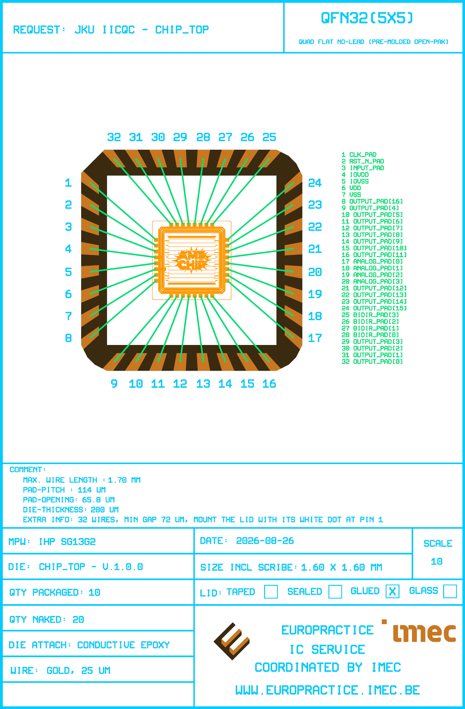

# Bondplan Report - chip_top v.1.0.0

Generated by `scripts/run_bondplan.py` on 2026-08-26.

## Summary

| | |
|---|---|
| Design | chip_top |
| Package | OP_QFN32_A4_FIT |
| Die size | 1.60 x 1.60 mm |
| Pad pitch / opening | 114 / 65.8 um |
| Bondwires | 32 (32 to leads, 0 exposed-pad downbonds) |
| Wire width | 25 um |
| Wire length | 1296 .. 1701 um |
| Min wire-to-wire gap | 72 um |
| Max lead skew | 3.5 deg |

## Bond Table

| Pin | Die pad | Die x/y (um) | Package x/y (um) | Length (um) | Angle (deg) | Skew (deg) | Min gap (um) |
|---|---|---|---|---|---|---|---|
| 1 | clk_PAD | 4010.0 / 9608.7 | 2725.0 / 10722.9 | 1700.8 | 139.1 | 3.5 | 71.8 |
| 2 | rst_n_PAD | 4010.0 / 9494.7 | 2725.0 / 10294.5 | 1513.5 | 148.1 | 3.2 | 71.8 |
| 3 | input_PAD | 4010.0 / 9380.7 | 2725.0 / 9864.7 | 1373.1 | 159.4 | 2.3 | 81.7 |
| 4 | IOVDD | 4010.0 / 9266.7 | 2725.0 / 9435.0 | 1296.0 | 172.5 | 1.0 | 88.0 |
| 5 | IOVSS | 4010.0 / 9152.7 | 2725.0 / 8984.5 | 1296.0 | -172.5 | 1.0 | 88.0 |
| 6 | VDD | 4010.0 / 9038.7 | 2725.0 / 8554.8 | 1373.1 | -159.4 | 2.3 | 81.7 |
| 7 | VSS | 4010.0 / 8924.7 | 2725.0 / 8125.1 | 1513.5 | -148.1 | 3.2 | 71.8 |
| 8 | output_PAD[16] | 4010.0 / 8810.7 | 2725.0 / 7699.1 | 1699.1 | -139.1 | 3.5 | 71.8 |
| 9 | output_PAD[4] | 4306.0 / 8514.7 | 3194.3 / 7229.7 | 1699.1 | -130.9 | 3.5 | 71.8 |
| 10 | output_PAD[5] | 4420.0 / 8514.7 | 3620.3 / 7229.7 | 1513.5 | -121.9 | 3.2 | 71.8 |
| 11 | output_PAD[6] | 4534.0 / 8514.7 | 4050.0 / 7229.7 | 1373.1 | -110.6 | 2.3 | 81.7 |
| 12 | output_PAD[7] | 4648.0 / 8514.7 | 4479.7 / 7229.7 | 1296.0 | -97.5 | 1.0 | 88.0 |
| 13 | output_PAD[8] | 4762.0 / 8514.7 | 4930.3 / 7229.7 | 1296.0 | -82.5 | 1.0 | 88.0 |
| 14 | output_PAD[9] | 4876.0 / 8514.7 | 5360.0 / 7229.7 | 1373.1 | -69.4 | 2.3 | 81.7 |
| 15 | output_PAD[10] | 4990.0 / 8514.7 | 5789.7 / 7229.7 | 1513.5 | -58.1 | 3.2 | 71.8 |
| 16 | output_PAD[11] | 5104.0 / 8514.7 | 6215.6 / 7229.7 | 1699.1 | -49.1 | 3.5 | 71.8 |
| 17 | analog_PAD[0] | 5400.0 / 8810.7 | 6685.0 / 7699.1 | 1699.1 | -40.9 | 3.5 | 71.8 |
| 18 | analog_PAD[1] | 5400.0 / 8924.7 | 6685.0 / 8125.1 | 1513.5 | -31.9 | 3.2 | 71.8 |
| 19 | analog_PAD[2] | 5400.0 / 9038.7 | 6685.0 / 8554.8 | 1373.1 | -20.6 | 2.3 | 81.7 |
| 20 | analog_PAD[3] | 5400.0 / 9152.7 | 6685.0 / 8984.5 | 1296.0 | -7.5 | 1.0 | 88.0 |
| 21 | output_PAD[12] | 5400.0 / 9266.7 | 6685.0 / 9435.0 | 1296.0 | 7.5 | 1.0 | 88.0 |
| 22 | output_PAD[13] | 5400.0 / 9380.7 | 6685.0 / 9864.7 | 1373.1 | 20.6 | 2.3 | 81.7 |
| 23 | output_PAD[14] | 5400.0 / 9494.7 | 6685.0 / 10294.5 | 1513.5 | 31.9 | 3.2 | 71.8 |
| 24 | output_PAD[15] | 5400.0 / 9608.7 | 6685.0 / 10720.4 | 1699.1 | 40.9 | 3.5 | 71.8 |
| 25 | bidir_PAD[3] | 5104.0 / 9904.7 | 6215.6 / 11189.7 | 1699.1 | 49.1 | 3.5 | 71.8 |
| 26 | bidir_PAD[2] | 4990.0 / 9904.7 | 5789.7 / 11189.7 | 1513.5 | 58.1 | 3.2 | 71.8 |
| 27 | bidir_PAD[1] | 4876.0 / 9904.7 | 5360.0 / 11189.7 | 1373.1 | 69.4 | 2.3 | 81.7 |
| 28 | bidir_PAD[0] | 4762.0 / 9904.7 | 4930.3 / 11189.7 | 1296.0 | 82.5 | 1.0 | 88.0 |
| 29 | output_PAD[3] | 4648.0 / 9904.7 | 4479.7 / 11189.7 | 1296.0 | 97.5 | 1.0 | 88.0 |
| 30 | output_PAD[2] | 4534.0 / 9904.7 | 4050.0 / 11189.7 | 1373.1 | 110.6 | 2.3 | 81.7 |
| 31 | output_PAD[1] | 4420.0 / 9904.7 | 3620.3 / 11189.7 | 1513.5 | 121.9 | 3.2 | 71.8 |
| 32 | output_PAD[0] | 4306.0 / 9904.7 | 3191.8 / 11189.7 | 1700.8 | 130.9 | 3.5 | 71.8 |
