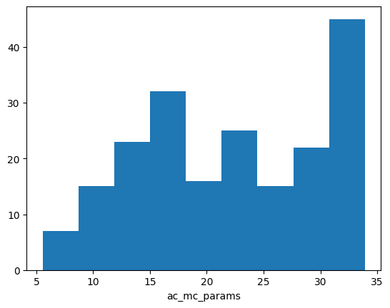
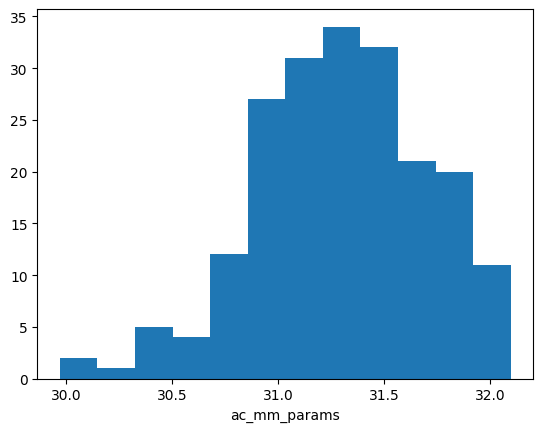
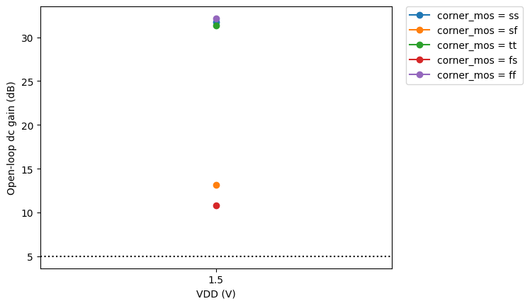
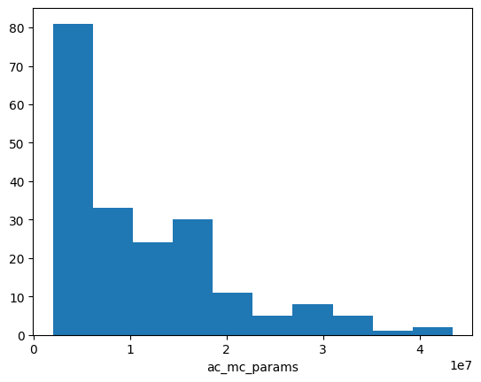
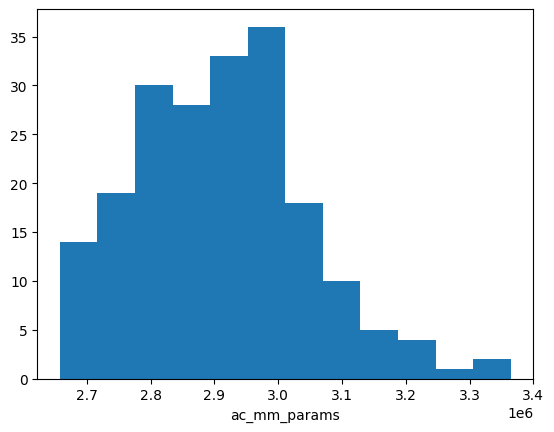
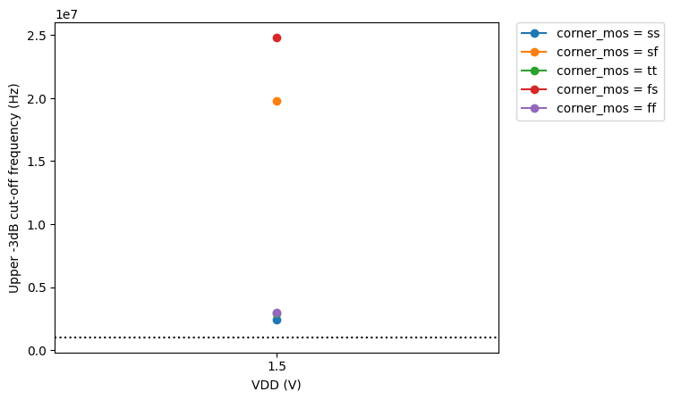
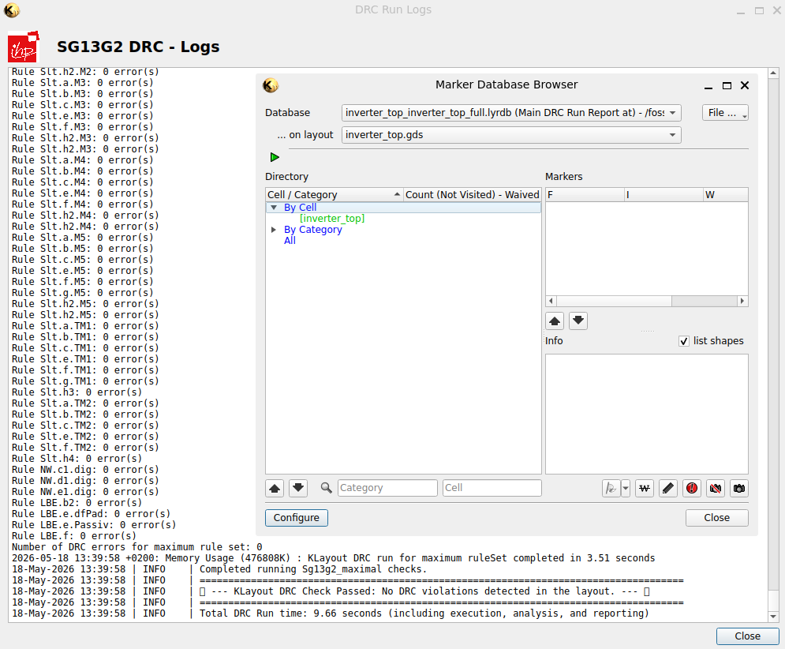
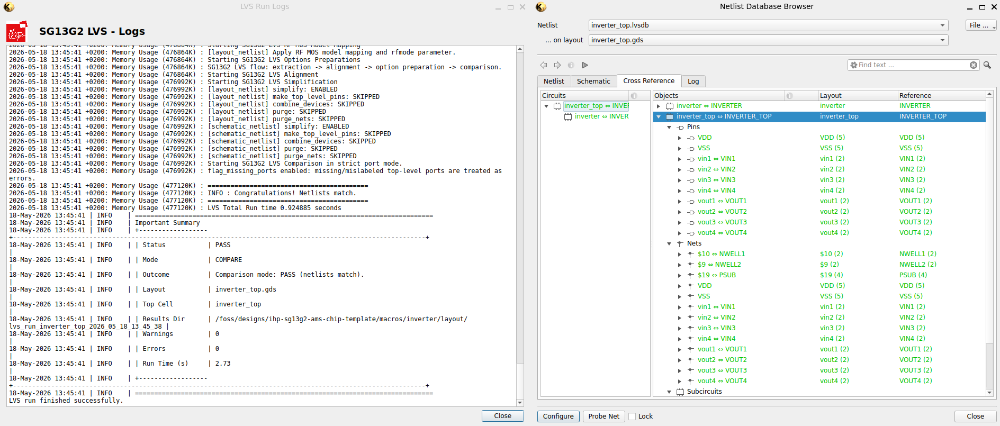

::: {.callout-important}
This tutorial and the underlying template repository require the [IIC-OSIC-TOOLS](https://github.com/iic-jku/IIC-OSIC-TOOLS) container with tag `2026.05` or later. All commands below assume that the container has been entered and that the working directory is a folder with the corresponding `Makefile`.
:::

# Tutorial Overview {#sec-overview}

This tutorial is a step-by-step walk-through of the open-source analog-mixed signal (AMS) chip flow based on the [`ihp-sg13g2-ams-chip-template`](https://github.com/iic-jku/ihp-sg13g2-ams-chip-template) repository for the ihp-sg13g2 130nm Open-PDK. It covers:

- [Overview](#sec-overview) and [Installation](#sec-installation) of [IIC-OSIC-TOOLS](https://github.com/iic-jku/IIC-OSIC-TOOLS)
- [Digital macro design](#sec-digital)
  - Design files written in SystemVerilog
  - Linting with [Verilator](https://github.com/verilator/verilator)
  - Simulation with Icarus Verilog and [cocotb](https://github.com/cocotb/cocotb)
  - Viewing waveforms with [GTKWave](https://github.com/gtkwave/gtkwave) and [Surfer](https://gitlab.com/surfer-project/surfer)
  - Synthesis, placement, routing, and sign-off with [Yosys](https://github.com/YosysHQ/yosys), [OpenROAD](https://github.com/The-OpenROAD-Project/OpenROAD), and [LibreLane](https://github.com/librelane/librelane)
- [Analog macro design](#sec-analog)
  - Schematic entry in [Xschem](https://github.com/StefanSchippers/xschem)
  - Simulation with [Ngspice](https://github.com/danchitnis/ngspice-sf-mirror) and [VACASK](https://codeberg.org/arpadbuermen/VACASK)
  - Monte Carlo / mismatch characterisation with [CACE](https://github.com/fossi-foundation/cace)
  - Layout in [KLayout](https://github.com/KLayout/klayout)
  - Verification with LVS, DRC, PEX using [KLayout](https://github.com/KLayout/klayout), [Magic](https://github.com/rtimothyedwards/magic) + [Netgen](https://github.com/rtimothyedwards/netgen)
- [Top-level assembly and padframe generation](#sec-top) with logos and fill structures using SystemVerilog and the [LibreLane](https://github.com/librelane/librelane) flow.

The example design used throughout the tutorial contains:

- Two digital `counter_top` macros (8-bit synchronous up-counters)
- Two `inverter_top` macros, one used as a 4-channel CMOS digital inverter, one as a 2-channel analog inverter
- One `RM_IHPSG13_1P_1024x32_c2_bm_bist` single-port SRAM macro
- A 32-pad padframe (8 pads per side) with I/O, power, analog, and bidirectional pads
- The top-level chip assembly with power distribution network (PDN), logos, and fill structures

The tutorial ends with a set of exercises that apply the same flow to a modified counter, a ring oscillator using the inverters, and a modified top-level floorplan and pinout. This way, all important steps of the flow are covered in a hands-on manner.

::: {.callout-tip}
The tutorial can be used both for self-study and as the basis for a workshop. Each section can be followed independently.
:::

::: {.callout-note}
After the tutorial, readers should be able to use the template repository for custom silicon projects and understand how to apply the open-source tools in the IIC-OSIC-TOOLS container to design, simulate, build, and verify AMS chips with the ihp-sg13g2 Open-PDK.
:::

## Guidelines & Cheatsheets

The following guidelines and cheatsheets should be helpful for the tutorial, the use of the template repository in general and for implementing your own custom silicon projects.

- [Designer's Guidelines](https://iic-jku.github.io/analog-circuit-design/aicd.html#sec-designers-etiquette)
- [Linux Cheatsheet](https://iic-jku.github.io/analog-circuit-design/aicd.html#sec-linux-cheatsheet)
- [SystemVerilog Cheatsheet](https://github.com/iic-jku/ihp-sg13g2-ams-chip-template/blob/main/doc/verilog/SystemVerilog_cheatsheet.pdf)
- [Verilog Cheatsheet](https://github.com/iic-jku/ihp-sg13g2-ams-chip-template/blob/main/doc/verilog/Verilog_cheatsheet.pdf)
- [Xschem Cheatsheet](https://iic-jku.github.io/analog-circuit-design/aicd.html#sec-xschem-cheatsheet)
- [Ngspice Cheatsheet](https://iic-jku.github.io/analog-circuit-design/aicd.html#sec-ngspice-cheatsheet)
- [KLayout Cheatsheet](https://github.com/iic-jku/ihp-sg13g2-ams-chip-template/blob/main/doc/klayout/klayout_cheatsheet.md)
- [KLayout Productivity Suite / Plugins](https://github.com/iic-jku/klayout-productivity-suite)
- [LibreLane Cheatsheet](https://github.com/iic-jku/ihp-sg13g2-ams-chip-template/blob/main/doc/librelane/librelane_cheatsheet.md)
- [ihp-sg13g2 Layout Calculation Cheatsheet](https://github.com/iic-jku/ihp-sg13g2-ams-chip-template/blob/main/doc/ihp-sg13g2-Open-PDK/sg13g2_os_layout_cheatsheet.xlsx)
- [ihp-sg13g2 LV NMOS / PMOS and HV NMOS / PMOS Techsweeps](https://github.com/iic-jku/ihp-sg13g2-ams-chip-template/tree/main/doc/sizing)

# Tools {#sec-tools}

Numerous open-source chip design tools cover the entire development workflow for purely digital, purely analog, or mixed analog-digital chips. Managing these many tools regarding installation, updates, and maintenance is complex, especially given the rapid pace of change. Therefore, the [Institute for Integrated Circuits and Quantum Computing](https://www.jku.at/en/institute-for-integrated-circuits-and-quantum-computing/) at [Johannes Kepler University](https://www.jku.at/) (JKU) Linz, Austria decided to build an all-in-one Docker container ([IIC-OSIC-TOOLS](https://github.com/iic-jku/IIC-OSIC-TOOLS)) that is updated monthly and supports all essential tools and PDKs. This eliminates the need for the time-consuming individual installation of many tools, and a reproducible development environment (important for past tapeouts) is available within a GNU/Linux-based virtual machine.

## IIC-OSIC-TOOLS Overview

@fig-tools-overview shows a rough overview of the most important tools in the IIC-OSIC-TOOLS container. Additional tools are also included, which are documented on the associated [GitHub page](https://github.com/iic-jku/IIC-OSIC-TOOLS).
The open-source AMS flow used in this tutorial relies on several tools, namely [Xschem](https://github.com/StefanSchippers/xschem), [Magic](https://github.com/rtimothyedwards/magic), [Netgen](https://github.com/rtimothyedwards/netgen), [KLayout](https://github.com/KLayout/klayout), [Ngspice](https://github.com/danchitnis/ngspice-sf-mirror), [VACASK](https://codeberg.org/arpadbuermen/VACASK), [CACE](https://github.com/fossi-foundation/cace), [LibreLane](https://github.com/librelane/librelane), [Yosys](https://github.com/YosysHQ/yosys), [OpenROAD](https://github.com/The-OpenROAD-Project/OpenROAD), [Verilator](https://github.com/verilator/verilator), [cocotb](https://github.com/cocotb/cocotb), [GTKWave](https://github.com/gtkwave/gtkwave), and [Surfer](https://gitlab.com/surfer-project/surfer).
The container also ships with four PDKs, including [SkyWater sky130A](https://github.com/rtimothyedwards/open_pdks), [GlobalFoundries gf180mcuD](https://github.com/rtimothyedwards/open_pdks), [IHP ihp-sg13cmos5l](https://github.com/IHP-GmbH/ihp-sg13cmos5l) and [IHP ihp-sg13g2](https://github.com/IHP-GmbH/IHP-Open-PDK) used by this template.

{#fig-tools-overview}

## IIC-OSIC-TOOLS Installation {#sec-installation}

The container runs on Linux, macOS, and Windows. The installation instructions are documented in the container's [`README.md`](https://github.com/iic-jku/IIC-OSIC-TOOLS/blob/main/README.md#1-how-to-use-these-open-source-and-free-ic-design-tools). For this tutorial, we recommend the quick one-liner installation.

Additional video walk-throughs are available for Linux and Windows.

::: {.callout-note collapse="true"}

### Ubuntu / Linux installation

- [IIC-OSIC-TOOLS installation on Ubuntu](https://www.youtube.com/watch?v=l8kZUocmY5k)
:::

::: {.callout-note collapse="true"}

### Windows installation

- [IIC-OSIC-TOOLS installation on Windows (from 37:20 to 45:15)](https://www.youtube.com/watch?v=AiFTwKdS2V4)
:::

## PDK Selection

As mentioned above, the container includes four Open-PDKs. To activate or switch the active PDK, the following two options are available. More detailed instructions can be found in the container's [`README.md`](https://github.com/iic-jku/IIC-OSIC-TOOLS/blob/main/README.md#2-installed-pdks).

1. **`.designinit` file:** Copy the [`.designinit`](https://github.com/iic-jku/ihp-sg13g2-ams-chip-template/blob/main/.designinit) file referencing the ihp-sg13g2 PDK into your `designs/` directory and restart the container. The PDK is then picked automatically every time the container is launched in that directory.

2. **On-the-fly switch:** Run

   ```sh
   sak-pdk ihp-sg13g2
   ```

  inside the container. This switches the active PDK for the current session without modifying any file. When called without arguments (`sak-pdk`), a list of installed PDKs is shown.

::: {.callout-tip}
By default, the container is already configured for `ihp-sg13g2`, so both options above are only needed when switching between PDKs. However, since this tutorial can also be used for all other PDKs, it is worth knowing how to switch the active PDK.
:::

# Repository Overview {#sec-repo}

## Purpose

This Makefile-driven repository simulates, builds, and fully verifies (LVS, DRC, PEX) a complete analog mixed-signal chip for the ihp-sg13g2 130nm Open-PDK, including padframe generation and top-level assembly. It uses:

- [**LibreLane**](https://github.com/librelane/librelane) for digital macro hardening, padframe generation and top-level assembly
- [**Xschem**](https://github.com/StefanSchippers/xschem) for schematic entry
- [**Ngspice**](https://github.com/danchitnis/ngspice-sf-mirror), [**VACASK**](https://codeberg.org/arpadbuermen/VACASK) and [**CACE**](https://github.com/fossi-foundation/cace) for analog simulation
- [**KLayout**](https://github.com/KLayout/klayout) for viewing and routing of the layout
- [**Magic**](https://github.com/rtimothyedwards/magic) + [**Netgen**](https://github.com/rtimothyedwards/netgen) and [**KLayout**](https://github.com/KLayout/klayout) for LVS, DRC and PEX verification
- **SystemVerilog**, [**cocotb**](https://github.com/cocotb/cocotb), [**GTKWave**](https://github.com/gtkwave/gtkwave) and [**Surfer**](https://gitlab.com/surfer-project/surfer) for digital simulation

The repository is the starting point for your own custom silicon and provides a universal design flow solution: Just clone the repo, enter the IIC-OSIC-TOOLS container, and run `make all` to get a tapeout-ready analog-mixed signal chip. Focus on your design and do not care about the tools and the design flow!

Furthermore, it serves as a regression test for the above-mentioned open-source tools and their dependencies using the ihp-sg13g2 Open-PDK.

## Examples

Examples based on this template are:

- [TinyWhisper](https://github.com/iic-jku/TinyWhisper): An Open-Source Fully-Integrated Multi-Mode Short-Wave Transmitter for Amateur Radio Applications in 130-nm CMOS
- [SPARX](https://github.com/iic-jku/SG13G2_SPARX): An Open-Source, Automated, Programmatically Generated, Frequency-Scalable Six-Port Receiver in 130-nm CMOS
- wafer.space gf180mcuD MPW [Multi-Project Chip](https://github.com/iic-jku/gf180mcu-jku-projects)


## Directory Structure

The repository is organised into the following top-level folders. The full listing can be found in the [top-level README.md](https://github.com/iic-jku/ihp-sg13g2-ams-chip-template/blob/main/README.md#directory-structure).

| Folder | Purpose |
| ------------------------------ | --- |
| [`doc/`](https://github.com/iic-jku/ihp-sg13g2-ams-chip-template/tree/main/doc/) | Designer documentation, including [specifications](https://github.com/iic-jku/ihp-sg13g2-ams-chip-template/blob/main/doc/specifications.md), [pinout](https://github.com/iic-jku/ihp-sg13g2-ams-chip-template/blob/main/doc/pinout.md), [floorplan](https://github.com/iic-jku/ihp-sg13g2-ams-chip-template/blob/main/doc/floorplan.md), and the [PDK and tool cheatsheets](https://github.com/iic-jku/ihp-sg13g2-ams-chip-template/blob/main/doc/librelane/librelane_cheatsheet.md). |
| [`flow/`](https://github.com/iic-jku/ihp-sg13g2-ams-chip-template/tree/main/flow/) | LibreLane top-level configuration with [config.yaml](https://github.com/iic-jku/ihp-sg13g2-ams-chip-template/blob/main/flow/librelane/config.yaml), [pdn_cfg.tcl](https://github.com/iic-jku/ihp-sg13g2-ams-chip-template/blob/main/flow/librelane/pdn_cfg.tcl), [chip_top.sdc](https://github.com/iic-jku/ihp-sg13g2-ams-chip-template/blob/main/flow/librelane/chip_top.sdc), plus the [ArtistIC](https://github.com/pulp-platform/artistic) logo flow. |
| [`ip/`](https://github.com/iic-jku/ihp-sg13g2-ams-chip-template/tree/main/ip/) | External IP cells including bondpads, custom IO cells, and logos. |
| [`layout/`](https://github.com/iic-jku/ihp-sg13g2-ams-chip-template/tree/main/layout/) | Compressed GDS streams of the top-level chip, including chip_top.gds.gz and chip_top_logo_fill.gds.gz. |
| [`macros/`](https://github.com/iic-jku/ihp-sg13g2-ams-chip-template/tree/main/macros/) | Recursive-style macros such as [counter/](https://github.com/iic-jku/ihp-sg13g2-ams-chip-template/tree/main/macros/counter/) and [inverter/](https://github.com/iic-jku/ihp-sg13g2-ams-chip-template/tree/main/macros/inverter/), each with its own Makefile and README. |
| [`netlist/`](https://github.com/iic-jku/ihp-sg13g2-ams-chip-template/tree/main/netlist/) | Synthesis, schematic, layout, and PEX netlists used for top-level LVS and simulation. |
| [`release/`](https://github.com/iic-jku/ihp-sg13g2-ams-chip-template/tree/main/release/) | Tapeout submission artifacts grouped by version. |
| [`render/`](https://github.com/iic-jku/ihp-sg13g2-ams-chip-template/tree/main/render/) | Chip and macro renders used in the documentation. |
| [`rtl/`](https://github.com/iic-jku/ihp-sg13g2-ams-chip-template/tree/main/rtl/) | Top-level RTL sources, including [chip_top.sv](https://github.com/iic-jku/ihp-sg13g2-ams-chip-template/blob/main/rtl/chip_top.sv) and [chip_core.sv](https://github.com/iic-jku/ihp-sg13g2-ams-chip-template/blob/main/rtl/chip_core.sv). |
| [`schematic/`](https://github.com/iic-jku/ihp-sg13g2-ams-chip-template/tree/main/schematic/) | Xschem schematics and symbols for the top-level chip. |
| [`scripts/`](https://github.com/iic-jku/ihp-sg13g2-ams-chip-template/tree/main/scripts/) | Helper Python and shell scripts for rendering, logo placement, and plotting. |
| [`testbenches/`](https://github.com/iic-jku/ihp-sg13g2-ams-chip-template/tree/main/testbenches/) | Xschem and cocotb testbenches for the top-level chip. |
| [`tutorial/`](https://github.com/iic-jku/ihp-sg13g2-ams-chip-template/tree/main/tutorial/) | This Quarto tutorial and its supporting materials. |
| [`verification/`](https://github.com/iic-jku/ihp-sg13g2-ams-chip-template/tree/main/verification/) | DRC, LVS, and signoff reports. |

## Workflow

The flow is driven by Makefiles. After cloning the repository and entering the IIC-OSIC-TOOLS container, every step is invoked via a `make` target. The default goal of every `Makefile` is `help`, so `make` (without arguments) prints the list of available targets. After entering the container, the starting folder is `foss/designs/`.

```sh
git clone https://github.com/iic-jku/ihp-sg13g2-ams-chip-template.git
cd ihp-sg13g2-ams-chip-template
make help              # show available targets at the top level
```

::: {.callout-tip}
Instead of `git clone`, you can start by clicking the green "Use this template" button on the GitHub page to create your own copy of the repository. This way, you can push your changes to your own GitHub repository and even make it public if you want to share your custom silicon design with the community.
:::

Each macro under [`macros/`](https://github.com/iic-jku/ihp-sg13g2-ams-chip-template/tree/main/macros/) has its own `Makefile` and `README.md` with macro-local targets. They are called by the top-level build targets, but can also be invoked directly from inside the macro folder.

### Top-level targets

The [top-level Makefile](https://github.com/iic-jku/ihp-sg13g2-ams-chip-template/blob/main/Makefile) provides:

| Target              | What it does                                                                                          |
| ----------------------------------------------- | ----------------------------------------------------------------------------------------------------- |
| `make help`         | Print the help banner and list every target with its description.                                     |
| `make init-submodules` | Initialise and update git submodules (for example the ArtistIC logo flow).                         |
| `make sim-rtl-cocotb` / `sim-gl-cocotb` | Run the RTL / gate-level cocotb testbench for the top-level.                       |
| `make sim-gl-xschem` | Run the gate-level Xschem testbench. Converges, but it may take a long time depending on the hardware used and is therefore not included in `sim-all`. |
| `make sim-view-cocotb` | Open the latest cocotb waveform in GTKWave (or Surfer with `WAVEFORM_VIEWER=surfer`).              |
| `make librelane` / `librelane-nodrc` | Run the LibreLane flow for the top-level (with / without DRC steps).                  |
| `make copy-reports` / `copy-gds` / `copy-netlist` / `copy-render` | Copy the latest LibreLane artifacts back into the source tree. |
| `make build-bondpad` / `build-logos` | Build the bondpad and the logos under `ip/`.                                     |
| `make build-counter` / `build-inverter` / `make build-macros` | Build the digital and analog macros individually or together. |
| `make build-top`    | Run LibreLane on the top-level, copy back all artifacts, add logos and fill structures, and render the final GDS. |
| `make build-all`    | Init submodules, build bondpad, build logos, build macros, and build top-level.                           |
| `make klayout-verify` / `magic-verify` | Run LVS, DRC, and PEX for a given cell with KLayout or Magic.                      |
| `make all`          | Full simulation, build, and verification.                                                                 |
| `make release VERSION=2.1.0` | Copy GDS, netlists, and renders into `release/v.<VERSION>/` for tapeout submission.          |

See the [top-level README](https://github.com/iic-jku/ihp-sg13g2-ams-chip-template/blob/main/README.md) for more details and how to use the Makefile targets.

### Digital macro targets

The [counter Makefile](https://github.com/iic-jku/ihp-sg13g2-ams-chip-template/blob/main/macros/counter/Makefile) provides:

| Target                                            | What it does                                                                |
| --------------------------------------------------------- | --------------------------------------------------------------------------- |
| `make lint-verilog` / `make lint-verilog-all`     | Lint a single cell or the full counter design with Verilator.               |
| `make sim-rtl-verilog`                            | Run the SystemVerilog testbench with Icarus Verilog.                        |
| `make sim-rtl-cocotb` / `sim-gl-cocotb`           | Run the cocotb RTL / gate-level simulation.                                 |
| `make sim-view-verilog` / `sim-view-cocotb`       | Open the latest waveform in GTKWave or Surfer.                              |
| `make librelane` (and `-nodrc`, `-magicdrc`, …)   | Run the LibreLane flow for the counter macro.                               |
| `make generate-xspice`                            | Convert the gate-level netlist into an XSPICE model for Xschem.             |
| `make sim-gl-xschem` / `sim-view-xschem`          | Run the mixed-signal XSPICE simulation in Xschem and plot the results.      |
| `make build-fpga`                                 | Run the full FPGA flow: lint, synthesis, P&R, and bitstream generation.     |
| `make build-top`                                  | Run LibreLane, copy reports, netlists, and final views, and render the final GDS. |
| `make all`                                        | Run lint, all simulations, the FPGA build, and the full macro build flow.   |

See the [counter README](https://github.com/iic-jku/ihp-sg13g2-ams-chip-template/blob/main/macros/counter/README.md) for more details and how to use the Makefile targets.

### Analog macro targets

The [inverter Makefile](https://github.com/iic-jku/ihp-sg13g2-ams-chip-template/blob/main/macros/inverter/Makefile) provides:

| Target                                            | What it does                                                                |
| --------------------------------------------------------- | --------------------------------------------------------------------------- |
| `make sim-xschem TB=<tb>` / `make sim-view-xschem` | Run a specific Xschem testbench and plot its results with Python.          |
| `make sim-cace`                                   | Run [CACE](https://github.com/fossi-foundation/cace) Monte-Carlo / mismatch characterisations. |
| `make klayout-lvs` / `magic-lvs`                  | Run LVS using KLayout or Magic + Netgen.                                    |
| `make klayout-drc` / `magic-drc`                  | Run DRC using KLayout or Magic.                                             |
| `make klayout-pex` / `magic-pex` (`EXT_MODE=<1|2|3>`) | Run parasitic extraction in C, CC, or full-RC mode.                     |
| `make klayout-verify` / `magic-verify`            | Run LVS + DRC + PEX for a given cell.                                       |
| `make lef` / `make lib` / `make verilog`          | Generate the LEF, the Liberty stub, and the Verilog stub for top-level integration.   |
| `make build-top`                                  | Build the analog macro deliverables: LEF, LIB, Verilog stub, GDS and rendered layout image. |
| `make all`                                        | Run all simulations, the analog macro build flow and KLayout / Magic verification. |

See the [inverter README](https://github.com/iic-jku/ihp-sg13g2-ams-chip-template/blob/main/macros/inverter/README.md) for more details and how to use the Makefile targets.


# Digital Macro Implementation {#sec-digital}

The [`counter`](https://github.com/iic-jku/ihp-sg13g2-ams-chip-template/tree/main/macros/counter/) macro is the digital reference macro of the template. It is a parameterisable synchronous up-counter with synchronous active-high reset implemented with SystemVerilog in [`counter.sv`](https://github.com/iic-jku/ihp-sg13g2-ams-chip-template/blob/main/macros/counter/rtl/counter.sv). The top-level wrapper [`counter_top.sv`](https://github.com/iic-jku/ihp-sg13g2-ams-chip-template/blob/main/macros/counter/rtl/counter_top.sv) converts the chip's active-low reset to an active-high signal. The default width is 8 bits, so the counter wraps from 255 back to 0.

## Folder Structure

The counter design files are located in [`macros/counter/`](https://github.com/iic-jku/ihp-sg13g2-ams-chip-template/tree/main/macros/counter/), the relevant folders are:

| Folder                                       | Content                                                                                  |
| ---------------------------------------------------- | ---------------------------------------------------------------------------------------- |
| [`rtl/`](https://github.com/iic-jku/ihp-sg13g2-ams-chip-template/tree/main/macros/counter/rtl/)             | SystemVerilog sources: [`constants.sv`](https://github.com/iic-jku/ihp-sg13g2-ams-chip-template/blob/main/macros/counter/rtl/constants.sv), [`counter.sv`](https://github.com/iic-jku/ihp-sg13g2-ams-chip-template/blob/main/macros/counter/rtl/counter.sv), [`counter_top.sv`](https://github.com/iic-jku/ihp-sg13g2-ams-chip-template/blob/main/macros/counter/rtl/counter_top.sv). |
| [`testbenches/`](https://github.com/iic-jku/ihp-sg13g2-ams-chip-template/tree/main/macros/counter/testbenches/) | `verilog/`, `cocotb/`, and `xschem/` testbenches with pre-configured GTKWave and Surfer view files. |
| [`flow/`](https://github.com/iic-jku/ihp-sg13g2-ams-chip-template/tree/main/macros/counter/flow/)           | LibreLane configuration (`config.yaml`, `pin_order.cfg`, `impl.sdc`, `signoff.sdc`). |
| [`final/`](https://github.com/iic-jku/ihp-sg13g2-ams-chip-template/tree/main/macros/counter/final/)         | Final deliverables (GDS, LEF, LIB per corner, NL, PNL, SPEF, VH) copied from the latest LibreLane run for top-level integration. |
| [`fpga/`](https://github.com/iic-jku/ihp-sg13g2-ams-chip-template/tree/main/macros/counter/fpga/)           | Optional FPGA flow for the [pico-ice](https://pico-ice.tinyvision.ai/) board.    |
| [`netlist/`](https://github.com/iic-jku/ihp-sg13g2-ams-chip-template/tree/main/macros/counter/netlist/)     | `nl/`, `pnl/`, `spice/` and `xspice/` netlists (see [LibreLane cheatsheet](https://github.com/iic-jku/ihp-sg13g2-ams-chip-template/blob/main/doc/librelane/librelane_cheatsheet.md#3-netlists--circuit-views) for more details). |
| [`schematic/`](https://github.com/iic-jku/ihp-sg13g2-ams-chip-template/tree/main/macros/counter/schematic/) | Xschem symbol of the macro for use in mixed-signal Xschem testbenches.                                       |
| [`scripts/`](https://github.com/iic-jku/ihp-sg13g2-ams-chip-template/tree/main/macros/counter/scripts/)     | Helper scripts (XSPICE conversion, plotting, layout rendering).                        |
| [`verification/`](https://github.com/iic-jku/ihp-sg13g2-ams-chip-template/tree/main/macros/counter/verification/) | Yosys, antenna, STA, IR-drop, DRC, LVS, and manufacturability reports.            |
| [`render/`](https://github.com/iic-jku/ihp-sg13g2-ams-chip-template/tree/main/macros/counter/render/)       | Macro renders for documentation.                                                       |

::: {.callout-tip}
Read the [counter README](https://github.com/iic-jku/ihp-sg13g2-ams-chip-template/blob/main/macros/counter/README.md) first to get familiar with the folder layout and the available Makefile targets. Most of the commands below are documented there as well.
:::

## Reading the RTL

The macro is split into a parameterised counter and a top-level wrapper that converts the chip's active-low reset to the internal active-high reset of the counter.

### `counter.sv`

The logic is implemented in [`counter.sv`](https://github.com/iic-jku/ihp-sg13g2-ams-chip-template/blob/main/macros/counter/rtl/counter.sv). It is an $N$-bit synchronous up-counter with reset and enable, and it wraps at `CTR_MAX`. $N$ defaults to 8, so the counter counts from 0 to 255 and then wraps back to 0.

```{.systemverilog filename="macros/counter/rtl/counter.sv"}

```

### `counter_top.sv`

[`counter_top.sv`](https://github.com/iic-jku/ihp-sg13g2-ams-chip-template/blob/main/macros/counter/rtl/counter_top.sv) wraps the counter and converts the active-low reset (`reset_n_i`) to an active-high signal `reset`.

```{.systemverilog filename="macros/counter/rtl/counter_top.sv"}

```

Shared defaults are defined in [`constants.sv`](https://github.com/iic-jku/ihp-sg13g2-ams-chip-template/blob/main/macros/counter/rtl/constants.sv). For example, for the final implementation, the maximum counter value is defined in `constants.sv` with the variable `COUNTER_MAX_DEFAULT`. For the testbenches, `CLK_FREQ_DEFAULT` is defined there to set the default clock frequency (e.g. 50 MHz) for the simulations. They are exposed as `` `define `` macros instead of a SystemVerilog `package`, because Yosys 0.64 cannot parse `import pkg::*` in a module header.

::: {.callout-note}
Open the three RTL files (using `gedit` or `vim`), follow and understand the counter through reset, hold, increment, and wrap-around.
:::

## Linting

[Linting](https://en.wikipedia.org/wiki/Lint_(software)) is done with [Verilator](https://www.veripool.org/verilator/) and can be executed with the following commands.

```sh
cd macros/counter
make lint-verilog                # lint the full counter_top design
make lint-verilog CELL=counter   # lint only the standalone counter
make lint-verilog-all            # lint counter and counter_top in sequence
```

`make lint-verilog-all` is also the lint step called by `make all`.

## Simulation

### RTL with SystemVerilog testbench (Icarus Verilog)

A SystemVerilog testbench ([`counter_top_tb.sv`](https://github.com/iic-jku/ihp-sg13g2-ams-chip-template/blob/main/macros/counter/testbenches/verilog/counter_top_tb.sv)) checks reset, hold, increment, and wrap-around. Run it with the following commands.

```sh
make sim-rtl-verilog
make sim-view-verilog               # open in GTKWave (default)
make sim-view-verilog WAVEFORM_VIEWER=surfer
```

{#fig-counter-top-verilog-gtkwave}

### RTL and gate-level with cocotb

The [cocotb](https://www.cocotb.org/) testbench ([`counter_top_tb.py`](https://github.com/iic-jku/ihp-sg13g2-ams-chip-template/blob/main/macros/counter/testbenches/cocotb/counter_top_tb.py)) checks the same four cases (reset, hold, increment, and wrap-around) as the SystemVerilog testbench, but implements them in Python.

```sh
make sim-rtl-cocotb                # RTL simulation
make sim-gl-cocotb                 # post-synthesis gate-level simulation
make sim-view-cocotb               # view in GTKWave
make sim-view-cocotb WAVEFORM_VIEWER=surfer
```

{#fig-counter-top-cocotb-gtkwave}

The gate-level cocotb run uses the gate-level Verilog netlist produced after synthesis: [`netlist/nl/counter_top.nl.v`](https://github.com/iic-jku/ihp-sg13g2-ams-chip-template/tree/main/macros/counter/netlist/nl/). In this tutorial, this netlist for the counter already exists. For new designs, run `make build-top` first to execute the LibreLane flow, then run `make copy-netlist` to copy the netlists from the latest LibreLane run.

## LibreLane Hardening

The LibreLane flow synthesises, places, and routes the macro, runs the sign-off steps, and writes its final output files to `flow/final/`. The wrapper target `make build-top` runs the flow, renders the final GDS, and copies the reports, final folders, netlists, and render output back into the source tree.

```sh
make build-top
```

::: {.callout-tip}
The macro can also be built as an FPGA bitstream ([`fpga/`](https://github.com/iic-jku/ihp-sg13g2-ams-chip-template/tree/main/macros/counter/fpga/)) for a pico-ice board (or other FPGA boards) with `make build-fpga`. The FPGA flow is not used in this tutorial and is only listed here for reference.
:::

## Viewing the Macro

After the flow finishes, the macro layout can be inspected with KLayout. The container provides the `ke` alias for `klayout -e` (edit mode). With the following command, the final GDS from the latest LibreLane run is opened in KLayout. With the keys `0`, `1`, `2`, ..., `9` you can view different layers as explained in the [KLayout cheatsheet](https://github.com/iic-jku/ihp-sg13g2-ams-chip-template/blob/main/doc/klayout/klayout_cheatsheet.md) or in the [klayout-layer-shortcuts](https://github.com/iic-jku/klayout-layer-shortcuts) plugin.

```sh
ke final/gds/counter_top.gds
```

{#fig-counter-top-layout}

The LibreLane render is copied to [`render/img/counter_top_librelane.png`](https://github.com/iic-jku/ihp-sg13g2-ams-chip-template/tree/main/macros/counter/render/img/), and the high-resolution render from `lay2img.py` is saved as `counter_top.png` in the same folder. The sign-off reports are written to [`verification/`](https://github.com/iic-jku/ihp-sg13g2-ams-chip-template/tree/main/macros/counter/verification/).

## RTL Mixed-Signal Simulation with Xschem

For an introduction to Ngspice and Verilog RTL co-simulation with Xschem, see Stefan Schippers' video: [Ngspice + Verilog Co-Simulation in Xschem](https://www.youtube.com/watch?v=PPd7jkcHOgA). This RTL mixed-signal simulation is currently not included in this repository, but it will be added in a future update.

## Gate-Level Mixed-Signal Simulation with Xschem

A more accurate validation step is the gate-level mixed-signal simulation in Xschem with the Ngspice XSPICE event-driven engine. The gate-level Verilog netlist produced after synthesis (`runs/RUN_*/*-yosys-synthesis/<TOP>.nl.v`) is converted into an XSPICE model with the following command.

```sh
make generate-xspice
```

The conversion pipeline is `.nl.v → .vp → .spice → .xspice`, followed by a pin-reorder pass to match the Xschem symbol
([`schematic/xschem/counter_top.sym`](https://github.com/iic-jku/ihp-sg13g2-ams-chip-template/tree/main/macros/counter/schematic/xschem/)).

::: {.callout-note}
`.vp` is the gate-level Verilog netlist with power pins. Hence, one might think that the conversion could be done directly from the `.pnl.v` netlist in the `flow/final/` folder. However, the `.nl.v` file from the LibreLane `yosys-synthesis` step must be used. The target `make generate-xspice` is not executed by `make all`.
:::

The Xschem testbench ([`counter_top_tb_tran.sch`](https://github.com/iic-jku/ihp-sg13g2-ams-chip-template/tree/main/macros/counter/testbenches/xschem/)) can be opened and simulated interactively.

```sh
cd testbenches/xschem
xschem counter_top_tb_tran.sch
```

{#fig-counter-top-tb-tran-schematic}

In Xschem, hold **`Ctrl`** and click the **Simulate** button in the schematic to launch the simulator. Once the simulation has finished, you can hold **`Ctrl`** and click the **Load waves** arrow to load the simulation results into the integrated waveform viewer.

::: {.callout-tip}
This testbench also shows multiple ways to connect and display bus signals in Xschem. For more information, refer to the [Xschem documentation: Use Bus/Vector notation for signal bundles / arrays of instances](https://xschem.sourceforge.io/stefan/xschem_man/tutorial_busses.html).
:::

::: {.callout-note}
These arrows in Xschem are called "launchers" and are essentially a series of Tcl commands. Since Xschem is fully scriptable via Tcl, repetitive tasks can be easily automated. Select a launcher and press `q` (Properties) to inspect or modify its underlying Tcl commands. This is also the beauty of Xschem and the reason why it is possible to also run simulations non-interactively, generate netlists, and run LVS with only Makefile targets, as you will see below.
:::

The same simulation can also be run non-interactively from the Makefile, and the result can be plotted from Python.

```sh
make sim-gl-xschem
make sim-view-xschem
```

{#fig-counter-top-tb-tran-sim}

## Build and Verify Everything

The full lint, simulation, and build chain is run with the following command.

```sh
make all
```

This calls `lint-verilog-all`, `sim-all`, `build-fpga`, and `build-top` in sequence. LVS and DRC are already covered by the LibreLane sign-off steps, so no extra verification target is needed for the digital macro.

# Analog Macro Implementation {#sec-analog}

The [`inverter`](https://github.com/iic-jku/ihp-sg13g2-ams-chip-template/tree/main/macros/inverter/) macro is the analog reference macro of the template. It is a four-channel CMOS inverter, drawn at transistor level, and verified with a comprehensive verification chain:

- Layout vs. Schematic ([LVS](https://en.wikipedia.org/wiki/Layout_versus_schematic)) with KLayout or Magic + Netgen,
- Design Rule Checking ([DRC](https://en.wikipedia.org/wiki/Design_rule_checking)) with KLayout or Magic,
- Parasitic Extraction ([PEX](https://en.wikipedia.org/wiki/Parasitic_extraction)) with Magic + Netgen,
- [Monte Carlo](https://en.wikipedia.org/wiki/Monte_Carlo_method) simulation of process and mismatch variations with CACE.

Two instances are used in the chip core. One is used as a 4-channel digital inverter (`inverter1`), and the other as a 2-channel analog inverter (`inverter2`). See the [chip specifications](https://github.com/iic-jku/ihp-sg13g2-ams-chip-template/blob/main/doc/specifications.md) for the full picture.

## Folder Structure

The inverter design files are located in [`macros/inverter/`](https://github.com/iic-jku/ihp-sg13g2-ams-chip-template/tree/main/macros/inverter/), and the relevant folders are:

| Folder                                          | Content                                                                                  |
| ------------------------------------------------------- | ---------------------------------------------------------------------------------------- |
| [`schematic/xschem/`](https://github.com/iic-jku/ihp-sg13g2-ams-chip-template/tree/main/macros/inverter/schematic/xschem/) | Xschem schematics and symbols (`inverter.sch`, `inverter.sym`, `inverter_top.sch`, `inverter_top.sym`, `inverter_top_pex.sym`). |
| [`layout/`](https://github.com/iic-jku/ihp-sg13g2-ams-chip-template/tree/main/macros/inverter/layout/)         | KLayout GDS files (`*.klay.gds`) and the exported `inverter_top.gds`.           |
| [`testbenches/xschem/`](https://github.com/iic-jku/ihp-sg13g2-ams-chip-template/tree/main/macros/inverter/testbenches/xschem/) | Transient, ac open-loop, dc input sweep, and top-level transient testbenches.      |
| [`netlist/`](https://github.com/iic-jku/ihp-sg13g2-ams-chip-template/tree/main/macros/inverter/netlist/)       | `schematic/` (CDL for KLayout LVS / SPICE for Magic + Netgen LVS), `layout/` (extracted for LVS), `pex/` (SPICE).           |
| [`scripts/`](https://github.com/iic-jku/ihp-sg13g2-ams-chip-template/tree/main/macros/inverter/scripts/)       | Python plotters, sizing notebooks, layout rendering, PEX pin reordering.                 |
| [`verification/`](https://github.com/iic-jku/ihp-sg13g2-ams-chip-template/tree/main/macros/inverter/verification/) | `drc/`, `lvs/`, and `cace/` (process, mismatch, supply sweeps).                       |
| [`final/`](https://github.com/iic-jku/ihp-sg13g2-ams-chip-template/tree/main/macros/inverter/final/)           | Build deliverables for the top-level integration (LEF, LIB, Verilog stub, GDS).          |
| [`render/`](https://github.com/iic-jku/ihp-sg13g2-ams-chip-template/tree/main/macros/inverter/render/)         | Macro renders for documentation.                                                         |

::: {.callout-tip}
Read the [inverter README](https://github.com/iic-jku/ihp-sg13g2-ams-chip-template/blob/main/macros/inverter/README.md) first to get familiar with the folder layout and the available Makefile targets. Most of the commands below are documented there as well.
:::

## Schematic-Level Simulation

Go to the Xschem testbench folder and start Xschem.

```sh
cd macros/inverter/testbenches/xschem
xschem
xschem <testbench_name>.sch # load a testbench schematic directly at startup
```

Four testbenches are available in
[`testbenches/xschem/`](https://github.com/iic-jku/ihp-sg13g2-ams-chip-template/tree/main/macros/inverter/testbenches/xschem/).

- [`inverter_tb_tran.sch`](https://github.com/iic-jku/ihp-sg13g2-ams-chip-template/blob/main/macros/inverter/testbenches/xschem/inverter_tb_tran.sch), single-channel transient response (see @fig-inverter-tb-tran-schematic),
- [`inverter_tb_ac_ol.sch`](https://github.com/iic-jku/ihp-sg13g2-ams-chip-template/blob/main/macros/inverter/testbenches/xschem/inverter_tb_ac_ol.sch), open-loop ac characterisation (see @fig-inverter-tb-ac-ol-schematic),
- [`inverter_tb_dc_vout.sch`](https://github.com/iic-jku/ihp-sg13g2-ams-chip-template/blob/main/macros/inverter/testbenches/xschem/inverter_tb_dc_vout.sch), dc input sweep (see @fig-inverter-tb-dc-vout-schematic),
- [`inverter_top_tb_tran.sch`](https://github.com/iic-jku/ihp-sg13g2-ams-chip-template/blob/main/macros/inverter/testbenches/xschem/inverter_top_tb_tran.sch), top-level transient on `inverter_top` (see @fig-inverter-top-tb-tran-schematic).

Load a testbench in Xschem by pressing **`Ctrl + o`**, then hold **`Ctrl`** and click the **Simulate** button in the schematic to launch the simulator. Once the simulation has finished, hold **`Ctrl`** and click the **Load waves** arrow to load the results into the integrated waveform viewer. The following figures show the testbench schematics and selected plotted results.

{#fig-inverter-tb-tran-schematic}

{#fig-inverter-tb-ac-ol-schematic}

{#fig-inverter-tb-dc-vout-schematic}

{#fig-inverter-top-tb-tran-schematic}

Non-interactive runs and post-processing are also available through the Makefile.

```sh
cd macros/inverter
make sim-xschem TB=<testbench_name>     # run a specific testbench non-interactively
make sim-view-xschem CELL=inverter      # plot results of inverter with Python
make sim-view-xschem CELL=inverter_top  # plot results of inverter_top with Python
```

The Makefile target `sim-view-xschem` calls the Python plotters in [`scripts/plot_simulations/`](https://github.com/iic-jku/ihp-sg13g2-ams-chip-template/tree/main/macros/inverter/scripts/plot_simulations) to parse the raw simulation output and plot the results with Matplotlib. The following figures show some of these plotted results.

{#fig-inverter-tb-ac-ol-sim width=90%}

{#fig-inverter-tb-dc-vout-sim width=80%}

{#fig-inverter-top-tb-tran-sim width=80%}

::: {.callout-tip}
The full simulation suite, including all four testbenches plus the CACE flow (see @sec-cace), is triggered with `make sim-all`.
:::

## Schematic-Level Drawing

To inspect or modify the underlying circuit of a symbol, mark the symbol and press **`e`** to descend into the underlying circuit, then **`Ctrl + e`** to go back up. To inspect or modify the graphical symbol of a device, mark the symbol and press **`i`** to descend into the symbol drawing, then **`Ctrl + e`** to go back up again.

::: {.callout-tip}
Since Xschem is a text-based schematic editor, you can also add `*.sch` and `.sym` files in a text editor and modify them there. This is especially useful for search-and-replace operations.
:::

@fig-inverter-symbol shows the symbol of the `inverter` cell.

{#fig-inverter-symbol width=30%}

@fig-inverter-schematic displays the schematic of the `inverter` cell with additional small-signal parameters for the NMOS and PMOS transistors at the chosen operating point. To view these small-signal parameters, hold **`Ctrl`** and click **Annotate OP** after the simulation has finished. Afterwards, descend into the inverter schematic.

{#fig-inverter-schematic width=65%}

::: {.callout-note}
The devices `ntap` and `ptap` are the NMOS and PMOS substrate contacts, which are required for a successful KLayout LVS and have no impact on the circuit functionality. This approach is only used by the ihp-sg13g2 PDK and is controversial since it requires additional pins `nwell` and `psub` and overloads the schematic drawings.
:::

## Process Variation and Mismatch (CACE) {#sec-cace}

[CACE](https://github.com/fossi-foundation/cace) drives Ngspice via a
characterisation YAML file ([`verification/cace/inverter.yaml`](https://github.com/iic-jku/ihp-sg13g2-ams-chip-template/blob/main/macros/inverter/verification/cace/inverter.yaml)) to run Monte-Carlo simulations and produce process and mismatch variation plots.

```sh
make sim-cace
```

Plots are written to [`verification/cace/results/inverter/`](https://github.com/iic-jku/ihp-sg13g2-ams-chip-template/tree/main/macros/inverter/verification/cace/results/inverter).
This step is mainly relevant for advanced designers who want to characterise the analog macro across PVT corners. The following figures show the results of the CACE simulations for 200 iterations.

@fig-inverter-cace-aol shows the process (left) and mismatch (right) variations of the dc open-loop gain $A_\mathrm{ol}$, while @fig-inverter-cace-aol-vdd plots its variation across several process corners at one fixed supply voltage.

::: {#fig-inverter-cace-aol layout-ncol=2 fig-cap="CACE process (left) and mismatch (right) variations of $A_\\mathrm{ol}$."}
{width=100%}

{width=100%}
:::

{#fig-inverter-cace-aol-vdd width=75%}

@fig-inverter-cace-fcu shows the process (left) and mismatch (right) variations of the open-loop lower cut-off frequency $f_\mathrm{cu}$, while @fig-inverter-cace-fcu-vdd plots its variation across several process corners at one fixed supply voltage.

::: {#fig-inverter-cace-fcu layout-ncol=2 fig-cap="CACE process (left) and mismatch (right) variations of $f_\\mathrm{cu}$."}
{width=100%}

{width=100%}
:::

{#fig-inverter-cace-fcu-vdd width=75%}

::: {.callout-note}
Note that the above process and mismatch variation results are poor for an analog circuit. Also, the open-loop gain varies significantly across corners. This is because the example is only a simple inverter without a compensation technique. For a practical single-ended inverter amplifier, one would at least add a feedback resistor from output to input to stabilise the operating point and therefore the gain across corners. If you want to see improved variation results, you can try adding a feedback resistor in the `inverter.sch` schematic and running the CACE flow again.
:::

::: {.callout-tip}
In the `inverter.yaml` characterisation file, more parameter sweeps can be added, for example, across temperature, supply voltages or load capacitance.
:::

## Transistor Sizing

During simulation, it could happen that some specifications are not fulfilled and that the inverter must be resized. In this tutorial, the inverter is sized with the $g_\mathrm{m}/I_\mathrm{D}$ method (see [Transistor Sizing Using $g_\mathrm{m}/I_\mathrm{D}$ Methodology](https://iic-jku.github.io/analog-circuit-design/aicd.html#sec-gmid-method) for theoretical background). Instead of relying on textbook square-law equations, the method looks up the actual device behaviour from pre-characterised SPICE simulations, parametrised by $g_\mathrm{m}/I_\mathrm{D}$. An overview of these techsweeps can be found in the folder [`doc/sizing/`](https://github.com/iic-jku/ihp-sg13g2-ams-chip-template/tree/main/doc/sizing). The chosen $g_\mathrm{m}/I_\mathrm{D}$ point sets the inversion level of the transistor and therefore the trade-off between intrinsic gain (high $g_\mathrm{m}/I_\mathrm{D}$, weak inversion) and bandwidth (low $g_\mathrm{m}/I_\mathrm{D}$, strong inversion). An overview of the $g_\mathrm{m}/I_\mathrm{D}$ tradeoffs can be found [here](https://iic-jku.github.io/analog-circuit-design/aicd.html#sec-tradeoffs-saturation). For each chosen operating point the lookup tables return all relevant figures of merit ($I_\mathrm{D}/W$, $g_\mathrm{m}/g_\mathrm{ds}$, $g_\mathrm{m}/C_\mathrm{gg}$, $S_\mathrm{TH}$, etc.) at the actual bias condition, which is then used to compute $W$ for a given drain current.

The full sizing flow for the inverter is implemented in the Jupyter notebook [`scripts/sizing/sizing_inverter.ipynb`](https://github.com/iic-jku/ihp-sg13g2-ams-chip-template/blob/main/macros/inverter/scripts/sizing/sizing_inverter.ipynb). The notebook uses [`pygmid`](https://github.com/dreoilin/pygmid) to query the pre-characterised ihp-sg13g2 NMOS/PMOS lookup tables ([`sg13g2_lv_nmos.mat`](https://github.com/iic-jku/ihp-sg13g2-ams-chip-template/blob/main/macros/inverter/scripts/sizing/data/sg13g2_lv_nmos.mat) and [`sg13g2_lv_pmos.mat`](https://github.com/iic-jku/ihp-sg13g2-ams-chip-template/blob/main/macros/inverter/scripts/sizing/data/sg13g2_lv_pmos.mat)). An overview of the $g_\mathrm{m}/I_\mathrm{D}$ MOSFET characterization procedure can be found [here](https://iic-jku.github.io/analog-circuit-design/aicd.html#sec-techsweep-testbench).

The Jupyter notebook `sizing_inverter.ipynb` runs through the following steps:

1. Define the design targets: $V_\mathrm{DD} = 1.5\,\mathrm{V}$, $V_\mathrm{cm,in} = V_\mathrm{cm,out} = V_\mathrm{DD}/2 = 0.75\,\mathrm{V}$, $I_\mathrm{out} = 0.75\,\mathrm{mA}$, $C_\mathrm{load} = 10\,\mathrm{pF}$ and $L = 1\,\mathrm{\upmu m}$. $L$ is chosen longer than the minimum to increase intrinsic gain and reduce mismatch, but at the cost of increased area and reduced bandwidth.
2. Look up $g_\mathrm{m}/I_\mathrm{D}$, $g_\mathrm{m}/g_\mathrm{ds}$, $g_\mathrm{m}/C_\mathrm{gg}$ and $I_\mathrm{D}/W$ based on $L$ and the operating-point voltages.
3. Compute the required widths $W = I_\mathrm{D} / (I_\mathrm{D}/W)$ for NMOS and PMOS, and derive the resulting $W_\mathrm{PMOS}/W_\mathrm{NMOS}$ ratio.
4. Round the continuous widths to a practical finger configuration with equal finger counts for NMOS and PMOS (for better layout matching) and recompute the small-signal parameters with the final widths.
5. Estimate the open-loop gain $A_\mathrm{ol} = -g_\mathrm{m,tot} / g_\mathrm{ds,tot}$ and the output resistance $R_\mathrm{out} = 1/g_\mathrm{ds,tot}$ of the complementary inverter stage.

The resulting device geometry is summarised in @tbl-inverter-sizing-geom.

| Device  | $L$ ($\mathrm{\upmu m}$) | Fingers ($\mathrm{NF}$) | $W$ / Finger ($\mathrm{\upmu m}$) | Total $W$ ($\mathrm{\upmu m}$) |
| :------ | :----------------------: | :-----------------: | :-------------------------------: | :----------------------------: |
| NMOS $M_1$ | 1.0                   | 20              | 1.0                               | 20.0                           |
| PMOS $M_2$ | 1.0                   | 20              | 6.0                               | 120.0                          |

: Sized device geometry of the complementary inverter. {#tbl-inverter-sizing-geom}

With these final widths the notebook computes the small-signal parameters listed in @tbl-inverter-sizing-ss. As a reference, compare these values with the OP annotations in @fig-inverter-schematic.

| Parameter                                                  | NMOS $M_1$      | PMOS $M_2$      | Inverter (NMOS $\parallel$ PMOS)        |
| :--------------------------------------------------------- | :-------------: | :-------------: | :-------------------------------------: |
| Drain current $I_\mathrm{D}$ ($\mathrm{mA}$)                                           | 0.89       | 0.78       | --                               |
| Transconductance efficiency $g_\mathrm{m}/I_\mathrm{D}$ ($\mathrm{V^{-1}}$)            | 3.76       | 3.76       | --                               |
| Inversion level                                                                        | strong     | strong     | --                               |
| Transconductance $g_\mathrm{m}$ ($\mathrm{mS}$)                                        | 3.35       | 2.92       | --                               |
| Output conductance $g_\mathrm{ds}$ ($\mathrm{\upmu S}$)                                | 116        | 29         | --                               |
| Gate capacitance $C_\mathrm{gg}$ ($\mathrm{fF}$)                                        | 154.32     | 824.86     | --                               |
| Transit frequency $f_\mathrm{T} = g_\mathrm{m}/(2\pi\,C_\mathrm{gg})$ ($\mathrm{GHz}$)  | 2.91       | 0.54       | --                               |
| Thermal noise PSD $S_\mathrm{TH}$ at $1\,\mathrm{Hz}$ ($\mathrm{pV^2/Hz}$)              | 38.95      | 73.98      | --                               |
| Flicker corner frequency $f_\mathrm{co}$ ($\mathrm{MHz}$)                               | 3.87       | 2.28       | --                               |
| $g_\mathrm{m,tot} = g_\mathrm{m,NMOS} + g_\mathrm{m,PMOS}$ ($\mathrm{mS}$)              | --         | --         | 6.28                             |
| $g_\mathrm{ds,tot} = g_\mathrm{ds,NMOS} + g_\mathrm{ds,PMOS}$ ($\mathrm{\upmu S}$)      | --         | --         | 145                              |

: Calculated small-signal parameters with final widths. {#tbl-inverter-sizing-ss}

From these values, the open-loop dc gain $A_\mathrm{ol}$, the output resistance $R_\mathrm{out}$, the open-loop cut-off frequency $f_\mathrm{cu}$, and the unity-gain frequency $f_\mathrm{T}$ with a dominant capacitive load $C_\mathrm{load} = 10\,\mathrm{pF}$ can be estimated as

$$
|A_\mathrm{ol}| = \frac{g_\mathrm{m,tot}}{g_\mathrm{ds,tot}} = \frac{6.28\,\mathrm{mS}}{145\,\mathrm{\upmu S}} = 43.2 = 32.72\,\mathrm{dB},
$$

$$
R_\mathrm{out} = \frac{1}{g_\mathrm{ds,tot}} = \frac{1}{145\,\mathrm{\upmu S}} = 6.89\,\mathrm{k\Omega},
$$

$$
f_\mathrm{cu} = \frac{1}{2\pi\,R_\mathrm{out}\,C_\mathrm{load}} = \frac{1}{2\pi \cdot 6.89\,\mathrm{k\Omega} \cdot 10\,\mathrm{pF}} = 2.31\,\mathrm{MHz},
$$

$$
f_\mathrm{T} = \frac{g_\mathrm{m,tot}}{2\pi\,C_\mathrm{load}} = \frac{6.28\,\mathrm{mS}}{2\pi \cdot 10\,\mathrm{pF}} = 100\,\mathrm{MHz}.
$$

@tbl-inverter-sizing-vs-ac compares these hand-calculated values against the open-loop ac simulation result from [`inverter_tb_ac_ol`](https://github.com/iic-jku/ihp-sg13g2-ams-chip-template/blob/main/macros/inverter/testbenches/xschem/inverter_tb_ac_ol.sch) (see @fig-inverter-tb-ac-ol-sim).

| Quantity                  | $g_\mathrm{m}/I_\mathrm{D}$ calculation | ac open-loop simulation |
| :------------------------ | :-------------------------------------: | :---------------------: |
| Open-loop dc gain $A_\mathrm{ol}$ | $32.72\,\mathrm{dB}$                | $31.33\,\mathrm{dB}$   |
| Open-loop cut-off frequency $f_\mathrm{cu}$   | $2.31\,\mathrm{MHz}$                | $2.89\,\mathrm{MHz}$   |
| Unity-gain frequency $f_\mathrm{T}$ | $100\,\mathrm{MHz}$            | $107\,\mathrm{MHz}$    |

: Calculated vs. simulated open-loop characteristics of the inverter. {#tbl-inverter-sizing-vs-ac}

::: {.callout-tip}
The notebook is fully parametric. Changing $L$, the target $g_\mathrm{m}/I_\mathrm{D}$ or $I_\mathrm{out}$ and re-running the cells immediately produces a new sizing point, so it can be used as a starting template for sizing other simple analog blocks with the ihp-sg13g2 lookup tables. Try it out yourself by decreasing the transistor length to $L = 0.5\,\mathrm{\upmu m}$ and see how the small-signal parameters and the resulting open-loop gain and cut-off frequency change. What would you expect based on the tradeoffs above?
:::

## Inspect / Edit the Layout

After the schematic is finalised and the design targets are met, the layout can be created. The layout of the `inverter` cell is hierarchical, and the top-level cell `inverter_top` contains four instances of the `inverter` cell. Around the four-channel inverter layout, a power ring is drawn on `Metal5` and `TopMetal1` layers, which is connected to the `VDD` and `VSS` pins of the four inverters. This power ring is required for top-level integration, connecting the macro power to the chip's PDN.

The layout is created and edited in KLayout. The container provides the `ke` alias for `klayout -e` (edit mode). With the following command, the GDS of the four-channel inverter is opened in KLayout. With the keys `0`, `1`, `2`, ..., `9` you can view different layers as explained in the [KLayout cheatsheet](https://github.com/iic-jku/ihp-sg13g2-ams-chip-template/blob/main/doc/klayout/klayout_cheatsheet.md) or in the [klayout-layer-shortcuts](https://github.com/iic-jku/klayout-layer-shortcuts) plugin.

```sh
ke layout/inverter_top.klay.gds
```

After modifying the layout, export a clean `.gds` file (for example `inverter_top.gds`) by pressing `File > Export Layout For Tapeout`. The Magic-based verification flows only work on `.gds` files, while the KLayout-based verification flows accept either `.gds` or `.klay.gds`.

{#fig-inverter-top-layout width=75%}

## DRC, LVS, and PEX

The inverter macro can be verified with two verification flows, either with KLayout or with Magic + Netgen. Each flow covers DRC, LVS, and PEX. Magic + Netgen provides only non-interactive command-line flows, while KLayout also has interactive GUI-based DRC and LVS.

### Design Rule Check

The non-interactive DRC can be run with the following Makefile targets. The `CELL` variable can be set to run DRC on a specific cell, or it defaults to `inverter_top` if not set.

```sh
make klayout-drc [CELL=<cellname>]  # default CELL=inverter_top
make magic-drc [CELL=<cellname>]    # default CELL=inverter_top
```

Reports are saved to [`verification/drc/`](https://github.com/iic-jku/ihp-sg13g2-ams-chip-template/tree/main/macros/inverter/verification/drc/).

::: {.callout-tip}
In KLayout, a non-interactive DRC run can be launched from the GUI by pressing **`F9`**. The DRC options can be modified by pressing **`F10`**.

{width=100%}
:::

### Layout-Versus-Schematic

The non-interactive LVS can be run with the following Makefile targets. The `CELL` variable can be set to run LVS on a specific cell, or it defaults to `inverter_top` if not set.

```sh
make klayout-lvs [CELL=<cellname>]  # default CELL=inverter_top, uses CDL netlist exported from Xschem
make magic-lvs [CELL=<cellname>]    # default CELL=inverter_top, uses SPICE netlist exported from Xschem
```

The schematic netlist is exported automatically by the matching `*-lvs-netlist` sub-target and moved to [`netlist/schematic/`](https://github.com/iic-jku/ihp-sg13g2-ams-chip-template/tree/main/macros/inverter/netlist/schematic/). The extracted layout netlist is moved to
[`netlist/layout/`](https://github.com/iic-jku/ihp-sg13g2-ams-chip-template/tree/main/macros/inverter/netlist/layout/) and the reports are saved to [`verification/lvs/`](https://github.com/iic-jku/ihp-sg13g2-ams-chip-template/tree/main/macros/inverter/verification/lvs/).

::: {.callout-tip}
In KLayout, a non-interactive LVS run can be launched from the GUI by pressing **`F11`**. The LVS options can be modified by pressing **`F12`**, where the schematic netlist `inverter_top_klayout.cdl` has to be selected manually. Set `deep` as the run mode.

{width=100%}
:::

### Parasitic Extraction

The non-interactive PEX can be run with the following Makefile targets. The `CELL` variable can be set to run PEX on a specific cell, or it defaults to `inverter_top` if not set. The `EXT_MODE` variable can be set to choose between different extraction modes,

- `EXT_MODE=1` for C-decoupled mode,
- `EXT_MODE=2` for C-coupled mode,
- `EXT_MODE=3` for full-RC extraction.

If not set, it defaults to `EXT_MODE=3`.

```sh
make klayout-pex [CELL=<cellname>] [EXT_MODE=<1|2|3>]         # default CELL=inverter_top, default EXT_MODE=3 (full-RC)
make magic-pex [CELL=<cellname>] [EXT_MODE=<1|2|3>]           # default CELL=inverter_top, default EXT_MODE=2 (CC mode)
```

PEX writes a SPICE netlist into [`netlist/pex/`](https://github.com/iic-jku/ihp-sg13g2-ams-chip-template/tree/main/macros/inverter/netlist/pex/). The subcircuit name is renamed to `<CELL>_pex`, and the pin order is rearranged to match the Xschem PEX symbol ([`inverter_top_pex.sym`](https://github.com/iic-jku/ihp-sg13g2-ams-chip-template/blob/main/macros/inverter/schematic/xschem/inverter_top_pex.sym)).

::: {.callout-tip}
To run a post-layout simulation, open one of the Xschem testbenches, swap the original symbol with the PEX symbol, and include the path to the SPICE netlist so the extracted netlist is used in the same testbench. This is the recommended way to compare schematic-only and post-layout simulation results.
:::

::: {.callout-note}
Note that [KLayout-PEX (KPEX)](https://github.com/iic-jku/klayout-pex) is currently under development and therefore the Magic engine is used internally for the actual extraction.
:::

### Run Full Verification Flow at Once

If you want to run the full verification flow at once, the verify targets bundle LVS, DRC, and PEX in one command.

```sh
make klayout-verify [CELL=<cellname>]   # default CELL=inverter_top
make magic-verify [CELL=<cellname>]     # default CELL=inverter_top
```

## Build Deliverables for Top-Level Integration

For the inverter to be picked up by the top-level LibreLane flow, it must expose a **[LEF](https://en.wikipedia.org/wiki/LEF/DEF)** (abstract pin / blockage view), a **[Liberty timing library](https://chipverify.com/rtl-synthesis/introduction-to-liberty-format)** stub, and a **Verilog stub**. The Verilog stub is referenced by [`rtl/chip_top.sv`](https://github.com/iic-jku/ihp-sg13g2-ams-chip-template/blob/main/rtl/chip_top.sv) for top-level integration. These files can be built with individual Makefile targets or via `build-top`.

```sh
make lef          # final/lef/inverter_top.lef
make lib          # final/lib/inverter_top.lib
make verilog      # final/vh/inverter_top.v
make build-top    # the three steps above plus copy-gds and render-gds
```

`make build-top` also copies the GDS to [`final/gds/`](https://github.com/iic-jku/ihp-sg13g2-ams-chip-template/tree/main/macros/inverter/final/gds/) and renders the macro to [`render/img/inverter_top.png`](https://github.com/iic-jku/ihp-sg13g2-ams-chip-template/tree/main/macros/inverter/render/img/), as displayed in @fig-inverter-top-layout.

## Full Analog Macro Flow

The full simulation, build, and verification chain is run with the following command.

```sh
make all
```

This calls `sim-all` (Xschem + CACE), `klayout-verify-all`, `magic-verify-all`, and `build-top` in sequence. Depending on the host hardware, a full pass can take a few minutes, especially the CACE simulation step.


# Top-Level Implementation {#sec-top}

This section covers the top-level assembly and padframe generation. The top-level files that need to be understood and modified for a new chip are:

- [`rtl/chip_top.sv`](https://github.com/iic-jku/ihp-sg13g2-ams-chip-template/blob/main/rtl/chip_top.sv), the padframe wrapper. It instantiates one I/O cell per pad and exposes the global `clk_PAD`, `rst_n_PAD`, `input_PAD`, `output_PAD`, `bidir_PAD`, and `analog_PAD` signals.
- [`rtl/chip_core.sv`](https://github.com/iic-jku/ihp-sg13g2-ams-chip-template/blob/main/rtl/chip_core.sv), the core logic. It instantiates the digital and analog macros (`counter1`, `counter2`, `inverter1`, `inverter2`, `sram_0`) and wires them together and to the I/O pads.
- [`flow/librelane/config.yaml`](https://github.com/iic-jku/ihp-sg13g2-ams-chip-template/blob/main/flow/librelane/config.yaml), the top-level LibreLane configuration. It defines the padframe order (`PAD_WEST`, `PAD_NORTH`, `PAD_SOUTH`, `PAD_EAST`), the chip area (`DIE_AREA`, `CORE_AREA`), the PDN core ring (`PDN_CORE_RING_VWIDTH`, `PDN_CORE_RING_HWIDTH`, `PDN_CORE_RING_VSPACING` and `PDN_CORE_RING_HSPACING`), the clock settings (`CLOCK_PORT`, `CLOCK_NET` and `CLOCK_PERIOD`), the macro list (`MACROS`), the bondpads, the logos, non-default routing rules (`NON_DEFAULT_RULES`, `DRT_ASSIGN_NDR`, and `RSZ_DONT_TOUCH_LIST`), STA corners, and references to `pdn_cfg.tcl` and `chip_top.sdc`.
- [`flow/librelane/pdn_cfg.tcl`](https://github.com/iic-jku/ihp-sg13g2-ams-chip-template/blob/main/flow/librelane/pdn_cfg.tcl), the Tcl script that builds the OpenROAD PDN. The bottom of the file contains the custom PDN connects for `inverter1`, `inverter2`, and `sram_0`. This is the part that has to be touched when adding new macros.
- [`flow/librelane/chip_top.sdc`](https://github.com/iic-jku/ihp-sg13g2-ams-chip-template/blob/main/flow/librelane/chip_top.sdc), timing constraints (clock period, input/output delays).
- Reference documentation for the chip, [specifications.md](https://github.com/iic-jku/ihp-sg13g2-ams-chip-template/blob/main/doc/specifications.md), [pinout.md](https://github.com/iic-jku/ihp-sg13g2-ams-chip-template/blob/main/doc/pinout.md), and [floorplan.md](https://github.com/iic-jku/ihp-sg13g2-ams-chip-template/blob/main/doc/floorplan.md).

## Understanding `chip_top.sv`

The padframe wrapper [`chip_top.sv`](https://github.com/iic-jku/ihp-sg13g2-ams-chip-template/blob/main/rtl/chip_top.sv) declares the chip's parameters and ports. The parameter block at the top of the module controls the number of pads of each type and is the place to update when the pinout changes.

```{.systemverilog filename="rtl/chip_top.sv (code snippet)"}
module chip_top #(
    // Power / ground pads for digital core / analog front-end
    parameter int unsigned NUM_VDD_PADS    = 1,
    parameter int unsigned NUM_VSS_PADS    = 1,

    // Power / ground pads for I/O
    parameter int unsigned NUM_IOVDD_PADS  = 1,
    parameter int unsigned NUM_IOVSS_PADS  = 1,

    // Signal pads
    parameter int unsigned NUM_INPUT_PADS  = 1,  // excluding clock and reset pads
    parameter int unsigned NUM_OUTPUT_PADS = 17,
    parameter int unsigned NUM_BIDIR_PADS  = 4,
    parameter int unsigned NUM_ANALOG_PADS = 4
) ( ... );
```

The remaining code does not need to be modified for a pinout change, since the `generate` blocks automatically instantiate the correct number of I/O cells based on the parameter values. One `generate` block per pad type (`vdd_pads`, `vss_pads`, `iovdd_pads`, `iovss_pads`, `inputs`, `outputs`, `bidirs`, `analogs`) instantiates the matching IHP I/O cell, plus single instances for the clock and reset pads. An example code snippet of the input pad generation with a `generate` block is shown below. The `input_PAD` signals are exposed as ports of the `chip_top` module and are connected to the pads of the I/O cell, while the `input_PAD2CORE` signals are connected to the internal core logic in `chip_core.sv`. The same structure, or a very similar one, applies to the other pad types.

::: {.callout-note}
Normally, only the parameter counts need to be edited in `chip_top.sv`. Only multi-clock and multi-reset chips would require modifications to the clock and reset pad generation, since the current template supports only one clock and one reset pad.
:::

```{.systemverilog filename="rtl/chip_top.sv (code snippet)"}
generate
    for (genvar i = 0; i < NUM_INPUT_PADS; i++) begin : g_inputs
        sg13g2_IOPadIn input_pad (
            `ifdef USE_POWER_PINS
            .iovdd (IOVDD),
            .iovss (IOVSS),
            .vdd   (VDD),
            .vss   (VSS),
            `endif
            .p2c   (input_PAD2CORE[i]),
            .pad   (input_PAD[i])
        );
    end
endgenerate
```

::: {.callout-note}
The `sg13g2_IOPadAnalog` cell exposes two internal core-side nodes per analog pad:

- `padres`: path through the pad's **secondary** ESD resistor
- `padbare`: **direct** path to the pad metal (only primary ESD diodes)

In this template, `inverter2` uses both paths:

- `vin1`/`vin2` are connected to `analog_PADRES[0:1]` (resistor-protected input path)
- `vout1`/`vout2` are driven onto `analog_PADBARE[2:3]` (direct output path to avoid extra RC)

Inside `chip_core.sv`, these nets appear as the corresponding lowercase core signals `analog_padres[*]` and `analog_padbare[*]`.

```{.systemverilog filename="rtl/chip_top.sv (code snippet)"}
generate
    for (genvar i = 0; i < NUM_ANALOG_PADS; i++) begin : g_analogs
        (* keep *)
        sg13g2_IOPadAnalog analog_pad (
            `ifdef USE_POWER_PINS
            .iovdd   (IOVDD),
            .iovss   (IOVSS),
            .vdd     (VDD),
            .vss     (VSS),
            `endif
            .pad     (analog_PAD[i]),
            .padres  (analog_PADRES[i]),
            .padbare (analog_PADBARE[i])
        );
    end
endgenerate
```
:::

## Understanding `chip_core.sv`

The core [`chip_core.sv`](https://github.com/iic-jku/ihp-sg13g2-ams-chip-template/blob/main/rtl/chip_core.sv) is where the macros are instantiated and wired to the chip's I/O pads. The `enable` signal is mapped to `input_PAD[0]`, the two `counter_top` instances share the clock and reset, the two `inverter_top` instances are wired up (one digital, one analog), and the SRAM output is XOR-reduced to a single bit on `output_PAD[16]`. The input and output assignments at the top and bottom of the file correspond to the bit-to-role mapping documented in [pinout.md](https://github.com/iic-jku/ihp-sg13g2-ams-chip-template/blob/main/doc/pinout.md). For improved clarity, every assignment is written on a separate line. Advanced designers can also use bus notation for more compact code.

```{.systemverilog filename="rtl/chip_core.sv (code snippet)"}
// ======================================================
// Input Assignments
// ======================================================
logic enable;
assign enable = input_in[0];

// Inverter 1
wire inv1_din1 = bidir_in[0];
wire inv1_din2 = bidir_in[1];
wire inv1_din3 = bidir_in[2];
wire inv1_din4 = bidir_in[3];

// Inverter 2
wire inv2_vin1 = analog_padres[0];
wire inv2_vin2 = analog_padres[1];
// ======================================================
```

```{.systemverilog filename="rtl/chip_core.sv (code snippet)"}
// ======================================================
// Output Assignments
// ======================================================
// Digital outputs
// Counter 1
assign output_out[0]  = counter1_value[0];
assign output_out[1]  = counter1_value[1];
assign output_out[2]  = counter1_value[2];
assign output_out[3]  = counter1_value[3];

// Counter 2
assign output_out[4]  = counter2_value[0];
assign output_out[5]  = counter2_value[1];
assign output_out[6]  = counter2_value[2];
assign output_out[7]  = counter2_value[3];
assign output_out[8]  = counter2_value[4];
assign output_out[9]  = counter2_value[5];
assign output_out[10] = counter2_value[6];
assign output_out[11] = counter2_value[7];

// Inverter 1
assign output_out[12] = inv1_dout1;
assign output_out[13] = inv1_dout2;
assign output_out[14] = inv1_dout3;
assign output_out[15] = inv1_dout4;

// SRAM
// Reduce the 32-bit SRAM output to a single bit by computing the parity.
// output_out[16] = 1 when an odd number of bits in sram_0_out are 1.
// output_out[16] = 0 when an even number of bits in sram_0_out are 1.
assign output_out[16] = ^sram_0_out;

// Digital bidirectionals (output side)
// Bidir output enable: drive when `enable` is high (counter visible),
// float as input when low (so external stimuli can drive inverter1).
assign bidir_out[0] = counter1_value[4];
assign bidir_oe[0]  = enable;

assign bidir_out[1] = counter1_value[5];
assign bidir_oe[1]  = enable;

assign bidir_out[2] = counter1_value[6];
assign bidir_oe[2]  = enable;

assign bidir_out[3] = counter1_value[7];
assign bidir_oe[3]  = enable;

// Analog outputs
assign analog_padbare[2] = inv2_vout1;
assign analog_padbare[3] = inv2_vout2;
// ======================================================
```

## Understanding `config.yaml`

The top-level LibreLane configuration [`config.yaml`](https://github.com/iic-jku/ihp-sg13g2-ams-chip-template/blob/main/flow/librelane/config.yaml) covers the following sections and references `pdn_cfg.tcl` and `chip_top.sdc`.

1. **Padframe generation.** `PAD_WEST`, `PAD_NORTH`, `PAD_SOUTH`, and `PAD_EAST`, in the order documented in [`doc/pinout.md`](https://github.com/iic-jku/ihp-sg13g2-ams-chip-template/blob/main/doc/pinout.md).
2. **PDN core ring.** `PDN_CORE_RING`, `PDN_CORE_RING_VWIDTH`, `PDN_CORE_RING_HWIDTH`, `PDN_CORE_RING_VSPACING`, and `PDN_CORE_RING_HSPACING`.
3. **Clock settings.** `CLOCK_PORT`, `CLOCK_NET`, and `CLOCK_PERIOD`.
4. **STA corners.**
  - `nom_fast_1p32V_m40C`
  - `nom_fast_1p65V_m40C`
  - `nom_slow_1p08V_125C`
  - `nom_slow_1p35V_125C`
  - `nom_typ_1p20V_25C`
  - `nom_typ_1p50V_25C`
5. **Non-default routing rules.** `NON_DEFAULT_RULES`, `DRT_ASSIGN_NDR`, and `RSZ_DONT_TOUCH_LIST`.
6. **Macro, bondpad, and logo placement.** `MACROS` with per-macro files and placement (`location`, `orientation`), plus top-level bondpad and logo placement settings, together with chip area and placement constraints (`DIE_AREA`, `CORE_AREA`, `FP_SIZING`, `PL_TARGET_DENSITY_PCT`).

::: {.callout-note}
The `NON_DEFAULT_RULES` section defines a dedicated routing rule for the analog traces of `inverter2` (`PADRES` and `PADBARE`). In this template, `NDR_analog` sets a wider wire width and larger spacing for the selected metals and vias, which helps reduce coupling and preserve analog signal quality.

The `DRT_ASSIGN_NDR` section applies this rule during detailed routing by matching net names with regular expressions (`^.*PADRES.*$` and `^.*PADBARE.*$`). The `RSZ_DONT_TOUCH_LIST` then protects the same analog nets from resizing, buffering, or other optimization steps, so the routed analog paths remain unchanged.
:::

## Understanding `pdn_cfg.tcl`

[`pdn_cfg.tcl`](https://github.com/iic-jku/ihp-sg13g2-ams-chip-template/blob/main/flow/librelane/pdn_cfg.tcl) is the OpenROAD callback that builds the power-distribution network (PDN). Most of the file follows the standard structure provided by LibreLane and OpenLane.

For macro changes, the bottom of the file is the relevant part. It defines per-instance PDN grids and macro connections. The current chip provides the following.

- A default macro grid (`TopMetal2` to `TopMetal1`) used by the two counters.
- A custom grid for `inverter1` and `inverter2` (`TopMetal2` to `TopMetal1` and `TopMetal2` to `Metal5`, because each inverter macro has its own internal `Metal5` / `TopMetal1` ring).
- A custom grid for `sram_0` (`Metal5` stripes bridged to `Metal4` and `TopMetal1`, because the SRAM exposes its supplies on `Metal4` and `Metal5`).

When new macros are added, the matching `define_pdn_grid` plus `add_pdn_connect` block at the bottom must be extended (or the default grid is used if the macro layers line up with the top-level grid). The custom grid for the inverters is shown below as an example. The comments explain the reasoning behind the layer choices and the connection structure.

```{.tcl filename="flow/librelane/pdn_cfg.tcl (code snippet)"}
# Custom connect for the inverter macros (inverter1, inverter2).
# The top-level power ring is on TM1 (horizontal) and TM2 (vertical).
# Each inverter has its own power ring on M5 (horizontal) and TM1 (vertical),
# so the connection between the top-level power ring and the inverter power rings crosses cleanly. 
# Note: within an inverter's power ring no top-level TM1 or TM2 power rails are routed.
define_pdn_grid \
    -macro \
    -instances "i_chip_core.inverter1 i_chip_core.inverter2" \
    -name inverter_top \
    -starts_with POWER \
    -halo "$::env(PDN_HORIZONTAL_HALO) $::env(PDN_VERTICAL_HALO)"

add_pdn_connect \
    -grid inverter_top \
    -layers "$::env(PDN_VERTICAL_LAYER) $::env(PDN_HORIZONTAL_LAYER)"

add_pdn_connect \
    -grid inverter_top \
    -layers "$::env(PDN_VERTICAL_LAYER) Metal5"
```

## Top-Level Simulation

The same RTL and gate-level cocotb flow as in @sec-digital is available at chip level.

```sh
make sim-rtl-cocotb
make sim-gl-cocotb
make sim-view-cocotb                                # GTKWave
make sim-view-cocotb WAVEFORM_VIEWER=surfer         # Surfer
```

The cocotb testbench at chip level is [`testbenches/cocotb/chip_top_tb.py`](https://github.com/iic-jku/ihp-sg13g2-ams-chip-template/blob/main/testbenches/cocotb/chip_top_tb.py), and it covers the global enable, reset, counters, and bidir behaviour documented in [specifications.md](https://github.com/iic-jku/ihp-sg13g2-ams-chip-template/blob/main/doc/specifications.md).

{#fig-chip-top-cocotb-gtkwave}

For mixed-signal sign-off, the [`testbenches/xschem/chip_top_tb_tran.sch`](https://github.com/iic-jku/ihp-sg13g2-ams-chip-template/tree/main/testbenches/xschem/) testbench exists and can be opened in Xschem the same way as for the counter or the inverter.

```sh
cd testbenches/xschem
xschem chip_top_tb_tran.sch
```

::: {.callout-note}
The top-level Xschem testbench converges, but it may take a long time depending on the hardware used. `make sim-gl-xschem` is therefore not part of `sim-all` and must be called manually when needed.
:::

{#fig-chip-top-tb-tran-schematic}

{#fig-chip-top-tb-tran-analog-inv-sim}

{#fig-chip-top-tb-tran-digital1-sim}

{#fig-chip-top-tb-tran-digital2-sim}

{#fig-chip-top-tb-tran-digital3-sim}

::: {.callout-tip}
Inspect the Xschem symbol of `chip_top` to see the connections defined in [`chip_core.sv`](https://github.com/iic-jku/ihp-sg13g2-ams-chip-template/blob/main/rtl/chip_core.sv) visually. Use **`e` / `Ctrl + e`** and **`i` / `Ctrl + e`** to descend into and back out of subcircuits and symbols.

Note that the SRAM is not in the schematic. IHP does not ship a SPICE model or an Xschem symbol for the `RM_IHPSG13_1P_1024x32_c2_bm_bist` macro, so it is excluded from the schematic-level simulation.
:::

{#fig-chip-top-schematic}

## Building the Chip

When the floorplan and pinout are settled, the chip can be built from scratch with the following command.

```sh
make build-all
```

This runs the steps in order, `init-submodules`, `build-bondpad`, `build-logos`, `build-macros`, and `build-top`. It is the right starting point on a fresh machine after cloning the repository and entering the IIC-OSIC-TOOLS container.

To re-run only the top-level flow (for example after a change in [`config.yaml`](https://github.com/iic-jku/ihp-sg13g2-ams-chip-template/blob/main/flow/librelane/config.yaml) or [`chip_core.sv`](https://github.com/iic-jku/ihp-sg13g2-ams-chip-template/blob/main/rtl/chip_core.sv)), without rebuilding the bondpad, logos, or macros, run the following command.

```sh
make build-top
```

Internally, `build-top` chains `librelane-nodrc`, `copy-reports`, `copy-gds`, `copy-netlist`, `copy-render`, `add-logo-fill`, and
`render-gds`. The final GDS is written to [`layout/chip_top_logo_fill.gds.gz`](https://github.com/iic-jku/ihp-sg13g2-ams-chip-template/tree/main/layout/).

## Viewing the Chip

After a successful build, the chip can be opened with KLayout.

```sh
ke layout/chip_top_logo_fill.gds.gz   # KLayout edit mode
```

The render generated by `lay2img.py` is in [`render/img/`](https://github.com/iic-jku/ihp-sg13g2-ams-chip-template/tree/main/render/img/). The sign-off reports (Yosys, antenna, STA, IR-drop, LVS, manufacturability) are in [`verification/reports/`](https://github.com/iic-jku/ihp-sg13g2-ams-chip-template/tree/main/verification/reports/).

{#fig-chip-top-layout}

{#fig-chip-top-layout-tm2}

## Chip-Level Verification

DRC, LVS, and PEX are also available at chip level.

### DRC

```sh
make magic-drc CELL=chip_top              # Magic DRC on the bare chip
make magic-drc CELL=chip_top_logo_fill    # Magic DRC including logo + filler
make klayout-drc-minimum                  # fast pre-check KLayout DRC
make klayout-drc-regular                  # full KLayout DRC (slower)
```

`klayout-drc-minimum` is a quick pre-check on the final top-level layout including the logo and the fill structures. `klayout-drc-regular` does the full check, but takes longer.

### PEX

```sh
make magic-pex CELL=chip_top              # only chip_top, default EXT_MODE=1
```

::: {.callout-tip}
At chip level, PEX is only run on `chip_top` (without logo and filler), and the default `EXT_MODE=1` (C-decoupled) keeps the runtime manageable.
:::

### LVS

```sh
make magic-lvs                            # top-level Magic + Netgen LVS
```

::: {.callout-warning}
The top-level LVS is currently under construction. The infrastructure is in place, but a fully clean run cannot be expected yet.
:::

## Full Pass

The comprehensive simulation, build, and DRC pass for the complete chip is run with the following command.

```sh
make all
```

This calls `sim-all` (RTL/GL cocotb, GL Xschem when available), then `build-all`, then Magic DRC on both `chip_top` and `chip_top_logo_fill`. Depending on the host hardware, this can take a while.

## Releasing for Tapeout

When the chip is clean, the `release` target copies the GDS, the netlists, and the renders into a versioned folder for tapeout submission.

```sh
make release VERSION=2.1.0
```

The artifacts are written to [`release/v.2.1.0/`](https://github.com/iic-jku/ihp-sg13g2-ams-chip-template/tree/main/release/) (`gds/`, `netlist/{layout,pnl,spice}/`, `img/`).

::: {.callout-important}
Run `make all` before `make release`. The release target only copies files, it does not rebuild or re-verify the chip.
:::


# Additional Exercises {#sec-exercises}

The following exercises repeat the corresponding sections of this tutorial with a modification of the design.

## Exercise 1: From 8-bit Up-Counter to 16-bit Down-Counter {#sec-exercise1}

Repeat @sec-digital for a 16-bit synchronous down-counter that wraps from 0 back to $2^{16} - 1$. The recommended steps are:

1. Update the RTL ([`counter.sv`](https://github.com/iic-jku/ihp-sg13g2-ams-chip-template/blob/main/macros/counter/rtl/counter.sv), [`counter_top.sv`](https://github.com/iic-jku/ihp-sg13g2-ams-chip-template/blob/main/macros/counter/rtl/counter_top.sv), [`constants.sv`](https://github.com/iic-jku/ihp-sg13g2-ams-chip-template/blob/main/macros/counter/rtl/constants.sv)). Change the bit-width and turn the increment block into a decrement, with wrap-around from 0 to `CTR_MAX`.
2. Update the testbenches in [`testbenches/verilog/`](https://github.com/iic-jku/ihp-sg13g2-ams-chip-template/tree/main/macros/counter/testbenches/verilog/), [`testbenches/cocotb/`](https://github.com/iic-jku/ihp-sg13g2-ams-chip-template/tree/main/macros/counter/testbenches/cocotb/), and [`testbenches/xschem/`](https://github.com/iic-jku/ihp-sg13g2-ams-chip-template/tree/main/macros/counter/testbenches/xschem/) to cover the new behaviour. Adjust the bus width in the waveform view files (`*.gtkw`, `*.surf.ron`) as well.
3. Run `make sim-all` to validate the new RTL.
4. Re-run the LibreLane flow with `make build-top`. Check the timing reports, a 16-bit counter at 50 MHz must still close timing.
5. Regenerate the XSPICE model with `make generate-xspice`, and re-run the gate-level Xschem simulation.

::: {.callout-tip}
## Bonus for advanced designers

Replace the binary counter with a 16-bit Gray counter (only one bit toggles per transition). The same testbench infrastructure can be reused with small changes to the self-check expectations.
:::

## Exercise 2: Inverter to Three-Stage Ring Oscillator {#sec-exercise2}

Repeat @sec-analog for a three-stage ring oscillator with an output buffer, derived from the existing quad inverter. The recommended steps are:

1. Copy the [inverter](https://github.com/iic-jku/ihp-sg13g2-ams-chip-template/tree/main/macros/inverter/) macro folder to a new location (for example `macros/ringosc/`), and adapt the Makefile names.
2. Update the schematic in Xschem. Connect three inverters in a ring, and tap the output of the last stage through a buffer. The fourth inverter of the quad inverter can naturally be used as the buffer.
3. Update the symbol of the macro ([`schematic/xschem/inverter_top.sym`](https://github.com/iic-jku/ihp-sg13g2-ams-chip-template/blob/main/macros/inverter/schematic/xschem/inverter_top.sym)) and the PEX symbol ([`schematic/xschem/inverter_top_pex.sym`](https://github.com/iic-jku/ihp-sg13g2-ams-chip-template/blob/main/macros/inverter/schematic/xschem/inverter_top_pex.sym)) to expose a single output net, instead of `vin1..vin4` and `vout1..vout4`.
4. Update the transient testbench ([`testbenches/xschem/inverter_top_tb_tran.sch`](https://github.com/iic-jku/ihp-sg13g2-ams-chip-template/blob/main/macros/inverter/testbenches/xschem/inverter_top_tb_tran.sch)) to measure the oscillation frequency. Delete the ac, dc, and standalone transient testbenches that are no longer relevant.
5. Optionally (advanced), adapt the CACE [`inverter.yaml`](https://github.com/iic-jku/ihp-sg13g2-ams-chip-template/blob/main/macros/inverter/verification/cace/inverter.yaml) to characterise the oscillation frequency across PVT.
6. Update the layout in KLayout. The existing `inverter_top.klay.gds` can be used as a starting point, but the internal routing has to be modified to form the ring and the buffer stage. After editing, export a clean `ringosc_top.gds`.
7. Re-run the verification chain, `make klayout-verify`, `make magic-verify`, and `make build-top`.

## Exercise 3: Update Pinout and Floorplan of the Top-Level {#sec-exercise3}

Building on @sec-exercise1 and @sec-exercise2, swap `inverter2` for the ring oscillator, delete `counter2`, and connect the now 16-bit `counter1` to the freed-up south-side pads. The recommended steps are:

1. Replace `inverter2` with the ring oscillator macro in [`chip_core.sv`](https://github.com/iic-jku/ihp-sg13g2-ams-chip-template/blob/main/rtl/chip_core.sv).
2. Replace three of the four analog pads with VSS pads, and connect the ring oscillator's output to the fourth analog pad.
3. Delete `counter2` and rewire all eight south-side pads to the new 16-bit `counter1` value.
4. Update the parameters of [`chip_top.sv`](https://github.com/iic-jku/ihp-sg13g2-ams-chip-template/blob/main/rtl/chip_top.sv) so that `NUM_OUTPUT_PADS`, `NUM_BIDIR_PADS`, `NUM_ANALOG_PADS`, and `NUM_VSS_PADS` match the new pin count (see @sec-top).
5. Update the macro instantiation and wiring in [`chip_core.sv`](https://github.com/iic-jku/ihp-sg13g2-ams-chip-template/blob/main/rtl/chip_core.sv).
6. Update the placement coordinates in the `MACROS` block of [`config.yaml`](https://github.com/iic-jku/ihp-sg13g2-ams-chip-template/blob/main/flow/librelane/config.yaml). Keep the [`doc/floorplan.md`](https://github.com/iic-jku/ihp-sg13g2-ams-chip-template/blob/main/doc/floorplan.md) constraints in mind, namely stay in the core, no overlaps, and respect the `Metal3` grid for inverter-like macros.
7. Update the PAD lists (`PAD_WEST`, `PAD_NORTH`, `PAD_SOUTH`, `PAD_EAST`) in `config.yaml` to match the new pinout.
8. Update [`pdn_cfg.tcl`](https://github.com/iic-jku/ihp-sg13g2-ams-chip-template/blob/main/flow/librelane/pdn_cfg.tcl) so that the new macros are covered by the correct PDN grid (default for digital, `inverter_top`-style for analog).
9. Rebuild the chip from scratch with `make build-all`, then verify with `make magic-drc CELL=chip_top` and `make klayout-drc-minimum`.


# Acknowledgements

This project is funded by the JKU/SAL [IWS Lab](https://research.jku.at/de/projects/jku-lit-sal-intelligent-wireless-systems-lab-iws-lab/), a collaboration of [Johannes Kepler University](https://jku.at) and [Silicon Austria Labs](https://silicon-austria-labs.com).

<table width="100%">
  <tr>
    <td align="left" width="50%">
      <a href="https://iic.jku.at" target="_blank">
        
      </a>
    </td>
    <td align="right" width="50%">
      <a href="https://silicon-austria-labs.com" target="_blank">
        
      </a>
    </td>
  </tr>
</table>
